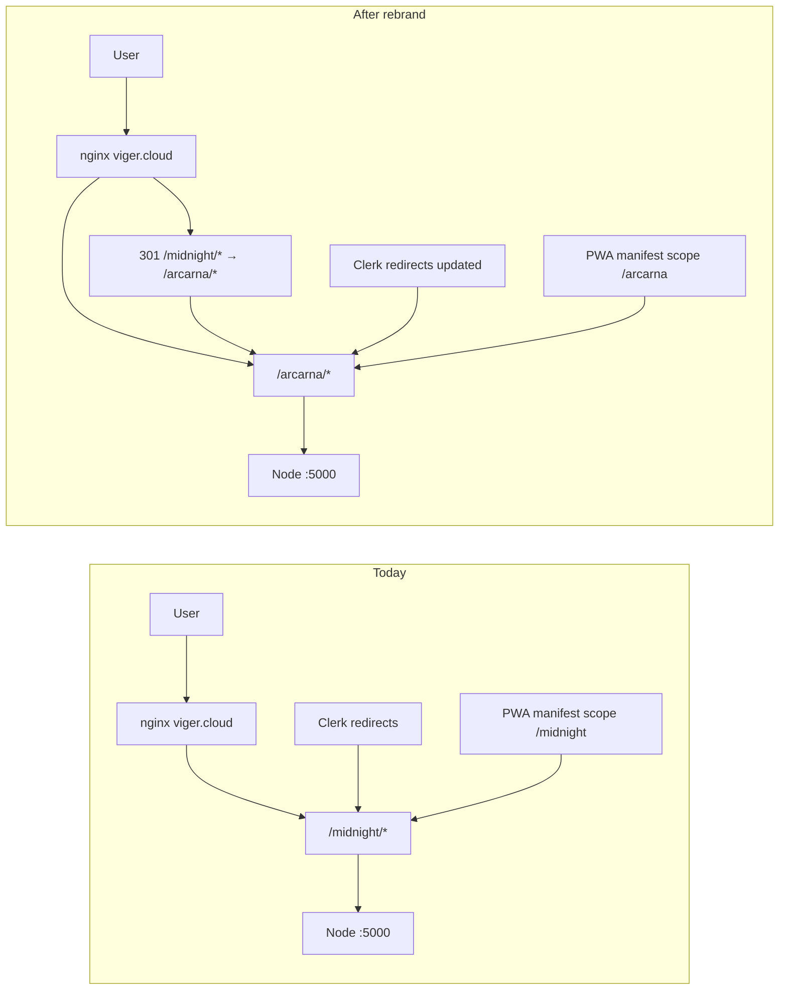

# ARCARNA rebrand — execution plan

**Status:** Planning · **URL cutover:** `/midnight` → `/arcarna`

## Goals

- **User-facing:** Every label, title, `alt` text, PWA name, portal card, receipt/email copy, and error message that says "Midnight" becomes **ARCARNA** (use **ARCARNA EPOS** only where the product previously said "Midnight EPOS").
- **URLs:** App mount moves **`/midnight` → `/arcarna`** with **301 redirects** from old paths so bookmarks and the stray `/midnightepos` monitor keep working.
- **Assets:** Two official marks — **A icon** for small surfaces; **full ARCARNA wordmark** for key brand points (see § Brand assets below).
- **Out of scope (v1):** GitHub repo name `MidnightEPOS`, PM2 process name `midnight-epos`, R2 bucket `midnight-backups`, Docker image names — infra identifiers stay unless you explicitly want a second ops wave.

## Architecture — before / after



## Brand assets — two marks (supplied)

You provided two finals. Copy into [`client/public/brand/`](client/public/brand/) on implementation:

| Source (workspace assets) | Repo filename | Use |
|-------------------------|---------------|-----|
| `ARCARNA_A_final_logo-…png` | `arcarna-mark.png` | **Small display** — favicon, `apple-touch-icon`, PWA `icon-192` / `icon-512`, collapsed mobile nav, command palette chip, notification tray |
| `Arcarna_Full_final_logo-…png` | `arcarna-wordmark.png` | **Key brand points** — portal hero, auth/onboarding shells, setup wizard header, expanded desktop sidebar, sign-out page, PWA install banner hero |

**Rule:** Never crop the wordmark to favicon size — always use `arcarna-mark.png` below ~48px logical width. Never use the A mark alone where the product name must be legible (portal card title area uses wordmark + text).

Regenerate raster sizes from **mark only** via [`scripts/generate-brand-assets.py`](scripts/generate-brand-assets.py):

- `favicon-32.png`, `icon-192.png`, `icon-512.png` ← `arcarna-mark.png`
- Optional: `arcarna-wordmark-sm.png` (max-width 240px) for narrow auth cards

Portal build copies **wordmark** to `portal/portal-assets/arcarna-wordmark.png` ([`scripts/build-portal.mjs`](scripts/build-portal.mjs)).

---

## Single source of truth (add first)

Create [`shared/brand.ts`](shared/brand.ts) (importable from client + server):

| Constant | Value |
|----------|--------|
| `BRAND_NAME` | `ARCARNA` |
| `BRAND_PRODUCT_NAME` | `ARCARNA EPOS` (replaces "Midnight EPOS") |
| `DEFAULT_APP_BASE_PATH` | `/arcarna` |
| `LEGACY_APP_BASE_PATH` | `/midnight` |
| `BRAND_MARK` | `/brand/arcarna-mark.png` |
| `BRAND_WORDMARK` | `/brand/arcarna-wordmark.png` |

Refactor [`client/src/components/BrandLogo.tsx`](client/src/components/BrandLogo.tsx):

```ts
type BrandLogoVariant = "mark" | "wordmark";
// mark → arcarna-mark.png, alt="ARCARNA"
// wordmark → arcarna-wordmark.png, alt="ARCARNA EPOS"
```

**Placement map (replace old `white-on-navy` / `navy-on-white` variants):**

| Surface | Variant | Also show text? |
|---------|---------|-----------------|
| `Layout` sidebar (desktop expanded) | `wordmark` | Optional subtitle only |
| `Layout` sidebar (mobile / narrow) | `mark` | Yes — `ARCARNA` text beside mark |
| `AuthShell`, `onboarding`, `setup-wizard` | `wordmark` | No duplicate H1 if wordmark includes name |
| `portal/index.html` hero | `wordmark` | Card H2 can be plain "ARCARNA EPOS" |
| `HullPanel` spatial shell | `wordmark` | — |
| `index.html` favicon / manifest icons | `mark` only | — |
| Receipt PDF / email (if logo URL set) | org `logoUrl` or default `wordmark` | — |

Update [`docs/ux-concepts/_shared-context.md`](docs/ux-concepts/_shared-context.md) § Brand — mandatory files list becomes `arcarna-mark.png` + `arcarna-wordmark.png`; do not redraw in CSS/SVG.

Update defaults in [`shared/appPaths.ts`](shared/appPaths.ts) (`/midnight` → `/arcarna`), [`.env.production.example`](.env.production.example) (`VITE_BASE_PATH`, `APP_BASE_PATH`, `VITE_APP_URL`), and [`client/src/lib/appPaths.ts`](client/src/lib/appPaths.ts).

Add a CI guard script `scripts/check-brand-strings.sh` that fails on **new** user-facing `Midnight` / `midnight EPOS` in `client/`, `portal/`, `shared/brand.ts` exclusions, and `server/templates/` — prevents regression.

---

## Layer 1 — Frontend UI and a11y (~25 files)

**Centralize display strings** — replace hardcoded copy with `BRAND_*` imports:

| Area | Files |
|------|--------|
| Shell / nav | [`client/src/components/Layout.tsx`](client/src/components/Layout.tsx), [`AuthShell.tsx`](client/src/components/AuthShell.tsx), [`HullPanel.tsx`](client/src/components/spatial/HullPanel.tsx) |
| Brand component | [`BrandLogo.tsx`](client/src/components/BrandLogo.tsx) — `mark` vs `wordmark` per placement map above |
| PWA UX | [`PwaInstallBanner.tsx`](client/src/components/PwaInstallBanner.tsx) |
| Pages | [`onboarding.tsx`](client/src/pages/onboarding.tsx), [`sign-out.tsx`](client/src/pages/sign-out.tsx), [`not-found.tsx`](client/src/pages/not-found.tsx), [`settings.tsx`](client/src/pages/settings.tsx) (mock emails → `@example.com`, not `@midnight.com`) |
| HTML shell | [`client/index.html`](client/index.html) — `<title>`, `apple-mobile-web-app-title` |

**Rename helper (internal, not user-visible):** `isMidnightAppPath` → `isAppBasePath` in [`client/src/lib/authNavigation.ts`](client/src/lib/authNavigation.ts) and [`useEnterApp.ts`](client/src/hooks/useEnterApp.ts).

**Hardcoded path bug to fix:** [`client/src/pages/analytics/rfm.tsx`](client/src/pages/analytics/rfm.tsx) uses `` `/midnight/api/...` `` — switch to `apiFetch` / `resolveAppPath`.

**CSS / design tokens:** Keep `liquid-metal`, `lm-card`, `text-metal-*` — these are **design system** names, not brand copy. Only update comments that say "Midnight" in [`client/src/styles/tokens/liquid-metal.css`](client/src/styles/tokens/liquid-metal.css).

---

## Layer 2 — PWA, service worker, icons

| File | Changes |
|------|---------|
| [`client/public/manifest.json`](client/public/manifest.json) | `name`, `short_name`, `start_url`, `scope`, icon paths → `/arcarna/...` |
| [`client/public/sw.js`](client/public/sw.js) | Bump cache version; prefix `arcarna-epos`; offline message "ARCARNA EPOS"; migrate-delete old `midnight-epos-*` caches on activate |
| Icons | Generate from **`arcarna-mark.png` only** — `favicon-32.png`, `icon-192.png`, `icon-512.png` under `client/public/` |

**Install dismiss key:** [`shared/pwa/installDismiss.ts`](shared/pwa/installDismiss.ts) — new key `arcarna-pwa-install-dismissed-until`; on boot, read legacy `midnight-pwa-*` once and migrate.

---

## Layer 3 — Client persistence migration (offline-critical)

Users on tablets may have IndexedDB + localStorage under old keys. **Dual-read / migrate-on-load** (one PR, well-tested):

| Legacy key / name | New | Migration |
|-------------------|-----|-----------|
| `midnight.selectedOrgId` | `arcarna.selectedOrgId` | copy on read in [`orgScope.ts`](client/src/lib/orgScope.ts) |
| `midnight-epos-db--{org}` | `arcarna-epos-db--{org}` | in [`offline-storage.ts`](client/src/lib/offline-storage.ts) + [`orgCacheWipe.ts`](client/src/lib/orgCacheWipe.ts): open legacy DB, export, re-import to new name |
| `midnight.notifications.dismissed` | `arcarna.notifications.dismissed` | [`NotificationCenter.tsx`](client/src/components/NotificationCenter.tsx) |
| `midnight-command-palette-recent` | `arcarna-command-palette-recent` | [`commandPaletteIndex.ts`](client/src/lib/commandPaletteIndex.ts) |
| `midnight_currentShiftId` | `arcarna_currentShiftId` | [`shift-open.tsx`](client/src/pages/pos/shift-open.tsx) |
| `midnight.whatsapp.*` | `arcarna.whatsapp.*` | [`whatsappDraft.ts`](client/src/lib/whatsappDraft.ts), [`WhatsAppPanel.tsx`](client/src/components/whatsapp/WhatsAppPanel.tsx) |

Update [`client/src/lib/__tests__/offlineDbName.test.ts`](client/src/lib/__tests__/offlineDbName.test.ts).

---

## Layer 4 — Portal (user-facing entry)

[`portal/index.html`](portal/index.html): card title, CTA, alt text, href `/arcarna/`, footer copy.

[`scripts/build-portal.mjs`](scripts/build-portal.mjs): copy `arcarna-wordmark.png` → `portal/portal-assets/` (portal hero uses wordmark, not A mark).

---

## Layer 5 — Server paths, redirects, customer-facing outputs

**Path defaults:** [`server/appBase.ts`](server/appBase.ts), [`server/static.ts`](server/static.ts), [`server/vite.ts`](server/vite.ts), [`vite.config.ts`](vite.config.ts) — align with `/arcarna`.

**Legacy redirects** — extend [`server/legacyRedirects.ts`](server/legacyRedirects.ts):

1. Keep existing root-segment redirects (e.g. `/pos` → `{base}/pos`) but with new base.
2. **Add** `GET /midnight` and `GET /midnight/*` → **301** to `/arcarna/...` (preserve query string).

**User/customer-visible server strings:**

| File | Change |
|------|--------|
| [`server/templates/receipt.html.ts`](server/templates/receipt.html.ts) | Sample org name |
| [`server/workers/receiptEmailWorker.ts`](server/workers/receiptEmailWorker.ts) | From address default |
| [`server/routes/invoices.ts`](server/routes/invoices.ts), [`invoiceWorker.ts`](server/workers/invoiceWorker.ts) | Google Drive folder label "ARCARNA EPOS Invoices" |
| [`server/webhooks/outboundNotify.ts`](server/webhooks/outboundNotify.ts) | Headers `X-Arcarna-Signature`, `X-Arcarna-Event` (document breaking change for any webhook consumer) |
| [`server/index.ts`](server/index.ts) | Startup log message |

**DB theme slug (low visibility):** default `accent_style` in [`shared/schema.ts`](shared/schema.ts) and [`setup-wizard.tsx`](client/src/pages/setup-wizard.tsx) default `"midnight"` → `"arcarna"`; optional SQL migration `036_rename_accent_style_default.sql` to `UPDATE organizations SET accent_style = 'arcarna' WHERE accent_style = 'midnight'`.

---

## Layer 6 — Tests and CI

Update path + title assertions:

- [`tests/e2e/smoke.spec.ts`](tests/e2e/smoke.spec.ts) — `/arcarna/api/health`, title `/ARCARNA EPOS/i`
- [`tests/a11y/critical-paths.spec.ts`](tests/a11y/critical-paths.spec.ts)
- [`tests/helpers/e2eTenant.ts`](tests/helpers/e2eTenant.ts) — storage key + API paths
- [`tests/visual/pos-tablet.spec.ts`](tests/visual/pos-tablet.spec.ts)
- [`.github/workflows/ci.yml`](.github/workflows/ci.yml) — any hardcoded `/midnight` env
- [`playwright.config.ts`](playwright.config.ts) — `baseURL` path segment

Add e2e test: `GET /midnight/` returns 301 to `/arcarna/`.

---

## Layer 7 — Operator deploy (same release, documented)

**Clerk Dashboard** ([`docs/AUTH_SETUP_CLERK.md`](docs/AUTH_SETUP_CLERK.md)):

- After sign-in / home URLs: `https://viger.cloud/arcarna/`
- Allowed origins include `https://viger.cloud`
- Rebuild required after `VITE_*` change

**VPS** ([`docs/DEPLOY_HOSTINGER_VPS.md`](docs/DEPLOY_HOSTINGER_VPS.md)):

```bash
# .env
VITE_APP_URL=https://viger.cloud/arcarna
VITE_BASE_PATH=/arcarna
APP_BASE_PATH=/arcarna
```

```bash
cd /root/MidnightEPOS
git pull && npm ci --include=dev && npm run build
npm run deploy:restart
curl -fsS http://127.0.0.1:5000/arcarna/api/health
curl -sI http://127.0.0.1:5000/midnight/ | head -3   # expect 301
```

**UptimeRobot:** URL → `https://viger.cloud/arcarna/api/health` ([`docs/ops/UPTIME_MONITORING.md`](docs/ops/UPTIME_MONITORING.md)).

**nginx (optional hard redirect at edge):** add `location /midnight/ { return 301 /arcarna$request_uri; }` in [`deploy/nginx-viger.cloud.conf.example`](deploy/nginx-viger.cloud.conf.example) — belt-and-braces with app-level redirect.

---

## Layer 8 — Documentation sweep (same wave, separate commit)

Bulk replace in `docs/`, `AGENTS.md`, [`docs/ux-concepts/_shared-context.md`](docs/ux-concepts/_shared-context.md):

- Product name → ARCARNA EPOS
- URLs → `viger.cloud/arcarna`
- Rename `MIDNIGHT_UX_REDESIGN_BRIEF.md` → `ARCARNA_UX_REDESIGN_BRIEF.md` (or add forward link)
- Add [`docs/REBRAND_ARCARNA.md`](docs/REBRAND_ARCARNA.md) — operator checklist + storage migration notes

**Do not** rewrite historical archive docs under `docs/archive/` unless you want a clean grep — mark as historical in rebrand doc instead.

---

## Suggested PR sequence (reviewable, deployable)

| PR | Branch | Scope |
|----|--------|-------|
| **1** | `feat/arcarna-brand-constants` | `shared/brand.ts`, `arcarna-mark` + `arcarna-wordmark` assets, `BrandLogo` variants, favicon gen from mark, `check-brand-strings.sh` |
| **2** | `feat/arcarna-ui-copy` | All client visible strings + `index.html` + portal |
| **3** | `feat/arcarna-pwa-offline-migration` | manifest, sw.js, icons, localStorage/IndexedDB migration |
| **4** | `feat/arcarna-path-redirects` | server redirects `/midnight` → `/arcarna`, env examples, nginx example |
| **5** | `feat/arcarna-server-outputs` | receipts, emails, invoices folder, webhook headers, accent_style migration |
| **6** | `test/arcarna-rebrand` | Playwright/a11y/unit test updates + 301 test |
| **7** | `docs/arcarna-rebrand` | ops runbook + doc sweep |

Merge **1→6** before production deploy; **7** can ship with **6** or immediately after.

---

## Acceptance criteria (DoD)

- [ ] `rg -i 'midnight epos|midnight epOS' client/ portal/ server/templates` → **0** user-facing hits (excluding migration code comments)
- [ ] `https://viger.cloud/arcarna/` loads; sign-in completes (Clerk)
- [ ] `https://viger.cloud/midnight/` → 301 → `/arcarna/`
- [ ] PWA install shows **ARCARNA**; home-screen icon uses **A mark** (readable at 192px)
- [ ] Favicon / tab icon uses **A mark**; portal + auth use **wordmark**
- [ ] Offline shell message updated
- [ ] Existing tablet: org selection + offline cart survive migration (manual QA on one device)
- [ ] `GET /arcarna/api/health` → `ok:true`
- [ ] Uptime monitor green on new URL
- [ ] `npm run check`, `npm test`, `npm run test:e2e`, `npm run test:a11y` green

---

## Risks and mitigations

| Risk | Mitigation |
|------|------------|
| Clerk redirect mismatch | Update Dashboard **before** cutover; keep `/midnight` 301 for 30+ days |
| Lost offline data | Dual-read storage migration + bump SW cache; test on staging tablet |
| Webhook integrators break | Document header rename; optional dual-send headers for one release |
| Hardcoded `/midnight` missed | CI `check-brand-strings.sh` + grep gate in PR template |
| Sentry/uptime still on old path | Ops checklist in `REBRAND_ARCARNA.md` |

---

## Pre-implementation checklist

1. **Logo PNGs** — supplied (A mark + full wordmark); copy into `client/public/brand/` as `arcarna-mark.png` and `arcarna-wordmark.png`
2. **Display casing:** **ARCARNA** in UI; **arcarna** in URLs/slugs
3. **Clerk access** to update redirect URLs on deploy day
