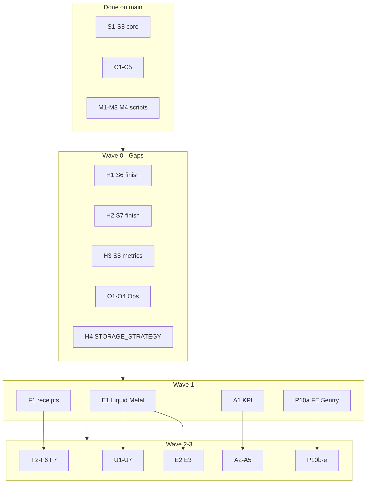

# MidnightEPOS — Master execution plan

**Purpose:** Single roadmap tying the architecture review (P0–P10, S1–S8) to repo briefs, plus **gap briefs** for work that landed only partially.

**Canonical brief format:** Goal / Touch / Steps / Out of scope / DoD / Verification / PR title — see [`README.md`](./README.md).

**Design direction:** [Liquid Metal Industrial](../ux-concepts/MIDNIGHT_UX_REDESIGN_BRIEF.md) — apply to all UI phases (E, U, F client surfaces).

---

## 1. What’s already done (do not re-brief)

| Review ID | Repo equivalent | Status |
|-----------|-----------------|--------|
| P0 | **S1** | Done — principles, domain map, schema evolution docs |
| P1 | **S2–S3** | Done — transactional outbox, inventory fail-not-skip |
| P2 | **S4–S5** | Done — orgId on storage, org-scoped offline cache |
| P3 | **M1** | Done — `apps/web` removed, `npm test` in CI, dep cleanup |
| P4 | **M2** | Done — `server/routes/*.ts` split |
| Channel prep | **C1–C5** | Done — API keys, catalog, webhooks, ingest doc, `orders.channel` |
| M3 | Feature flags | Done — `feature_flags`, `useFlag`, Settings → Flags |
| M4 scripts | Backup automation | Done — scripts + `DISASTER_RECOVERY.md`; **drill not run** |
| P7 (core) | **S7** partial | Done — audit log, Clerk SUPER_ADMIN MFA, `SECURITY_REVIEW.md` |
| P7 (HTTP) | **S6** partial | Done — helmet + global `/api` rate limit |
| P10 (partial) | **M3 + S8** partial | Done — feature flags; optional BE Sentry |

---

## 2. Gaps from the review (not fully implemented)

These need **new or follow-up briefs** — not re-doing finished stabilise work.

| Gap ID | Source | What’s missing | New brief |
|--------|--------|----------------|-----------|
| **S6b** | S6 / P7 | CSP (tuned for Clerk+Vite), HSTS in nginx + deploy docs, tiered limiters (`/api/auth`, imports) | [`PHASE_HARDENING.md`](./PHASE_HARDENING.md) **H1** |
| **S7b** | S7 / P7 | 7-year audit retention policy, `SECRET_ROTATION_RUNBOOK.md` | **H2** |
| **S8b** | S8 / P5 | Health metrics: dead letters, dispatched, oldest pending age; optional SUPER_ADMIN gate | **H3** |
| **S8c** | S8 | External uptime alerts on `/midnight/api/health` | **O1** in [`PHASE_O_OPS.md`](./PHASE_O_OPS.md) |
| **P6** | P6 | `STORAGE_STRATEGY.md`; Files/Backups limits when portal ships | **H4** + portal brief later |
| **M4b** | M4 | One-time restore drill on VPS/R2 | **O2** |
| **Ops** | Ops | `pm2 startup` + save, incident checklist | **O3**, **O4** |
| **P8** | P8 | F1–F6 retail features | [`PHASE_F_FEATURES.md`](./PHASE_F_FEATURES.md) |
| **P8+** | P8 backlog | Channel attribution reporting | **F7** (new section in F doc) |
| **P9** | P9 | U1–U7 + Liquid Metal E1–E3 | [`PHASE_U_UX_POLISH.md`](./PHASE_U_UX_POLISH.md), [`PHASE_E_LIQUID_METAL.md`](./PHASE_E_LIQUID_METAL.md) |
| **P10** | P10 | FE Sentry, analytics, Renovate, Playwright E2E, Cloudflare runbook | [`PHASE_P10_PLATFORM.md`](./PHASE_P10_PLATFORM.md) |
| **A** | Analytics | A1–A5 | [`PHASE_A_ANALYTICS.md`](./PHASE_A_ANALYTICS.md) |
| **L** | Long horizon | L1–L7 | Brief when prioritised |

---

## 3. Full brief inventory

### Stabilise gaps — [`PHASE_HARDENING.md`](./PHASE_HARDENING.md)

| ID | Title | Depends on |
|----|--------|------------|
| **H1** | Finish S6: CSP/HSTS docs + tiered rate limits | — |
| **H2** | Finish S7: audit retention + secret rotation runbook | H1 optional |
| **H3** | Finish S8: extended `/api/health/metrics` | — |
| **H4** | P6: `STORAGE_STRATEGY.md` (doc only; no Files API yet) | — |

### Ops — [`PHASE_O_OPS.md`](./PHASE_O_OPS.md)

| ID | Title |
|----|--------|
| **O1** | External uptime monitor + alert rules |
| **O2** | M4 restore drill (execute + sign-off in DR doc) |
| **O3** | `pm2 startup` + `pm2 save` verification on VPS |
| **O4** | Incident response checklist (1-pager) |

### Platform — [`PHASE_P10_PLATFORM.md`](./PHASE_P10_PLATFORM.md)

| ID | Title |
|----|--------|
| **P10a** | Sentry frontend + document BE DSN |
| **P10b** | PostHog or Plausible (org-scoped, env-gated) |
| **P10c** | `renovate.json` + CI policy |
| **P10d** | Playwright smoke + a11y critical paths (CI job) |
| **P10e** | Cloudflare / edge runbook (docs + nginx notes) |

### Design — [`PHASE_E_LIQUID_METAL.md`](./PHASE_E_LIQUID_METAL.md)

| ID | Title |
|----|--------|
| **E1** | Tokens + spatial Insights (`spatialWorkspace`) |
| **E2** | Shell + POS token rollout |
| **E3** | PWA install experience |

### Retail — [`PHASE_F_FEATURES.md`](./PHASE_F_FEATURES.md) + **F7** (in that file)

| ID | Title | Order |
|----|--------|-------|
| **F1** | Email receipts | 1 |
| **F2** | Shifts + Z-report | 2 |
| **F3** | Refunds polish | 3 (needs F2) |
| **F4** | Gift cards / store credit | 4 (needs F3) |
| **F5** | Loyalty UX | 5 |
| **F6** | Barcode scanner first-class | 6 |
| **F7** | Channel attribution dashboard | After F1 or parallel A1 |

### UX — [`PHASE_U_UX_POLISH.md`](./PHASE_U_UX_POLISH.md)

| ID | Title | Note |
|----|--------|------|
| **U1** | Skeletons + empty states | After **E1** tokens |
| **U2** | Cmd-K palette | |
| **U3** | Saved filter views | |
| **U4** | Bulk actions | |
| **U5** | WCAG AA + axe in CI | Uses Playwright from **P10d** |
| **U6** | Onboarding wizard | When acquisition matters |
| **U7** | Tablet POS layout | |

### Analytics — [`PHASE_A_ANALYTICS.md`](./PHASE_A_ANALYTICS.md)

| ID | Title |
|----|--------|
| **A1** | Daily KPI card (operational) |
| **A2** | RFM segmentation |
| **A3** | Hour-of-day heatmap |
| **A4** | Stock turn ratio |
| **A5** | Promotion lift |

### Maintenance (complete)

| ID | Status |
|----|--------|
| M1–M3 | Done |
| M4 scripts | Done; **O2** closes DoD |

---

## 4. Recommended waves (how to tackle)

Run **one PR per brief** unless noted. Target &lt;600 lines diff.

### Wave 0 — Close the stabilise ledger (1–2 weeks, mostly ops/docs)

**Goal:** Nothing from S6–S8 / M4 / ops left “partial” before big feature/UI spend.

```
H1 → H2 → H3     (can parallel H1+H3)
O1, O2, O3, O4   (O2 is VPS time-boxed; O1 external config)
H4               (doc only, 1 PR)
```

**Exit criteria:** CSP/HSTS/limiters documented or shipped; metrics complete; uptime alerting live; restore drill signed off; `STORAGE_STRATEGY.md` exists.

### Wave 1 — Foundation for product + UX (2–4 weeks)

**Pick one lead track** based on business priority:

| Track | Sequence | Best if… |
|-------|----------|----------|
| **UX-first** | E1 → U1 → U2 → (U3–U5 parallel) | Redesign / demo / mobile POS pain |
| **Revenue-first** | F1 → A1 → F2 → F3 | Receipts + ops dashboard matter most |
| **Platform-first** | P10a → P10d → P10c | Incidents / deps / CI pain |

**Recommended default (retail-first):**

```
E1  (design tokens — unblocks U and POS)
F1  (email receipts — quick win)
A1  (daily KPI — operational dashboard)
P10a (FE Sentry — cheap safety net)
```

### Wave 2 — Retail core (3–6 weeks)

```
F2 → F3 → F4 → F5 → F6
F7 (channel attribution) — can start after A1 or with A2
```

### Wave 3 — UX completion + design rollout (overlaps Wave 2)

```
U1 → U2 → U3 → U4 → U5
E2 → E3 (shell/POS/PWA — after E1)
U6, U7 when ready
```

### Wave 4 — Analytics depth (parallel-friendly)

```
A2 → A3 → A4 → A5   (any order after A1)
```

### Wave 5 — Platform polish + Files (when portal is real)

```
P10b, P10c, P10e
Portal Files/Backups implementation (new brief TBD) + H4 rate limits on upload routes
```

### Wave 6 — Long horizon

Brief **L1–L7** only when prioritised (WhatsApp, RLS, AI, etc.).

---

## 5. Dependency diagram



---

## 6. Parallelism rules

| Can run in parallel | Must be sequential |
|---------------------|-------------------|
| H1 + H3 + H4 | F2 → F3 → F4 |
| O1 + O3 + O4 (ops) | E1 → U1 (tokens before polish) |
| F1 + A1 + H4 (different domains) | F2 before F3 |
| A2–A5 after A1 | U5 after P10d (Playwright in CI) |
| U3 + U4 after U2 | Files portal before upload rate limits |

**Max concurrent PRs:** 2–3 if they touch different trees (`server/` vs `client/` vs `docs/`).

---

## 7. Agent pickup checklist

When starting any brief:

1. Read [`README.md`](./README.md) conventions + logo rule.
2. Confirm brief ID in PR title (e.g. `feat(ops): shifts + Z-report (F2)`).
3. `npm run check && npm run build && npm test` before PR.
4. Update this plan’s status table (optional) or PR description links `MASTER_EXECUTION_PLAN.md#<id>`.

---

## 8. Status tracker (update as PRs merge)

| ID | Status | PR / notes |
|----|--------|------------|
| H1 | **Done** | `main` — tiered limits, `server/security.ts` |
| H2 | **Done** | `main` — rotation runbook + retention policy |
| H3 | **Done** | `main` — extended `/api/health/metrics` |
| H4 | **Done** | `main` — `STORAGE_STRATEGY.md` |
| O4 | **Done** | `main` — `docs/ops/INCIDENT_CHECKLIST.md` |
| O1 | Not started | External uptime (operator) |
| O2 | Not started | M4 restore drill (VPS) |
| O3 | Not started | pm2 startup (VPS) |
| E1 | **Done** | `main` — Liquid Metal + spatial Insights |
| E2–E3 | Not started | |
| P10a | **Done** | `main` — Sentry browser SDK |
| P10b–e | Not started | |
| F1 | **Done** | `main` — email receipts |
| F2 | **Done** | `main` — shifts + Z-report |
| F3 | **Done** | `main` — refunds wizard |
| F4–F7 | Not started | **Wave 3–4** |
| U1 | **Done** | `main` — skeletons + empty states |
| U2–U7 | Not started | **Wave 3** — U2 next |
| A1 | **Done** | `main` — daily KPI card |
| A2–A5 | Not started | |
| M4 drill | Not started | Use O2 |

---

## 9. Quick “what do I do Monday?”

1. **Wave 0:** Merge **H1** + **O1** + **O2** (security + uptime + backup proof).  
2. **Wave 1:** **E1** + **F1** in parallel (design system + receipts).  
3. Revisit **U1** once E1 is on `main`.

For full brief text: follow links in §3.
