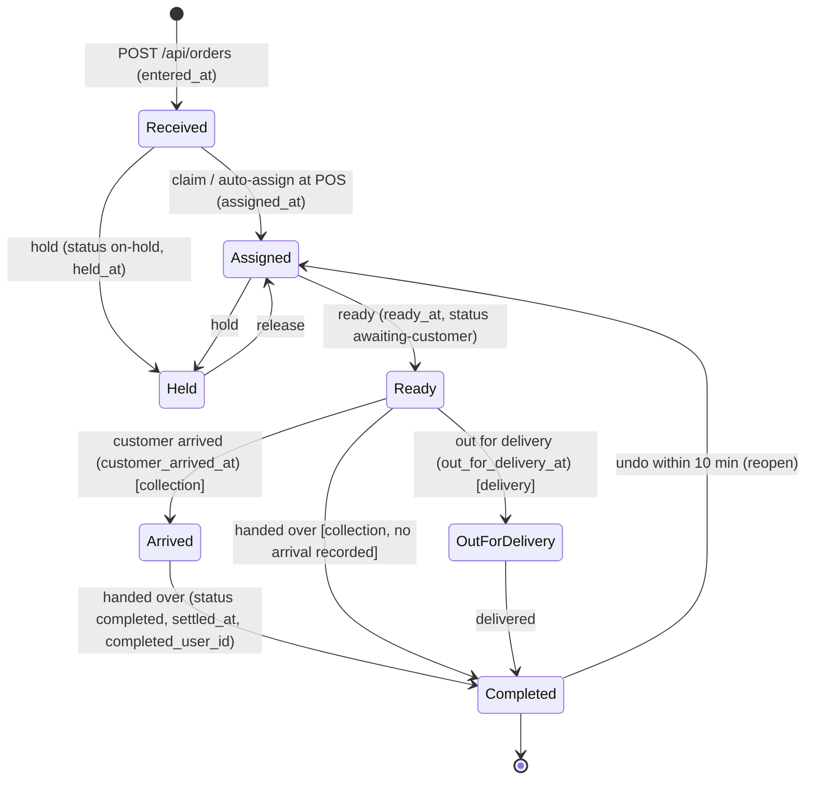

# Phase N — The Operations Centre

**Status (2026-09-11):** **Planned** — spec agreed here before anything is built (this is the L5 spec that [`PHASE_L_SHIFTS_AND_DAILY_CLOSE.md`](./PHASE_L_SHIFTS_AND_DAILY_CLOSE.md) said must exist). **Depends on:** Phase L (L1–L5 built). **Mock:** the owner's artifact "Arcarna Operations Centre" (form beside a Collection | Delivery card board).

Six work packages in six PRs: **N1** timing model + board read, **N2** transitions + stations, **N3** alerts, **N4** the screen (form extraction, board, combined page), **N5** reporting, **N6** cleanup. N1 is usable on the floor on its own (the old list gets colours and clocks); N4 is the screen the owner asked for.

---

## Why this phase exists

The shop is live on the system. Open Orders is a list: it says what exists, not what needs doing. Nobody can see at a glance who is looking after an order, whether it is on time, when the customer is coming, or that a delivery promised for 17:30 is now 17:44 and still on the shelf. Completion happens on that screen and earns the completer 90% of the commission, so it is the most important screen in the building and it is the least useful one.

The owner asked for a McDonald's-style operations board: orders as cards in a Collection area and a Delivery area, colour-coded by whether they are on time, running clocks on each, the cashier who owns it, visual and audible alerts when something needs a person (assigned to you; due in ten minutes; late), cashiers assigned to areas so alerts are personal, the order form on the same screen because there is room, and reporting on timing and issues afterwards. And old code gone when it is replaced.

## The idea, reviewed

What is right and stays exactly as asked:

- Cards, not rows. Two areas: **Collection** and **Delivery** (this is `orders.fulfilment_method`, already on every order).
- Running clocks on every card, colour as the first signal, one-tap actions.
- Personal alerts, with a station (Collection / Delivery / Both) per person per day.
- Timing captured as first-class facts so it can be reported.
- The order form is good; it moves, it does not change.

What the owner's list needed resolving or adding:

| Point | Resolution |
|---|---|
| "Dark blue = completed" and "green = completed" both listed | **Dark blue = Ready** (made ready, waiting to be handed over or to go out). **Green = Completed.** Truth Blue (the brand accent, `--truth-blue`) = on time. |
| "On time" needs a time to be on time *against* | Every order gets a **due time**: the collection time or the delivery ETA promised to the customer, captured on the payment step (quick chips: +15 / +30 / +45 / +60 min, or a time). If none is given, the org's prep SLA (default 20 min) is the implicit due time and the card says "no time given". |
| "Late" vs "delayed" are different things | **Late** is a fact the clock decides: past the due time and not ready (collection) or not delivered (delivery). **Delayed** is a decision a person made: the delay flag with a revised time, which already exists for the Delay Log. A delayed order with a new time in the future is orange, not red. |
| "Due soon" was described (the 10-minute alert) but had no colour | Added as its own state: bright Truth Blue ring + pulse, from due − 10 min until ready. |
| Ten minutes is wrong for a five-minute job and a three-day pre-order | Lead time, prep SLA and late grace are **org settings** (defaults 10 / 20 / 5 min). Pre-orders sit in a collapsed "Scheduled" strip until their trading day and are never late before then. |
| A walk-in till sale handed over on the spot should not sit on a board | POS orders are auto-assigned to the person who keyed them in, and the "Order placed" toast carries a **Handed over** button, so a counter sale is two taps and gone. |
| Who "owns" an order vs who earns on it | Three different people can be on an order: **loaded by** (input, 10%), **looked after by** (assigned, new), **completed by** (90%, frozen). Assignment never touches commission — that rule is locked in Phase L and this brief does not reopen it. |
| Notifications are org-wide today | Alerts become **per person** (and per station), stored, acknowledged, and therefore reportable: "told at 17:20, acted at 17:26" is itself a timing metric. |
| Nobody can tell whether the board is live | Cards carry a server clock; the page shows "updated 4 s ago" and a stale banner when the service worker is serving cache. |

Added value the owner did not ask for but the floor needs (effort S/M/L):

- **Unassigned pool** with a station-wide alert when a website / WhatsApp / phone order arrives with nobody on it (S).
- **Pass to…** and **Take over** on the card, with an audit row, so a break does not strand an order (S).
- **Undo** on a completed card for ten minutes (reopen, already allowed) so a wrong tap is not a manager job (S).
- **Customer arrived** for collections, so "waiting at the counter" is measured and a customer standing there for an order that is not ready pulses red on the card (S).
- **Out for delivery** stage, so delivery ETA-vs-actual is real rather than "completed at" (S).
- **Scheduled strip** for pre-orders and a **Recently completed** rail so the board is not cluttered with the finished or the far-off (S).
- **Order history** (an events table) so held time, reassignments and delays are reportable after the fact, not only while the flag is up (M).
- **Timing report** ARC-T2-005 "Order timing & service levels": prep time, wait, on-time %, ETA accuracy, by day, station, cashier, channel (M).
- **Sound that actually works** on a tablet: one audio context unlocked on first tap, a visible "tap to enable sound" chip, a per-device mute (S).
- **Two-cashier safety**: claiming is atomic; two people tapping Claim on the same order cannot both win (S).

---

## Decisions locked

| Rule | Value |
|---|---|
| Terminal status | `completed` stays the one and only settling status. "Handed over" and "Delivered" are the completion transition with a different label. No `delivered`, `ready` or `cancelled` status is added; stages are **timestamps** on the order. |
| Where completion happens | The board. Whoever taps Handed over / Delivered is `completed_user_id` (90%), as Phase L locked. |
| Assignment | A third attribution: `assigned_user_id`. Never written into the commission columns. Any staff role may claim, mark ready, arrive, dispatch and complete. Assigning or unassigning **someone else** is MANAGER+ or the current assignee passing it on. |
| Due time | `eta_given` is the promise (collection time or delivery ETA). `revised_eta` overrides it when a delay is flagged. `original_eta` is frozen on the first delay, as today. No new "due" column. |
| Colours | Tokens only, never Tailwind palette classes: Truth Blue on time · bright Truth Blue due soon (pulse) · `--danger` late · `--warning` delayed · light blue held · `--truth-blue-strong` ready · `--success` completed. Every colour has an icon and a word beside it. Text on dark surfaces uses new `-text` tokens measured at ≥ 4.5:1 (closes GAP-U5-04). |
| Time | `entered_at` is "received" (falls back to `created_at` for historic rows). All "today" maths is the org trading day (06:00–06:00). The board compares against the **server** clock (`serverNow` in the payload), not the tablet's. |
| Live data | Polling, not SSE, for this phase: the board polls one open-only endpoint every 10 s (exempt from the shared-IP rate limit). Alerts are rows in a table, so they are per person, deduped across tabs and reportable. SSE is a follow-on if the shop grows beyond four tablets. |
| Screen | One route, `/operations`. Desktop and tablet landscape: form left, board right. Phone: two tabs, Order and Board. `/create-order`, `/pos`, `/open-orders`, `/orders` redirect there. The form keeps every test id and the no-dialog rule. |
| Reports | ARC-T1-003 (Order Status Dashboard) retires; the board is that screen. ARC-T1-005 (Delay Log) stays and is fed from the events table so a cleared flag no longer erases a delay. ARC-T2-005 is new. |
| Cleanup | Anything the board replaces is deleted in the PR that replaces it, with its tests. Dead code found on the way that is unrelated to the board goes in N6, not in a feature PR. |

## What the code does today, and where it conflicts

| # | Finding | Where |
|---|---|---|
| **G1** | No assignment concept anywhere. Attribution is `input_user_id` (loaded) and `completed_user_id` (completed, frozen). | `shared/schema.ts` orders; `server/routes/orders.ts` |
| **G2** | No lifecycle timestamps beyond `entered_at`, `created_at`, `settled_at`. Nothing records ready, arrived, out for delivery, held. Status transitions only exist implicitly in `event_outbox` payloads. | `shared/schema.ts`, `server/routes/orders.ts` L757 |
| **G3** | The due time (`eta_given`) is never written at creation; the only writer is `OrderOpsDialog`, and that dialog has been **unreachable since PR #136** (`selectedOrder` can never be set). So ARC-T1-003/005 have had no UI feed for three weeks. | `client/src/pages/orders.tsx` L91, L222–251, L1012–1085 |
| **G4** | `PATCH /api/orders/:id` reads the row outside the transaction with no lock and no from→to rules: two completions race, and any claim built the same way lets two cashiers both win. | `server/routes/orders.ts` L644–736 |
| **G5** | Notifications are org-wide: `org_notifications` has no user column and "read" is read for everyone. The bell also leaks cross-tenant approval and dead-letter counts. | `shared/schema.ts` L1948; `server/services/operationalIntelligence.ts` L371, L392 |
| **G6** | The worker loop's housekeeping runs every 15 minutes; nothing can fire "ten minutes before". The loop *does* already compute a precise wake for queued jobs, which a "next alert due" lookahead can join. | `server/workers/index.ts` L245, L347–353 |
| **G7** | Production rate limit is 800 req / 15 min **per IP**, and every tablet in the shop shares one IP. A 5 s poll from four tablets alone exceeds it. | `server/security.ts` L48–55 |
| **G8** | `GET /api/orders` returns every order the org has ever taken, completed included, on every 10 s poll. | `server/routes/orders.ts` L393–445 |
| **G9** | The two Drizzle schema files disagree: `apps/server/src/db/schema.ts` lacks five operational columns (`queue_position`, `delay_cause`, `original_eta`, `delay_notification_sent_at`, `delay_resolution`), and the drift audit ignores columns present in only one file. | `apps/server/src/db/schema.ts` L84–88 |
| **G10** | The 60-minute red label fails WCAG AA (3.05:1) and CI never renders one because its database has no old orders (GAP-U5-04). A live board would show that failure permanently. | `client/src/components/orders-row.tsx` L70 |
| **G11** | Website orders lose their fulfilment: `website.ts` never passes `fulfilmentMethod` (and the site says `pickup`), so every web delivery would land in the Collection column. | `server/services/website.ts` L568–586; `shared/website.ts` L163 |
| **G12** | Bulk "Set status" writes any string with no validation and bypasses settlement, attribution, credit and events. | `server/lib/bulkActionHandler.ts` L157–173 |
| **G13** | The order form collects order expenses and never sends them (silent data loss); the checkout expenses UI is dead weight. | `client/src/pages/pos.tsx` L136, L680–763 |
| **G14** | The form is a page that owns its `dvh` shell and header; it is not embeddable. Its line grid uses viewport breakpoints, so it overflows in a ~45% pane on 1024–1279 px screens. | `client/src/pages/pos.tsx` L808–985; `pos-order-lines.tsx` L264 |
| **G15** | There is no fake-time convention in any test (zero uses of `page.clock`, `vi.useFakeTimers`, `emulateMedia`), no DOM test environment, no seeded orders in the a11y job, only one seeded cashier, and the `visual` Playwright project is unwired and asserts classes that no longer exist. | `tests/`, `vitest.config.ts`, `playwright.config.ts` |

---

## Order lifecycle & timing model



Every arrow is one call to `POST /api/orders/:id/transition`, one transaction, one `order_events` row, one outbox event. Timestamps are written **once** (first write wins) except `assigned_*`, which changes on reassignment, and `held_at`, which is cleared on release (history stays in `order_events`).

### Card state — one rule, shared

`shared/orders/opsState.ts` exports `deriveCardState(order, now, settings)`; the board, the alert sweep and the timing report all call it, so a card, an alert and a report can never disagree. Precedence, first match wins:

| # | State | Condition | Colour token | Card word / icon | Running clock |
|---|---|---|---|---|---|
| 1 | **Completed** | `status = completed` | `--success` | Completed · check | Prep, Wait, vs promised (static) |
| 2 | **Held** | `status = on-hold` | `--held` (new light-blue token) | Held · pause | Held for |
| 3 | **Late** | collection: `now > due + grace` and `ready_at` null · delivery: `now > due + grace` and not completed | `--danger` | Late · warning | Over by (counts up) |
| 4 | **Delayed** | `delay_flag` and `revised_eta > now` | `--warning` | Delayed · warning | New time in |
| 5 | **Ready** | `ready_at` set | `--truth-blue-strong` | Ready · box (+ "Out for delivery" pill / "Customer here" pill) | Ready for; At counter |
| 6 | **Due soon** | `due − now ≤ lead` | `--truth-blue-bright` + ring pulse | Due soon · clock | Due in (counts down) |
| 7 | **On time** | otherwise | `--truth-blue` | On time · clock | Waiting (since received), Due in |

Definitions:

- `due = revised_eta ?? eta_given ?? entered_at + prepSla` (collection) or `entered_at + deliveryLead` (delivery). When the fallback is used the card shows "no time given" and the report excludes it from on-time %.
- `grace` = `ops_late_grace_minutes` (default 5); `lead` = `ops_due_soon_lead_minutes` (default 10); `prepSla` = `ops_prep_sla_minutes` (default 20); `deliveryLead` = `ops_delivery_lead_minutes` (default 45). All org settings, all readable by cashiers through `GET /api/settings`.
- `urgent` status is a **priority flag** (icon + sort to top), not a colour.
- `awaiting-customer` maps to Ready: the transition writes `ready_at` and sets that status, so anything still reading the status keeps working.
- A collection that is Ready and past due is **not** late (the customer is); the Ready clock turns amber text after `due + grace` and the card says "Waiting for customer".
- A Ready collection whose customer has arrived and waited more than `grace` shows "Customer waiting" in red text (state stays Ready; this is the exception that pulses red).
- Pre-orders (`date_kind = preorder`, trading day in the future) sit in the **Scheduled** strip: no clocks, no lateness, no alerts until their trading day starts. Backdated orders never appear on the board unless open, and then carry the Backdated badge with no due time.
- Cards leave the board 10 minutes after completion (they sit in a **Recently completed** rail with Undo until then).

### Clocks

One 1-second ticker per page (`client/src/lib/opsClock.ts`), paused when `document.hidden`. Elapsed values are computed against `serverNow + (Date.now() − receivedAt)` so a tablet with a wrong clock still shows the right numbers. Labels: `m:ss` under an hour, `1h 02m` after, `2d` after a day. Live regions announce state **changes** (a card turning late), never ticks.

---

## Data model & migration (`migrations/065_operations_centre.sql`)

Both `shared/schema.ts` and `apps/server/src/db/schema.ts` for every `orders` column (G9 fixed in the same migration: the five missing operational columns are declared in the snake_case file). All new columns nullable; the release-gate seed inserts bare orders.

```sql
-- orders: who is looking after it, and when each stage happened.
ALTER TABLE orders
  ADD COLUMN IF NOT EXISTS assigned_user_id     varchar(255),
  ADD COLUMN IF NOT EXISTS assigned_at          timestamp,
  ADD COLUMN IF NOT EXISTS assigned_by_user_id  varchar(255),
  ADD COLUMN IF NOT EXISTS ready_at             timestamp,
  ADD COLUMN IF NOT EXISTS customer_arrived_at  timestamp,
  ADD COLUMN IF NOT EXISTS out_for_delivery_at  timestamp,
  ADD COLUMN IF NOT EXISTS held_at              timestamp;

-- The board's read: open orders by who owns them.
CREATE INDEX IF NOT EXISTS orders_open_assigned_idx
  ON orders (org_id, assigned_user_id)
  WHERE status <> 'completed';

-- What happened to an order, in order. Written in the same transaction as
-- the transition; the timing report and the Delay Log read this, not flags.
CREATE TABLE IF NOT EXISTS order_events (
  id          uuid PRIMARY KEY DEFAULT gen_random_uuid(),
  org_id      uuid NOT NULL REFERENCES organizations(id) ON DELETE CASCADE,
  order_id    uuid NOT NULL REFERENCES orders(id) ON DELETE CASCADE,
  kind        varchar(32) NOT NULL,   -- created|assigned|unassigned|ready|unready|held|released|arrived|out_for_delivery|completed|reopened|delayed|due_changed
  at          timestamp NOT NULL DEFAULT now(),
  user_id     varchar(255),
  meta        jsonb
);
CREATE INDEX IF NOT EXISTS order_events_order_idx ON order_events (org_id, order_id, at);
CREATE INDEX IF NOT EXISTS order_events_kind_idx  ON order_events (org_id, kind, at);

-- Who is working which area today. One row per person per trading day; the
-- 06:00 close does not need to touch it because tomorrow is a new key.
CREATE TABLE IF NOT EXISTS ops_stations (
  org_id      uuid NOT NULL REFERENCES organizations(id) ON DELETE CASCADE,
  user_id     varchar(255) NOT NULL,
  trading_day date NOT NULL,
  station     varchar(16) NOT NULL CHECK (station IN ('collection','delivery','both')),
  set_at      timestamp NOT NULL DEFAULT now(),
  PRIMARY KEY (org_id, user_id, trading_day)
);

-- Personal alerts. user_id NULL + station set = everyone on that station.
CREATE TABLE IF NOT EXISTS ops_alerts (
  id          uuid PRIMARY KEY DEFAULT gen_random_uuid(),
  org_id      uuid NOT NULL REFERENCES organizations(id) ON DELETE CASCADE,
  order_id    uuid NOT NULL REFERENCES orders(id) ON DELETE CASCADE,
  user_id     varchar(255),
  station     varchar(16),
  kind        varchar(32) NOT NULL,   -- assigned|due_soon|late|unassigned_new|delayed|customer_waiting
  severity    varchar(16) NOT NULL DEFAULT 'info',
  title       varchar(255) NOT NULL,
  message     text NOT NULL,
  due_at      timestamp,
  created_at  timestamp NOT NULL DEFAULT now(),
  read_at     timestamp,
  acked_at    timestamp,
  acked_by_user_id varchar(255)
);
CREATE UNIQUE INDEX IF NOT EXISTS ops_alerts_once_idx
  ON ops_alerts (order_id, kind, COALESCE(user_id, ''), COALESCE(station, ''));
CREATE INDEX IF NOT EXISTS ops_alerts_user_idx ON ops_alerts (org_id, user_id, created_at) WHERE acked_at IS NULL;

-- Org settings (shared/schema.ts only — organizations is not in the snake_case file).
ALTER TABLE organizations
  ADD COLUMN IF NOT EXISTS ops_prep_sla_minutes        integer NOT NULL DEFAULT 20,
  ADD COLUMN IF NOT EXISTS ops_due_soon_lead_minutes   integer NOT NULL DEFAULT 10,
  ADD COLUMN IF NOT EXISTS ops_late_grace_minutes      integer NOT NULL DEFAULT 5,
  ADD COLUMN IF NOT EXISTS ops_delivery_lead_minutes   integer NOT NULL DEFAULT 45;
```

Rules: idempotent SQL (the deploy script runs every file, `ON_ERROR_STOP=0`); every CHECK and partial index also declared in `shared/schema.ts` (the push-drift audit); `order_events`, `ops_stations`, `ops_alerts` added to `scripts/migration-sanity-check.ts` REQUIRED_TABLES; user ids are `varchar(255)` with no FK, like `input_user_id` (migration 057's reason: removing a person must not make history unreadable). No `withTimezone` on any timestamp, matching every existing column (the drift audit does not compare it, so the DoD greps for it).

---

## API

All routes `...scoped` (org context), roles as stated. Every write is one transaction that updates the order, inserts the `order_events` row, and `publishEventTx('OrderStatusChanged', …)` with `{ stage, actor: { type: 'user', id } }` in the payload (the existing consumers ignore what they do not know; Automation rules can now react to stages).

### `GET /api/orders/board` (all staff) — N1

Registered **before** `GET /api/orders/:id` so `board` is not read as an id. Returns open orders (`status <> 'completed'`) plus orders settled in the last 10 minutes, for the org (optional `?locationId=`), joined to customers and names resolved once (`resolveUserNames` for input, assigned, completed). Response:

```json
{
  "serverNow": "2026-09-11T17:42:10.000Z",
  "tradingDay": "2026-09-11",
  "settings": { "prepSlaMinutes": 20, "dueSoonLeadMinutes": 10, "lateGraceMinutes": 5, "deliveryLeadMinutes": 45 },
  "orders": [ { "id": "…", "customerName": "…", "total": "53.40", "paymentMethod": "cash", "channel": "pos",
                "fulfilmentMethod": "collection", "status": "pending", "dateKind": "live",
                "enteredAt": "…", "createdAt": "…", "etaGiven": "…", "originalEta": null, "revisedEta": null,
                "delayFlag": false, "delayReason": null, "delayCause": null,
                "assignedUserId": "…", "assignedUserName": "Sam", "inputUserId": "…", "inputUserName": "Ben",
                "completedUserId": null, "completedUserName": null,
                "readyAt": null, "customerArrivedAt": null, "outForDeliveryAt": null, "heldAt": null, "settledAt": null,
                "itemCount": 3, "locationId": "…" } ],
  "summary": { "open": 9, "collection": 5, "delivery": 4, "unassigned": 2, "mine": 3, "lateNow": 2, "readyWaiting": 3,
               "todayMedianPrepSeconds": 680, "todayOnTimePct": 91, "todayDeliveryEtaDeltaSeconds": 240, "todayCompleted": 34 }
}
```

The client keeps the query key `["/api/orders/board"]` so every existing `invalidateAfterOrderMutation` / `invalidateAfterPosCheckout` family match refreshes it. Poll: 10 s, `refetchIntervalInBackground: true`. The path is added to the rate limiter's skip list (G7) — it is authenticated and org-scoped, so the shared-IP limiter adds nothing there.

### `POST /api/orders/:id/transition` (all staff; some actions MANAGER+) — N2

```ts
{ action: 'claim' | 'assign' | 'unassign' | 'ready' | 'unready' | 'hold' | 'release'
        | 'arrived' | 'out_for_delivery' | 'complete' | 'reopen' | 'set_due',
  userId?: string,      // assign: who; unassign: whom (MANAGER+ unless it is you)
  dueAt?: string,       // set_due: ISO; also accepted with 'ready'/'out_for_delivery' for a delivery ETA
  reason?: string }     // hold / unassign
```

- `claim`: `UPDATE orders SET assigned_user_id=$me, assigned_at=now(), assigned_by_user_id=$me WHERE id=$id AND org_id=$org AND assigned_user_id IS NULL RETURNING *` — zero rows → `409 { code: 'ORDER_ALREADY_ASSIGNED', assignedUserName }`. That single statement is the whole concurrency story (G4).
- `assign` to someone else: MANAGER+, or the current assignee passing it on. Writes an `assigned` event with `meta.from/to`, and creates the `assigned` alert for the new person in the same transaction.
- `ready`: sets `ready_at` (first write wins) and `status = awaiting-customer`. `unready` clears the status only; the timestamp stays and an `unready` event records it.
- `hold` / `release`: `status = on-hold` + `held_at` / `status = pending` + `held_at = null`; events carry the reason.
- `arrived`: `customer_arrived_at` (collection only, 400 otherwise). `out_for_delivery`: `out_for_delivery_at` (delivery only).
- `complete`: calls `completeOrderTx(tx, order, actor, cashierShift)` — the settlement block **extracted** from `PATCH /api/orders/:id` (settled total, credit leg, backdated shift, completed_user_id, event). One completion path, not two. `PATCH /api/orders/:id { status: 'completed' }` keeps working by calling the same function.
- `reopen`: `status = pending`; allowed for any staff within 10 minutes of `settled_at`, MANAGER+ after. Never touches `settled_*` or `completed_*` (frozen).
- Illegal moves (`arrived` before `ready`, `out_for_delivery` on a collection, `ready` on a completed order) → `409 { code: 'ORDER_TRANSITION_INVALID', from, action }`; `assertTransition` lives in `shared/orders/opsState.ts` with its spec.
- Cross-org id → 404, as everywhere.

### `PATCH /api/orders/:id/operations` (all staff) — kept, fixed in N2

Still the delay-capture write (`delayFlag`, `delayCause`, `delayReason`, `revisedEta`, `notifyCustomerNow`, `delayResolution`). Fixed: `delayFlag` only changes when sent (today a save with the switch off clears a delay); runs in a transaction; writes a `delayed` / `due_changed` event; creates the `delayed` alert for the assignee. `queuePosition` and the `GET /api/delay-causes` endpoint are removed (dead, see Cleanup).

### `POST /api/orders` — N2

Accepts `dueAt` (ISO → `eta_given`) and `assignToMe` (default **true** for `channel = pos`, false otherwise). Declared in `PlaceOrderInput` and written by the route after `placeOrder`, exactly as `input_user_id` is, so nothing is stripped. Writes the `created` (+ `assigned`) events. Website orders map `pickup → collection` and pass `fulfilmentMethod` (G11).

### Stations & staff — N2

- `GET /api/operations/staff` (all staff): `[{ userId, name, role, station, onShiftToday, lastActiveAt }]` from `allowed_users` (staff roles only, no CUSTOMER) left-joined to `users` for names (falls back to `allowed_users.name`, then email — seeded users have no `users` row), today's `ops_stations` row, and today's cashier shift.
- `PATCH /api/operations/station { station: 'collection' | 'delivery' | 'both' | null }` sets the caller's station for the current trading day; `PATCH /api/operations/station/:userId` is MANAGER+. Both `recordAdminAudit('ops.station_set')`.

### Alerts — N3

- Rows are created (a) in the transition / operations transactions (`assigned`, `delayed`, `unassigned_new` on create when unassigned, addressed to the order's station), and (b) by `sweepOpsAlerts(now)` for `due_soon`, `late` and `customer_waiting`, which runs as a housekeeping task **and** is folded into the runner's precise-wake: `runTick` takes `min(nextQueuedRunAt, nextOpsAlertAt)` where `nextOpsAlertAt()` is one indexed query over open orders with a due time (G6). The unique index makes the sweep idempotent; restarts and overlapping ticks cannot double-fire.
- `GET /api/operations/alerts?since=<iso>` (all staff): the caller's unacknowledged alerts (`user_id = me` or `station in (my station, 'both')` or `user_id IS NULL AND station IS NULL`), newest first, plus `serverNow`. Polled at 10 s by the Operations Centre only; on the limiter skip list.
- `PATCH /api/operations/alerts/:id/ack` (own alerts, or MANAGER+): sets `acked_at`, `acked_by_user_id`. `PATCH …/read` marks seen without acting.
- The existing bell keeps org-wide Signals; the Operations Centre header shows the personal alert count. The bell's cross-tenant leak (G5) is fixed in N3 as a one-line org filter, with a test.

### Settings — N2

`ops_*` columns: added to `orgProfilePatchSchema` (`shared/setup.ts`), the `updateOrgProfile` allow-list (`server/storage.ts`), projected in `GET /api/settings` (cashiers can read that, not `/api/org/setup`), and an "Operations" card in Settings following `CashierCommissionSettings.tsx`. Feature flag `operationsCentre` in `KNOWN_FEATURE_FLAGS` gates the route and nav entry during rollout; the redirects from the old paths are only installed when the flag is on, so the old screens stay until the owner flips it.

---

## Assignment & stations, on the floor

- **Claim** on any unassigned card; **Take over** on someone else's (records `from`); **Pass to…** opens an inline list of today's staff (from `/api/operations/staff`), sorted by station match, then name. Never a dialog.
- POS orders arrive already on the list of the person who keyed them in. Web / WhatsApp / phone orders arrive **Unassigned** and pulse on the station that matches their fulfilment.
- Station picker in the header: Collection / Delivery / Both. It sets the server row (so the alert sweep and other people's boards know) and filters the board to that column by default (the other column is one tap away and never hidden entirely; a filter is not a wall).
- **Mine / Unassigned / All** filter next to it, persisted per device (`STORAGE_OPS_FILTER`).
- Role rules: any staff can claim / ready / arrive / dispatch / complete; assign or unassign another person is MANAGER+ or the current assignee; edit lines and delete stay MANAGER+ (unchanged). Written into `RBAC.md`.
- Under `DEV_AUTH_BYPASS` (Playwright) `requireRole` is a no-op, so role gates are proven in vitest with the `captureRoutes` / `runGuard` pattern, not in the browser.

## Alerts & notifications

| Kind | To whom | When | Card | Sound |
|---|---|---|---|---|
| `assigned` | the new assignee (not on self-claim) | in the assign transaction | blue ring pulse + "Assigned to you" pill | two-tone chime |
| `unassigned_new` | everyone on the matching station | on create, unassigned | pulse on the Unassigned pill + card | chime |
| `due_soon` | assignee, else the station | `due − lead` while not ready | bright-blue ring pulse, "Due in m:ss" | chime |
| `late` | assignee + managers | `due + grace`, not ready / not delivered | red stripe, "Over by" | low double tone |
| `customer_waiting` | assignee | `customer_arrived_at + grace` and not completed | red text on a Ready card | low double tone |
| `delayed` | assignee | someone else flags a delay | orange stripe | none |

Mechanics:

- The card **pulse is computed client-side** from the timestamps on every tick, so it starts at exactly due − 10:00 whatever the poll phase; the alert **row** is what makes it personal, acknowledged, cross-tab deduped and reportable. Both exist on purpose.
- Pulse: a Tailwind keyframe `ops-pulse` on `box-shadow` using `--truth-blue-bright`, applied as `animate-ops-pulse motion-reduce:animate-none`; under reduced motion the card gets a static 2 px ring and the same words. Paused when `document.hidden`.
- Sound: `client/src/lib/posAudio.ts` gains `unlockAudio()` (one `AudioContext`, `resume()` on the first `pointerdown` / `keydown` / `touchstart`, `{ once: true }`), `playOpsAlert(kind)` returning `false` when the context is not running, and the header shows a "Tap to enable sound" chip in that case. `STORAGE_OPS_SOUND` mutes per device. `WhatsAppPanel`'s inline `AudioContext` is routed through the same module (it leaks one context per message today).
- Cross-tab: `BroadcastChannel('arcarna-ops:<orgId>')`; the first tab to see an alert plays the sound and the others stay quiet. `localStorage` `storage` event as the fallback.
- Toasts: at most one is on screen (`TOAST_LIMIT = 1`), so the toast is only the "you were assigned" case; everything else is the card and the header count. Never a `role=dialog` anywhere on this page (the order-form journey asserts that at phone width).
- Stale data: the service worker returns cached JSON with a 200 when offline; the board reads `dataUpdatedAt`, shows "updated N s ago", and a banner after 30 s without a fresh response. Transitions are **not** queued offline (a claim from stale data is worse than a failed tap); the toast says so.

```mermaid
sequenceDiagram
    participant Ben as Ben (tablet A)
    participant API
    participant DB
    participant Runner as Worker runner
    participant Sam as Sam (tablet B)
    Ben->>API: POST /orders/7f3a/transition {action: assign, userId: sam}
    API->>DB: tx: update orders, insert order_events(assigned), insert ops_alerts(assigned→sam), outbox
    API-->>Ben: 200
    Sam->>API: GET /operations/alerts?since=… (10 s poll)
    API-->>Sam: [assigned 7f3a]
    Sam->>Sam: toast + chime (first tab only) + card pulse
    Note over Runner: nextOpsAlertAt() = 18:05 (due 18:15 − 10)
    Runner->>DB: sweepOpsAlerts(18:05): insert ops_alerts(due_soon→sam) ON CONFLICT DO NOTHING
    Sam->>API: GET /operations/alerts
    API-->>Sam: [due_soon 7f3a]
    Sam->>Sam: card already pulsing since 18:05:00 (client rule); row makes it acked/reportable
    Sam->>API: POST /orders/7f3a/transition {action: ready}
    API->>DB: tx: ready_at, status awaiting-customer, order_events(ready), ack open alerts for 7f3a
```

---

## UI — the Operations Centre

Route `/operations` (nav: **Sell → Operations**, replacing the Create Order and Open Orders entries; `/create-order`, `/pos`, `/open-orders`, `/orders` redirect; `/open-orders/:id/refund` stays as is). Test ids fixed here so UI and tests can be written in parallel:

`ops-page`, `ops-header`, `ops-station-picker` (+ `ops-station-collection|delivery|both`), `ops-filter-mine|unassigned|all`, `ops-alert-count`, `ops-audio-toggle`, `ops-audio-unlock`, `ops-updated-ago`, `ops-stale-banner`, `ops-summary-<metric>`, `ops-scheduled-strip`, `ops-column-collection`, `ops-column-delivery`, `ops-column-count-<col>`, `ops-recent-rail`, `ops-card-<id>` (with `data-state` = `on-time|due-soon|late|delayed|held|ready|completed` and `data-pulse` = `true|false` and `data-static` under reduced motion), `ops-card-state-<id>`, `ops-clock-<kind>-<id>` (`waiting|due|over|ready|held|counter`), `ops-assignee-<id>`, `ops-claim-<id>`, `ops-takeover-<id>`, `ops-pass-<id>` (+ `ops-pass-option-<userId>`), `ops-ready-<id>`, `ops-unready-<id>`, `ops-hold-<id>`, `ops-release-<id>`, `ops-arrived-<id>`, `ops-out-<id>`, `ops-complete-<id>`, `ops-undo-<id>`, `ops-delay-<id>` (inline delay form: `input-eta-given`, `switch-delay`, `select-delay-cause`, `input-revised-eta`, `input-delay-reason`, `switch-notify`, `button-save-order-ops`), `ops-details-<id>` (inline expander: lines, refunds, bank/collection copy buttons, `button-download-receipt`, `button-download-invoice`, refund link), `button-view-order-<id>` (kept for the documents journey — it is the details toggle), `input-order-search` (kept: id / customer / phone), `ops-tab-order`, `ops-tab-board` (phone).

Layout:

- **≥ 1024 px** (desktop, tablet landscape 1194×834): `ResizablePanelGroup` (already installed, unused) — form pane 34–45%, board pane the rest, inside a `calc(100dvh − 4rem)` shell. The form pane owns its own scroller; the confirm bar stays pinned inside the pane. The board's right and bottom gutters reserve the WhatsApp / assistant launcher space the form already reserves.
- **768–1023 px** (tablet portrait): stacked, form on top collapsed to a "New order" bar that expands; board below.
- **< 768 px** (phone): Radix Tabs **Order | Board**, `forceMount` + `hidden` so cart state, the consumed WhatsApp draft and the single barcode-scanner listener survive a tab switch. The Order tab is today's phone form byte-for-byte (the no-dialog journey passes unchanged except for the URL). `?pane=order|board` picks the tab; `/create-order` redirects with `?pane=order`.
- The form is extracted first (`client/src/components/order-form/OrderForm.tsx` + `useOrderForm()`), keeps every test id and the `pos-*` classes, gains an `onPlaced(orderId)` callback, and loses the page header (the Operations header carries Z-report, Close shift and the selling location). Its line grid and the fulfilment/date/due grid become pane-relative via `@tailwindcss/container-queries` (`@container` on the pane) so a 45% pane at 1024–1279 px does not overflow (G14).
- Card anatomy (top to bottom): customer + short id + state word/icon; three clocks; reason line (hold / delay); assignee pill (Mine / name / Unassigned), total, channel, received time, stage pills; actions row (primary + secondary + View). Minimum 44 px targets; the primary action is always the next step in the lifecycle for that fulfilment. Icon-only buttons carry `aria-label`s keyed by order id.
- Columns sort: due soon → late → delayed → on time (by due) → ready → held; urgent flag floats to the top of its state. Column headers show `open · mine · unassigned`.
- Summary strip (today, trading day): median received→ready, on-time %, late now, ready waiting, delivery ETA delta — from `summary` in the board payload. Big-number tiles are justified here: they are the point of an ops screen.
- Skeleton: two lanes of three card-shaped bars (`docs/UI_PATTERNS.md`); empty states per column ("Nothing to collect", CTA "New order") and for the whole board.
- Colour tokens added to `client/src/styles/tokens/arcarna.css`: `--held`, `--held-text`, `--danger-text`, `--warning-text`, `--success-text`, `--truth-blue-text` — the `-text` variants are the ≥ 4.5:1 versions for small text on `--card`; solid fills keep `-foreground` text. Measured by axe in the a11y suite with a seeded red card (G10).
- After a sale: the form resets as today; the board refetches via the existing invalidation; the new card flashes once (`ops-card-<id>[data-new]`); the "Order placed" toast offers **Handed over** (completes it) for counter sales.
- Command palette: index `/operations`; order rows deep-link to `/operations?order=<id>` which scrolls to and expands the card.

## Reporting

- **ARC-T2-005 Order timing & service levels** (new, N5): per trading day range, grouped by fulfilment, station, cashier (assigned and completed), channel, hour: orders, median/p90 received→ready, median ready→handed over, median at-counter wait, on-time % (against a given due; "no time given" excluded and counted), late count, delivery ETA delta (median, p90), delays (count, proactive-comms %), alert response (created→acked median). Pure aggregation in `shared/reports/orderTiming.ts` (+ spec); engine function; catalog entry; `client/src/pages/reports/order-timing.tsx`; route. Red flags: "on-time below 80% yesterday" (one string, not per order, so the bell is not flooded).
- **ARC-T1-005 Delay Log** re-based on `order_events` (`delayed` rows) and trading-day bounds, so a cleared flag no longer erases the record and last night's delays are not hidden by a local-midnight cut.
- **ARC-T1-003 Order Status Dashboard** retired: engine function, page, catalog entry, route and its `READY` branch that could never fire. The board is the working screen; the timing report is the export.
- Control Centre tiles (`toCollect`, `toDeliver`, `openOrders`) link to `/operations?station=…` instead of the undifferentiated list.

## Cleanup — the delete list

Deleted in the PR that replaces it (feature PRs), verified by grep and by `node scripts/audit-ui-wiring.mjs --strict` before the PR opens:

| In PR | Path :: symbol | Why it is dead after this |
|---|---|---|
| N4 | `client/src/pages/orders.tsx` (whole file, 1282 lines) | Replaced by `/operations`. Includes the unreachable `selectedOrder` block (G3), the five stat cards, status grouping, the two filter selects, bulk wiring, `window.prompt` status set. |
| N4 | `client/src/components/orders-row.tsx` :: `OrdersRow`, `describeWait`, `StatusBadge`, `getStatusBorderClass`, `STATUS_CONFIG` re-export | Replaced by `OpsCard` + `opsState`. `formatPaymentLabel` moves to `client/src/lib/paymentLabel.ts` (used by `invoice-row.tsx`, `insights.tsx`). |
| N4 | `client/src/components/orders-skeleton.tsx`, `orders/OrderStatusSelect.tsx`, `orders/statusConfig.ts` | Board skeleton and state tokens replace them. |
| N4 | `client/src/components/reports/OrderOpsDialog.tsx`, `SatisfactionDialog.tsx` | Delay capture is inline on the card; rating capture has no home yet → GAP-OPS-06. `shared/delayCauses.spec.ts` re-pointed at `OpsDelayForm.tsx`. |
| N4 | `client/src/components/__tests__/ordersRow.test.ts` | Replaced by `shared/orders/opsState.spec.ts` + `client/src/lib/__tests__/paymentLabel.test.ts`. |
| N4 | `shared/bulkActions.ts` :: `ORDER_ACTIONS`; `server/lib/bulkActionHandler.ts` :: `handleOrderBulk`; `POST /api/orders/bulk` | The board has no multi-select; the "tag" action bypassed settlement (G12). Customers / products bulk untouched. |
| N4 | `client/src/hooks/useSavedViews.ts` 'orders' wiring; `shared/savedViews/state.ts` :: `applyViewState` (+ spec) | No filters to save; `applyViewState` already had no caller. The server `PAGE_IDS` entry stays (stored rows are harmless). |
| N4 | `tests/journeys/uiSeams.spec.ts` U4 rewritten against `ops-complete-<id>`; `tests/a11y/critical-paths.spec.ts` paths updated | Same PR, or CI goes red. |
| N2 | `server/routes/reportCapture.ts` :: `GET /api/delay-causes`, `queuePosition` handling; `orders.queue_position` left in place (history) but no longer written or read | Never called; the board has no queue position (sort is by due). |
| N5 | `server/services/reportsEngine.ts` :: `orderStatusDashboard`, `ReportRef` type, `'COLLECTED'/'collected'` variants; `client/src/pages/reports/order-status.tsx`; catalog entry; App route | Retired report (see Reporting). |
| N4 | `client/src/pages/pos/shift-open.tsx` :: `ShiftOpenModal`, `CASHIER_SHIFT_CHANGED_EVENT` (keep `getStoredShiftId`/`setStoredShiftId` → `client/src/lib/shiftStorage.ts`); `client/src/pages/pos/cashier-shift.tsx` (whole); `pos.tsx` `arcarna:cashier-shift-required` dispatch (→ readable toast); `orgScope.ts` cashier getters/setters + `STORAGE_CASHIER_*` keys | Unmounted since Phase L2; touched anyway by the form extraction. |
| N4 | `client/src/components/pos-cart-panel.tsx` :: `variant="full"` branch and its props/handlers in `pos.tsx`; `pos.tsx` `window.scrollTo` no-op | The line editor is the cart. |
| N4 | `pos.tsx` / `pos-checkout-step.tsx` order-expenses state, validation and `<details>` block (G13) | Collected and never sent. Removed rather than wired: wiring it is a separate money change → GAP-OPS-05. **Owner to confirm.** |
| N4 | `tests/visual/pos-tablet.spec.ts`; `liquid-metal.css` `.pos-tablet-shell`, `.pos-product-card*` rules | Assert a layout that no longer exists; replaced by `tests/visual/operations-board.spec.ts` and a wired `test:visual` job. |

Found on the way, unrelated to the board, deleted in **N6** so feature reviews stay focused: `server/eventBus.ts` :: `startReconciliationJob`, `stopReconciliationJob` (+ its `server/index.ts` call), `createTransactionalPublisher`; `server/routes/orders.ts`, `settingsOrg.ts`, `auth.ts` copy-pasted unused import blocks and the shadowing dynamic `resolveUserNames` import; `server/services/cashierShiftEngine.ts` :: `effectiveCommissionRate`, `startCashierShift`, `autoCloseInactiveCashierShifts` (+ housekeeping entry + the `shiftInactivityCloseAfter` Select in settings/setup wizard; the column stays); `server/routes/cashiers.ts` code-based `POST /api/cashier-shifts/start`, `POST …/:id/end`, `GET …/current/:cashierId`, `GET /api/cashier-shifts`; `client/src/lib/offline-storage.ts` :: `saveOfflineOrder`, `getOfflineOrders`, `deleteOrder`, `deleteMutation`, `getPendingMutationsCount`; `client/public/sw.js` no-op `sync` handler + the `registration.sync.register('sync-orders')` call; `client/src/hooks/useSavedViews.ts` unused third parameter; `packages/domain/src/types.ts` `'processing' | 'cancelled'` status members and the unreachable branches that read them (`server/storage.ts` L1811, `topSellers.ts`); `package.json` jest / ts-jest / @types/jest devDependencies (no jest config exists) and `supertest` moved to devDependencies. Docs: `PHASE_U_UX_POLISH.md` U7 and `BRIEF_STATUS.md` U7 rewritten to say what the form is now.

Kept on purpose: `cashier_profiles` and every `*_cashier_id` column (history, Z-reports, payroll); `PATCH /api/orders/:id` (bulk clients, offline replay); `X-Cashier-Id` server handling (external API clients); `saved_views` page enum; `orders.queue_position` column.

---

## Test matrix — full, not just function

Fixtures first (N1, so every later package tests against the same board): `tests/journeys/opsFixtures.ts` — `orderInState(api, db, state, { fulfilment, minutesAgo, dueIn, assignedTo })` places a real order through the API, drives real transitions, then rewrites timestamps through Drizzle from the runner (precedent `tests/journeys/security/tenants.ts`) so "received 65 minutes ago" is server truth; `secondCashier(db)` inserts and cleans an `allowed_users` row; `headersFor(userId)`; `boardFor(api, station)`. Conventions introduced (none exist today, G15): `page.clock.install()` before `goto` for browser time, `page.emulateMedia({ reducedMotion })`, `vi.useFakeTimers()` only for the ticker helper; server code keeps taking `now` as a parameter.

| Layer | Runner / CI job | Files | Proves |
|---|---|---|---|
| L0 Static gates | `check` | — | tsc; `audit-ui-wiring` (route line lands in the same PR as the first link; no props read off an `apiRequest` Response; icon buttons named); `audit-schema-drift` (both files agree) + DoD grep for `withTimezone`; `audit-migration-numbers` (065 allocated to N1 only); `audit-storage-orgid`; `lint:strict` on every new file (no identifier `item`). |
| L1 Pure rules | `check` (vitest, no DB) | `shared/orders/opsState.spec.ts`, `shared/orders/opsAlerts.spec.ts`, `shared/reports/orderTiming.spec.ts`, `client/src/lib/__tests__/opsClock.test.ts`, `paymentLabel.test.ts` | Every row of the state table at its boundary minute (± 1 s); precedence; collection vs delivery lateness; pre-order and backdated exclusions; `assertTransition` matrix; alert schedule (due − lead, due + grace, arrived + grace) and idempotency keys; label formatting; `shouldAnimate(prefersReduced, active)`, `shouldBeep(pref, hidden, active, ctxRunning)`; timing aggregation with known timestamps across the 06:00 cut and a BST change day. |
| L2 Route units | `check` | `server/__tests__/orderTransitions.test.ts`, `orderTransitionRoles.test.ts`, `orderBoardRoute.test.ts`, `opsAlertsRoute.test.ts`, `opsStationRoute.test.ts`, `websiteFulfilment.test.ts` | Per action: 400 on bad body, 404 cross-org, exact `.set()` patch, first-write-wins on `ready_at`, `completed_*` untouched by everything but `complete`, `publishEventTx` once inside the tx with `stage` + actor, 409 codes; role guards via `captureRoutes`/`runGuard`; board projection registered before `/:id`; alerts filtered by `req.user.id` and station; website `pickup → collection`. |
| L3 DB integration | local + new `unit-db` CI job (postgres service, `DATABASE_URL`; files also in the vitest exclude list) | `server/__tests__/orderClaimRace.test.ts`, `orderTransitionAtomicity.test.ts`, `opsAlertSweep.test.ts`, `orderTimingReport.test.ts`, `orderBoardPerf.test.ts` | Two (then four) concurrent claims via supertest + `makeBarrier`: exactly one 2xx, the rest 409, DB names the winner, one `assigned` event; order row + event + outbox commit or roll back together; sweep with injected `now` is idempotent on rerun and across an overlapping tick; report figures from fixed timestamps; board query p95 < 150 ms with 2,000 open orders. |
| L4 Migration | `migration-sanity`, `gate` | `migrations/065_operations_centre.sql`, `scripts/migration-sanity-check.ts` | Fresh-DB apply, `db:push` drift audit, REQUIRED_TABLES, release-gate seed inserts bare orders. |
| L5 API journeys | `journeys` | `tests/journeys/operations.spec.ts` | Collection lifecycle claim→ready→arrived→complete and delivery claim→out→delivered: each timestamp set once, monotonic, exposed by the board; illegal move 409 changes nothing (`orgFingerprint`); claim race through HTTP; A sees A's alerts, B does not; ack is per person; station set/read; cross-tenant 404 on every new route; role probes appended to `roleEnforcement.spec.ts` (self-skipping under bypass, documented). |
| L6 Browser journeys | `journeys` | `tests/journeys/operationsBoard.spec.ts` (desktop 1280, iPad 1194×834, Pixel 7) | Cards in the right column; column counts equal API counts inside one poll; claim writes and shows the name; clock advances under `page.clock.runFor`; every colour state via fixtures asserted on `data-state`; fresh order turns late with `setFixedTime(+65 min)` and no DB write; due-soon alert appears at T−10 with `data-pulse`, ack clears and stays cleared after reload; audio stub counts one beep, mute stops the second; reduced motion → `data-static` and `animationName === 'none'` with words still visible; two cashiers on two contexts: A claims, B sees it within a poll, B's claim gets the 409 toast; create an order from the combined page and see its card without navigation with zero `[role=dialog]` at phone width; the confirm bar stays inside the viewport in the pane; no horizontal scroll at any of the three widths; the U2 "every visible button is wired" sweep; console/page errors captured into poll messages. |
| L7 Accessibility | `a11y` | `tests/a11y/critical-paths.spec.ts` (+ `/operations`), `tests/a11y/operations-centre.spec.ts` | Seeds one card per state (including late and an active pulse) **before** axe runs; zero serious/critical at wcag2a/2aa/21a/21aa; explicitly asserts no `color-contrast` violation (closes GAP-U5-04 for this screen); repeats under reduced motion; names on every icon button. |
| L8 Visual | new `visual` CI job + `test:visual` script | `tests/visual/operations-board.spec.ts` + committed baselines | Six states at 1194×834 and Pixel 7 with `setFixedTime`, clocks masked; replaces the stale tablet spec. |
| L9 Reports | `check` + `journeys` | `tests/journeys/reports.spec.ts` | Known timestamps → exact figures from the endpoint and rendered on `/reports/order-timing`; CSV/PDF export downloads. |
| L10 Security & ops | `check`, `journeys`, manual | `roleEnforcement.spec.ts`, `tenants.ts`, `server/__tests__/rateLimitSkip.test.ts` | Org scoping on every new table; role guards; limiter skip list contains only the two ops polls; alerts never include another org's order; `npm audit --omit=dev` clean. |
| L11 Cleanup verification | `check` | `node scripts/audit-ui-wiring.mjs --strict`, `grep -rn "open-orders\|orders-row\|OrderOpsDialog\|delay-causes"` | No orphan routes or endpoints; every old reference migrated or a redirect. |

---

## Delivery plan — work packages for parallel agents

File ownership is exclusive per package; a package must not edit a file it does not own (it may add a **new** file). Migration number 065 belongs to N1 only. Each package runs `npm run check`, `npm test`, the audit scripts and its own Playwright project before handing back, and is reviewed by a separate adversarial review agent before the lead merges. PRs land in the order below; N2/N3 and N4a/N5 run in parallel worktrees.

| WP | PR | Depends on | Owns (`+` new, `~` modified, `−` deleted) | Est. diff |
|---|---|---|---|---|
| **N1** Timing model + board read | PR1 | — | `+ migrations/065_operations_centre.sql` · `~ shared/schema.ts` · `~ apps/server/src/db/schema.ts` · `+ shared/orders/opsState.ts` (+ spec) · `+ shared/orders/opsAlerts.ts` (+ spec, schedule only) · `~ server/routes/orders.ts` (board route only, registered before `/:id`) · `+ server/services/opsBoard.ts` · `~ server/security.ts` (skip list) · `~ scripts/migration-sanity-check.ts` · `~ server/services/website.ts` + `shared/website.ts` (G11) · `+ tests/journeys/opsFixtures.ts` · `+ server/__tests__/orderBoardRoute.test.ts`, `websiteFulfilment.test.ts`, `orderBoardPerf.test.ts` · `~ .github/workflows/ci.yml` (`unit-db` job) · `~ vitest.config.ts` (exclude list) · `~ client/src/pages/orders.tsx` **minimal**: consume `/api/orders/board`, colour the existing row stripe from `deriveCardState`, show the due time (the floor gets colours on day one; this file is deleted in N4) | ~750 |
| **N2** Transitions, stations, settings | PR2 | N1 | `~ server/routes/orders.ts` (extract `completeOrderTx` into `+ server/services/orderCompletion.ts`; `+ transition` route; `dueAt`/`assignToMe` on create) · `+ server/routes/operations.ts` (staff, station) · `~ server/routes.ts` (register) · `~ server/routes/reportCapture.ts` (fix, events, `− delay-causes`, `− queuePosition`) · `~ packages/domain/src/schemas.ts` (`dueAt`, `assignToMe`) · `~ shared/setup.ts`, `~ server/storage.ts`, `~ server/routes/settingsOrg.ts` (ops settings) · `+ client/src/components/settings/OperationsSettings.tsx` · `~ client/src/pages/settings.tsx` (card) · `~ shared/featureFlags.ts` · `~ RBAC.md` · `+ server/__tests__/orderTransitions.test.ts`, `orderTransitionRoles.test.ts`, `opsStationRoute.test.ts`, `orderClaimRace.test.ts`, `orderTransitionAtomicity.test.ts` · `+ tests/journeys/operations.spec.ts` · `~ tests/journeys/security/roleEnforcement.spec.ts` | ~900 |
| **N3** Alerts | PR3 | N1 (parallel with N2; reads `order_events` rows N2 writes, hooks nothing in N2's files) | `+ server/services/opsAlerts.ts` (create-in-tx helper used by N2 via import, sweep, `nextOpsAlertAt`) · `~ server/workers/index.ts` (housekeeping task + precise wake) · `~ server/routes/operations.ts` **alerts routes only** (N2 owns the file; N3 lands after N2 merges — sequenced, not parallel, for this one file) · `~ server/services/operationalIntelligence.ts` (G5 org filter) · `+ server/__tests__/opsAlertsRoute.test.ts`, `opsAlertSweep.test.ts`, `notificationsOrgScope.test.ts` | ~500 |
| **N4a** Form extraction | PR4 | — (parallel with N1) | `+ client/src/components/order-form/OrderForm.tsx`, `useOrderForm.ts`, `OrderFormPane.tsx` · `~ client/src/pages/pos.tsx` (thin page rendering the pane) · `~ pos-order-lines.tsx`, `pos-checkout-step.tsx` (container queries; due-time chips + field; `− expenses UI`) · `~ pos-cart-panel.tsx` (`− full variant`) · `+ client/src/lib/shiftStorage.ts` · `− client/src/pages/pos/shift-open.tsx` (modal), `− cashier-shift.tsx` · `~ client/src/lib/orgScope.ts`, `~ shared/storageKeys.ts` (`− cashier keys`, `+ STORAGE_OPS_*`) · `~ tailwind.config.ts` (container-queries plugin, `ops-pulse` keyframe) · `~ package.json` (`@tailwindcss/container-queries`) · `~ liquid-metal.css` (dead POS rules) · `− tests/visual/pos-tablet.spec.ts` · `~ tests/journeys/orderForm.spec.ts` only if a selector must move (goal: unchanged) | ~700 (net negative) |
| **N4b** Board components | PR5 | N1, N2, N3, N4a | `+ client/src/components/operations/{OpsBoard,OpsColumn,OpsCard,OpsCardClocks,OpsCardActions,OpsCardDetails,OpsDelayForm,OpsPassMenu,OpsHeader,OpsSummary,OpsScheduledStrip,OpsRecentRail,OpsAlerts,OpsSkeleton}.tsx` · `+ client/src/lib/opsClock.ts` (+ test), `+ client/src/lib/opsAlertsClient.ts` (BroadcastChannel, ack) · `~ client/src/lib/posAudio.ts` (unlock, `playOpsAlert`) · `~ client/src/components/whatsapp/WhatsAppPanel.tsx` (use shared audio) · `~ client/src/styles/tokens/arcarna.css` (`-text` tokens, `--held`) · `+ client/src/lib/paymentLabel.ts` (+ test) · `~ invoice-row.tsx`, `insights.tsx` (import path) | ~1,400 |
| **N4c** The page, routes, deletions | PR5 (same PR as N4b, second commit) | N4b | `+ client/src/pages/operations.tsx` · `~ client/src/App.tsx` (route + redirects behind the flag) · `~ nav-items.ts`, `~ commandPaletteIndex.ts`, `~ dashboard/OperationsSnapshot.tsx`, `~ dashboard/RecentOrders.tsx`, `~ invoices.tsx`, `~ orders/refund.tsx` (links) · `− pages/orders.tsx`, `− orders-row.tsx`, `− orders-skeleton.tsx`, `− orders/OrderStatusSelect.tsx`, `− orders/statusConfig.ts`, `− reports/OrderOpsDialog.tsx`, `− reports/SatisfactionDialog.tsx`, `− __tests__/ordersRow.test.ts` · `~ shared/bulkActions.ts`, `~ server/lib/bulkActionHandler.ts`, `~ server/routes/orders.ts` (`− bulk`) · `~ shared/savedViews/state.ts` (+ spec), `~ hooks/useSavedViews.ts` · `~ shared/delayCauses.spec.ts` · `~ tests/journeys/uiSeams.spec.ts` (U4), `~ tests/journeys/documents.spec.ts` (path), `~ tests/a11y/critical-paths.spec.ts` · `+ tests/journeys/operationsBoard.spec.ts`, `+ tests/a11y/operations-centre.spec.ts`, `+ tests/visual/operations-board.spec.ts` · `~ playwright.config.ts`, `~ package.json` (`test:visual`), `~ ci.yml` (visual job) · `~ docs/POS_USER_GUIDE.md` | ~1,200 net (≈ 2,600 deleted) |
| **N5** Reporting | PR6 | N1, N2 | `+ shared/reports/orderTiming.ts` (+ spec) · `~ server/services/reportsEngine.ts` (`+ orderTiming`, `~ delayLog` on events, `− orderStatusDashboard`, `− ReportRef`, `− COLLECTED`) · `~ client/src/lib/reportCatalog.ts` · `+ client/src/pages/reports/order-timing.tsx`, `− order-status.tsx` · `~ client/src/App.tsx` (report routes only — coordinated with N4c by landing after it) · `~ server/services/controlCentre.ts` + `dashboard/OperationsSnapshot.tsx` links · `+ server/__tests__/orderTimingReport.test.ts` · `+ tests/journeys/reports.spec.ts` · `~ server/__tests__/reportCaptureLogic.test.ts` (import the real rule) | ~700 |
| **N6** Cleanup found on the way | PR7 | — (any time; conflicts only with N2's `orders.ts` import block, so land after N2) | the "found on the way" list above · `~ docs/briefs/PHASE_U_UX_POLISH.md`, `BRIEF_STATUS.md` (U7 text) | ~ −900 |

Orchestration (the lead runs this as a workflow):

1. **Wave A** (parallel, isolated worktrees): N1, N4a, and a test-harness agent that writes `opsFixtures.ts`, the `unit-db` and `visual` CI jobs and the `page.clock` conventions doc comment against the test ids fixed above. N1's PR1 is the first thing on the floor: coloured, clocked rows and a due time.
2. **Wave B** (after PR1 merges): N2, then N3 (sequenced on `operations.ts`). N4b starts as soon as N2's API shape is merged, against a mocked board.
3. **Wave C**: N4c, then N5 (both touch `App.tsx`; N5 waits).
4. **Wave D**: N6; full suite (`check`, `unit-db`, `e2e`, `a11y`, `journeys`, `visual`, `migration-sanity`, `gate`) on the integration branch; a11y and visual reviewed by a human on a real tablet; flag flipped on for the demo org.
5. Every PR: adversarial review agent (correctness, tenancy, money paths, a11y) → fix → lead review → merge. No PR merges red. `npm run build` before each PR.

Sizes: total ≈ 6,000 lines changed, of which ≈ 3,500 are deletions and tests; net code added ≈ 2,500. Two PRs (N4b/c, N2) exceed the 600-line guideline; the reason is stated in each PR (a screen cannot ship half a card; a transition endpoint cannot ship half a lifecycle).

## Per-package DoD & verification

**N1 DoD:** migration applies on a fresh DB and on the seeded one; both schema files agree (`audit-schema-drift`), no `withTimezone` (`grep -n withTimezone shared/schema.ts apps/server/src/db/schema.ts` empty); `GET /api/orders/board` returns open + recently completed with names, `serverNow`, settings and summary in < 150 ms at 2,000 open orders; `deriveCardState` spec covers every table row at ± 1 s; website delivery orders land in Delivery; Open Orders rows show the state colour and due time. **Verify:** `npm run check && npm test && node scripts/audit-*.mjs && npm run migration:sanity`, `unit-db` job green.

**N2 DoD:** every action in the table behaves as specified; claim race test proves one winner; `PATCH /api/orders/:id { status: completed }` and `transition complete` produce identical rows (test asserts equality); POS orders arrive assigned to their creator; delay save with the switch untouched does not clear a delay; ops settings round-trip through Settings and `/api/settings`; RBAC.md updated. **Verify:** unit + `unit-db` + `journeys` (`operations.spec.ts`).

**N3 DoD:** an assignment creates one alert for the assignee and none for the assigner; the sweep creates `due_soon` at due − lead once, `late` at due + grace once, and never twice across restarts; the runner wakes within 60 s of the next due alert while idle (test with injected clock); the bell no longer shows other orgs' approvals or dead letters. **Verify:** unit + `unit-db`.

**N4a DoD:** `orderForm.spec.ts` passes unchanged; the form renders inside a 34% pane at 1024 px with no horizontal scroll; the due-time chips write `eta_given`; the cashier-shift and expenses dead code is gone; `uiSeams` U6 still passes. **Verify:** `journeys`, `a11y`.

**N4b/c DoD:** every row of the Test matrix L6–L8 green; `/operations` in CRITICAL_PATHS with seeded states and no `color-contrast` violation; old paths redirect; `audit-ui-wiring --strict` clean; the delete list applied; `grep -rn open-orders client tests` shows only redirects and the refund route; POS user guide updated. **Verify:** full Playwright suite + visual baselines committed.

**N5 DoD:** ARC-T2-005 figures match fixed fixtures; Delay Log shows a delay after its flag was cleared; ARC-T1-003 gone from catalog, routes and engine. **Verify:** `check` + `journeys` (`reports.spec.ts`).

**N6 DoD:** each deleted symbol has zero references (`grep`), `npm audit --omit=dev` clean, tests for deleted code removed, no behaviour change (full suite green).

**PR titles:** `feat(ops): order timing model, board read and coloured rows (N1)` · `feat(ops): order transitions, stations and settings (N2)` · `feat(ops): personal alerts and the due-soon sweep (N3)` · `refactor(pos): extract the order form as an embeddable pane (N4a)` · `feat(ops): the Operations Centre (N4)` · `feat(reports): order timing & service levels; retire the status dashboard (N5)` · `chore: remove code left behind by Phases L and U7 (N6)`.

## Risks & open questions (answer or the default stands)

| # | Question | Default assumed |
|---|---|---|
| 1 | Colours: dark blue = **Ready**, green = **Completed**, bright blue pulse = **Due soon**? | Yes. |
| 2 | Should a till order be auto-assigned to whoever keyed it in? | Yes for POS; web/WhatsApp/phone arrive Unassigned. |
| 3 | Defaults: due-soon lead 10 min, prep SLA 20 min, late grace 5 min, delivery lead 45 min? | Yes; all editable in Settings → Operations. |
| 4 | One nav entry **Operations** replacing Create Order and Open Orders, old URLs redirecting? | Yes, behind the `operationsCentre` flag until you flip it. |
| 5 | Remove the order-expenses UI from checkout (it never saved anything), and wire it properly later as its own change? | Remove now (GAP-OPS-05 records the follow-up). |
| 6 | An assignee who does not press Handed over / Delivered earns nothing — the Phase L rule stands? | Stands. Not reopened here. |
| 7 | Retire the Order Status Dashboard report (the board replaces it)? | Yes. Delay Log stays. |
| 8 | Cancelled orders: still "delete, MANAGER+"? A `cancelled` status changes what an order is and is its own brief. | Out of scope. |
| 9 | Customer-facing "your order is ready" (WhatsApp / SMS)? | Out of scope; the `ready` event is the hook for a later phase. |
| 10 | Multi-location: board org-wide with a location chip, or per selling location? | Org-wide with a chip when the org has more than one active location. |
| 11 | Sound on tablets requires one tap per page load (browser rule). Acceptable? | Yes; the chip says so. |

## Out of scope

SSE / WebSockets (polling is enough at this size and the endpoint is designed to be pushed later); customer notifications; a kitchen/prep stage split (one "Ready" is enough for a supplies counter); driver tracking; per-order SLA overrides; a cancelled status; wiring order expenses; scheduled email digests of the timing report.
