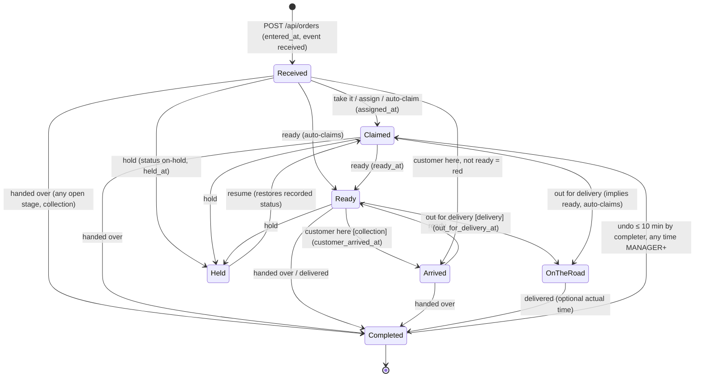

# Phase N — The Operations Centre

**Status (2026-09-13):** **N0–N9b Built** on `main` (PRs #185–#198). All fourteen packages merged in order N0 → { N1 ‖ N2 ‖ N8 } → N3a → N3b → { N4a ‖ N7 } → N4b → N6 → { N5a ‖ N7 } → N5b → N9a → N9b; see [`BRIEF_STATUS.md`](./BRIEF_STATUS.md) for the per-package table and PR numbers, and [`GAPS_BACKLOG.md`](./GAPS_BACKLOG.md#operations-centre--found-during-the-phase-n-review-2026-09-11) for which of the pre-existing gaps found during the review this phase actually closed. Sixteen questions were put to the owner on 2026-09-12 and answered; § *Owner's answers* records them and § *Changes from revision 2* lists what moved (re-settlement on re-complete, the default-owner rule, no checkout completion chip, server push instead of database polling, expenses wired, `/operations` only). This is the L5 spec that [`PHASE_L_SHIFTS_AND_DAILY_CLOSE.md`](./PHASE_L_SHIFTS_AND_DAILY_CLOSE.md) said must exist before anything is built. Revision 1 (the first commit on PR #184) was reviewed by three independent designs, a judge panel and five adversarial critics (accessibility and devices; data integrity, concurrency and time; CI gates and scope; cleanup; floor reality); § *Changes from revision 1* lists what moved. **Depends on:** Phase L (L1–L4 built). **Mock:** the owner's artifact "Arcarna Operations Centre" (form beside a Collection | Delivery card board, final colours).

Ten work packages in fourteen PRs. **PR1 is on the floor the day it merges**: two lanes of coloured, ticking cards over the fields the orders table already has, with one-tap Handed over / Delivered. Everything it replaces is deleted by the PR that completes the replacement.

---

## Why this phase exists

The shop is live. Open Orders is a list: it says what exists, not what needs doing. Nobody can see at a glance who is looking after an order, whether it is on time, when the customer is coming, or that a delivery promised for 17:30 is now 17:44 and still on the shelf. Completion happens on that screen and earns the completer 90 % of the commission, so it is the most important screen in the building and the least useful.

The owner asked for a McDonald's-style operations board: orders as cards in a Collection area and a Delivery area, colour-coded, with running clocks, the cashier who is dealing with each one, visual and audible alerts when something needs a person (assigned to you; due in ten minutes; late), cashiers assigned to areas so alerts are personal, the order form on the same screen because there is room, reporting on timing and issues afterwards, full testing, and old code gone when it is replaced.

## The idea, reviewed

**Right, and kept exactly as asked:** cards in two lanes by `fulfilment_method`; colour as the first signal with running clocks; one glance, one tap; the form beside the board; timing captured as facts; station-scoped personal alerts; report on it afterwards.

**Missing, and added** (each is small and each closes a real hole):

| Gap | What is added |
|---|---|
| Nothing records a promised time at creation; the only writer (`OrderOpsDialog`) has been unreachable since PR #136 | Due-time chips on the payment step (+5 … +60 or a time); "set a due time?" chip on the new card |
| Nothing records ready / arrived / dispatched / held | Stage timestamps on `orders`, each mirrored by an `order_events` row |
| No "who is dealing with it" separate from the two commission columns | `assigned_user_id`, atomic Take it, Pass to…, auto-claim on work |
| A walk-in coffee would become a three-tap card that alerts the whole station | Every sale goes to the board (owner's call), but **Handed over** is one tap on any open collection card, the card is already on its owner's list, and no alerts fire on a fresh till order while its owner is present |
| Every till-keyed order is `channel='pos'` — phone and WhatsApp orders are invisible | Walk-in / Phone / WhatsApp chip on the payment step |
| Two taps on Delivered can both settle; a claim built like today's PATCH lets two cashiers both win | `SELECT … FOR UPDATE`, claim as `UPDATE … WHERE assigned_user_id IS NULL`, one completion transaction |
| Notifications are org-wide with one read flag | Per-person alert rows, resolved by a colleague's action, acknowledged server-side, reportable |
| 800 req / 15 min per IP; the whole shop is one IP | The board poll is exempt; board taps invalidate only the board |
| The 60-minute red text is 3.05:1 (GAP-U5-04); the a11y job has no orders so it never sees it | Every colour pair proven by a token-maths unit test and by a seeded a11y spec from PR1 |
| The service worker serves cached JSON as 200 when the server is down | The board is never cached; staleness is judged from `serverNow` |
| Website deliveries land in Collection | `pickup → collection` and a due time on every web order |
| Open orders from yesterday would sit red at the top of the lane at 06:00 | A "Yesterday" strip with no clocks, no alerts, and an honest "handed over yesterday?" on completion |

**Changed from the owner's wording, and why** — see *Decisions locked* and the colour section; the short version: no new statuses (money keys on `status='completed'`), green = completed, "dark blue = ready" becomes a second, lighter blue because the app is a single dark theme where a dark blue band is invisible, "light blue = held" is carried by a dashed light-blue border and chip rather than a tinted body, and the blue pulse means "you have something to do now", not "on time".

---

## Decisions locked

| Rule | Value |
|---|---|
| Terminal status | `completed` stays the only settling status. Handed over / Delivered are the existing completion transaction with a label. No `ready`, `delivered` or `cancelled` status. Stages are **timestamps** on `orders`, written once, each mirrored by an `order_events` row in the same transaction. |
| Completion | Extracted once into `completeOrderTx(tx, lockedRow, actor)`; the PATCH route and the transition route both call it inside the same lock. Whoever completes is `completed_user_id` (90 %) — Phase L, not reopened. Every sale goes to the board (owner, Q6): a counter sale is one tap on **Handed over** on its card. |
| Completed rows | Accept only `reopen` (and idempotent repeats). No hold / ready / arrived / out-for-delivery on a settled row — from the transition route, from PATCH, from anywhere. |
| Reopen (Undo) | ≤ 10 min by the completer, any time **within the same trading day** by MANAGER+; refused (409 `ORDER_REOPEN_CLOSED_DAY`) once that trading day has closed — use a refund or a new order. Refused (409) if a refund exists or the credit row has payments. Voids the open credit leg in the same transaction and writes a `reopened` event carrying the prior settlement. **Re-completing re-settles** (owner, Q3): `settled_total`, `settled_at` and `completed_user_id` are rewritten from the current lines, tenders and completer, the credit leg is re-opened for the current tick amount, and a `resettled` event records old and new. Safe because commission is computed at the day's close from the final columns; that is why reopen stops at the close. |
| Assignment | `assigned_user_id` is the auth subject (`req.user.id`), the same string `input_user_id` / `completed_user_id` hold. Never written into commission columns. Claim is atomic; Ready / Out for delivery on an unassigned card claims it for the actor; completion never assigns. **Default owner on create** (owner, Q4/Q16): the person who keyed it in, if they are present on the order's station (or Both); otherwise the present member of that station with the fewest open orders; otherwise Unassigned with a station alert. The inputter can pick someone else at the till, and any cashier can pass or release an order at any time; the break toggle hands theirs over. Org toggle `ops_auto_claim_on_create`, default **on**. |
| Ready | Derived from `ready_at` only. `awaiting-customer` is retained as a status for the website settings and history; choosing it on the board's status select runs the `ready` transition; PATCH writing it stamps `ready_at` too. |
| Due time | `eta_given` is the promise; `revised_eta` overrides it when a delay is flagged; `original_eta` frozen on first write. Sent to the server as **minutes or a wall-clock time on the order's date**, never as an absolute instant from the tablet. No promise → the org SLA is the fallback for colour only: the card says "No time given", counts elapsed, never counts down, never alerts (unless the org turns that on). |
| Late vs delayed | Late is computed (promise passed, work not done; red). Delayed is declared (staff moved the promise and it is still ahead; orange). Both reported. |
| Concurrency | No version token. Every stamp is first-write-wins under `FOR UPDATE` and returns `changed:false` on repeat; only `claim` can lose (409 naming the winner). The response always carries the fresh row and the client applies it. |
| Events | Stage taps publish a new `OrderStageChanged` outbox event with **no** required workers. `OrderStatusChanged` is published only when `status` actually changes (complete, hold, unhold, reopen). |
| Colours | Tokens only. Truth Blue on time · **second blue** (`--ops-ready`) ready / on the road · `--danger` late and customer-waiting · `--warning` delayed · dashed light-blue border + chip held · `--success` completed · bright-blue pulse only while an alert for *you* is open. Every state has a chip with words and an icon; body text is never tinted or reduced in opacity; every pair is asserted by a unit test on the token values. The app is one theme (Liquid Metal, dark). |
| Time | All new columns naive `timestamp` UTC like every existing column. Rendered in the org timezone. "Today" is the trading day (06:00–06:00). Clocks tick against `serverNow`. |
| Live data | **Server push** (owner, Q10): an in-process `opsBus` (one PM2 fork, `ecosystem.config.cjs` instances: 1; if that ever grows, the bus moves to Postgres `LISTEN/NOTIFY`) emits a delta after every committed transition, create, delay edit and alert sweep; `GET /api/orders/board/stream` (SSE) fans it out per org. A tablet loads the board once on connect and then receives deltas — zero database reads while nothing changes. A reconciliation poll every `ops_reconcile_poll_seconds` (default 60) and on becoming visible guards against a missed event. Both endpoints exempt from the shared-IP limiter, never cached by the service worker; screen wake lock while the board is open. Alerts ride the same stream. |
| Screen | `/operations` only (owner, Q11): fixed 42 % form pane + board when the main area is ≥ 900 px (the sidebar collapses to its icon rail while the board is mounted); Board / New order tabs below. `/create-order` and `/pos` redirect to `/operations?pane=order`; `/open-orders` and `/orders` redirect to `/operations`. One nav entry, **Operations**. No feature flag. |
| Keyboard | Tab / arrows / Enter / focus-scoped `/` only. No single-letter shortcuts (the barcode scanner shares the page). Enter is ignored inside a scanner burst. |
| Stations & presence | `ops_staff (org_id, user_id)`: station (collection / delivery / both), sticky, plus `last_seen_at` written by the board poll and an on-break flag. Recipients of station alerts are members seen in the last 15 min, else everyone on the station. |
| Reports | ARC-T1-003 retires (the board is that screen). ARC-T1-005 Delay Log stays, fed from events. ARC-T2-005 Timing and ARC-T1-006 Order Issues are new. ARC-T2-003 Satisfaction keeps its feed (rating chips on the completed card). |
| Cleanup | Everything the board replaces is deleted in the PR that replaces it, with its tests. Unrelated dead code found on the way goes in N9a. |
| Migrations | 065 = N2 (data), 066 = N5a (alerts). Migrations are re-applied on every deploy, so every statement is idempotent, including the backfill. |
| Order expenses | Wired in this phase (owner, Q12): the checkout expenses reach the server and are inserted as `order_expenses` rows inside the create transaction, the same path personal use already takes; they are costs, never part of the order total. |

## What the code does today, and where it conflicts

| # | Finding | Where |
|---|---|---|
| G1 | No assignment concept; attribution is `input_user_id` (loaded) and `completed_user_id` (completed, frozen). | `shared/schema.ts` orders; `server/routes/orders.ts` |
| G2 | No stage timestamps beyond `entered_at`, `created_at`, `settled_at`. | same |
| G3 | `eta_given` is only written by `OrderOpsDialog`, unreachable since PR #136. | `client/src/pages/orders.tsx` L91, L222–251 |
| G4 | `PATCH /api/orders/:id` reads the row outside the transaction on the pooled `db`, decides `isSettling` from it, and `creditLegTotal` borrows a second pool client inside the tx (pool max 10 — self-deadlock under ~10 concurrent completions). Two Delivered taps both settle; the second moves `completed_user_id`. | `server/routes/orders.ts` L646–768; `server/services/creditLedger.ts` L67–78; `apps/server/src/db/index.ts` L12–46 |
| G5 | `orders.updated_at` is a DB default at microsecond precision and PUT/`save()` never touches it — useless as a version token. | `apps/server/src/db/repos.ts` L75–113 |
| G6 | Migrations are re-applied on every deploy (`apply-migrations-pm2.sh`, CI loop with `ON_ERROR_STOP=0`), so a non-idempotent backfill fabricates data on each release and CI cannot see it because `db:push` already built the tables. | `scripts/apply-migrations-pm2.sh`; `.github/workflows/ci.yml` L92–99 |
| G7 | `org_notifications` is org-wide with one `read_at`. | `shared/schema.ts` L1948 |
| G8 | The worker loop wakes for queued jobs only; housekeeping is every 15 min. | `server/workers/index.ts` L343–352 |
| G9 | 800 req / 15 min per IP; every tablet shares one IP. `skip` is a one-liner. | `server/security.ts` L53–58 |
| G10 | `OrderStatusChanged` fans out to four workers and the automation rule engine, which matches rules even when `from === to`. | `shared/schema.ts` L2581; `server/services/automationEngine.ts` L129 |
| G11 | The service worker answers API GETs from cache with the original 200 when the network fails; `navigator.onLine` stays true when the WAN is down. | `client/public/sw.js` fetch handler |
| G12 | `apps/server/src/db/schema.ts` lacks five operational columns; the drift audit ignores single-file columns. `organizations` exists there as a four-column stub. | `apps/server/src/db/schema.ts` L84–88 |
| G13 | The 60-minute red label is 3.05:1 (GAP-U5-04); the a11y job seeds no orders (`scripts/seed.ts` inserts none) so it never renders one. axe `color-contrast` covers text only and returns *incomplete* on gradient surfaces (`bg-metal-surface`). | `client/src/components/orders-row.tsx` L70; `.github/workflows/ci.yml` a11y job comment |
| G14 | On the real surface (`.liquid-metal`, card hsl(215 12 % 13 %)): `--truth-blue-strong` is 2.42:1 (invisible band), `--truth-blue-subtle` tint is 1.22:1, and muted text on a subtle-tinted card is 4.24:1. The app has no light theme. | `client/src/styles/tokens/arcarna.css` L14–17; `liquid-metal.css` L37–59; `Layout.tsx` L99 |
| G15 | `useBarcodeScanner` lets every keydown of a burst bubble on `window` before it consumes the trailing Enter; anything keyed to bare letters or Enter on a focused card would fire from a scan. | `client/src/hooks/useBarcodeScanner.ts` L60–72; `pos.tsx` L485 |
| G16 | Chrome grants user activation on `pointerup` / `touchend` / `click` / `keydown`, not on touch `pointerdown`; `posAudio.ts` never unlocks the context at all. | `client/src/lib/posAudio.ts` L1–12 |
| G17 | The desktop sidebar is 256 px open / 64 px collapsed from localStorage; a 1194 px tablet has 938 or 1130 px of main width depending on a toggle. | `Layout.tsx` L159; `NavigationContext.tsx` L12–19 |
| G18 | The POS layout is chosen by five JS `isMobile` branches on the viewport, not by CSS breakpoints alone. | `pos.tsx` L103, L860–979; `hooks/use-mobile.tsx` L9 |
| G19 | Website orders never pass `fulfilmentMethod` (site says `pickup`) and are inserted with `settings.defaultOrderStatus`, which may be `awaiting-customer`. | `server/services/website.ts` L568–586; `shared/website.ts` L129, L163 |
| G20 | The order form never sends `channel`; the domain schema defaults it to `pos`. | `packages/domain/src/schemas.ts` L34 |
| G21 | Offline replay: `_offlineQueuedAt` is honoured only with a replay token set by code that is already unmounted (`shift-open.tsx`); a replayed order is born "received now". | `server/middleware/requireActiveCashierShift.ts` L98–113; `client/src/lib/sync-service.ts` L9–15 |
| G22 | The daily close reads completed rows only; open orders from the day are neither closed nor reported. | `server/services/dailyClose.ts` L173–184 |
| G23 | `SatisfactionDialog` is the only writer of `POST /api/satisfaction`, which feeds ARC-T2-003. | `client/src/components/reports/SatisfactionDialog.tsx` L56 |
| G24 | `commandPaletteIndex.ts` imports the `OrdersListOrder` type from `orders-row.tsx`. | `client/src/lib/commandPaletteIndex.ts` L18 |
| G25 | `vitest.config.ts` excludes twelve DB suites unless `DATABASE_URL` is set — a naive `unit-db` job would switch all twelve on against an unseeded database. | `vitest.config.ts` L17–33 |
| G26 | `tests/visual/pos-tablet.spec.ts` asserts classes no TSX renders; the `visual` Playwright project is not run by CI. | `playwright.config.ts` L96 |
| G27 | `queue_position` will have no reader or writer after this phase; `GET /api/delay-causes` has none today; `startReconciliationJob`, `createTransactionalPublisher`, `effectiveCommissionRate` (imported unused in `routes/cashiers.ts`), `ReportRef`, `newCheckout` flag, `applyViewState`, `ShiftOpenModal`, `CashierShiftBadge` are dead now. | see *Cleanup* |

---

## Order lifecycle & timing model



Every arrow is one call to `POST /api/orders/:id/transition`: one transaction, one `order_events` row, one outbox event. Timestamps are written once (first write wins) except `assigned_*` (changes on reassignment) and `held_at` (cleared on resume; history stays in events).

| Milestone | Column | Written by |
|---|---|---|
| Received | `entered_at` (exists; `created_at` fallback) | insert; offline replay uses `_offlineQueuedAt` |
| Promised | `eta_given` (+ `original_eta` frozen) | `POST /api/orders dueInMinutes\|dueTime`, `set_due` |
| Current promise | `revised_eta`, `delay_*` (exist) | `PATCH …/operations` |
| Dealing with it | `assigned_user_id`, `assigned_at`, `assigned_by_user_id` | `claim` / `assign` / auto-claim |
| Held | `held_at` (null when not held; reason in `order_events.meta`) | `hold` / `unhold`; PUT edits that move status sync it |
| Ready | `ready_at` | `ready`, implied by `out_for_delivery`, PATCH `awaiting-customer` |
| Customer arrived | `customer_arrived_at` (collection) | `arrived` |
| Out for delivery | `out_for_delivery_at` (delivery) | `out_for_delivery` |
| Completed | `settled_at`, `completed_user_id` (exist, frozen) | `completeOrderTx` |

**Derived** (`shared/orders/opsState.ts`, pure, `now` injected): `receivedAt = entered_at ?? created_at` · `dueAt = revised_eta ?? eta_given ?? null` · `dueSource = dueAt ? 'promise' : 'sla'` · `dueEffective = dueAt ?? receivedAt + (collection ? prepSla : deliveryLead)` (pre-orders: never SLA — they have a promise by rule) · `handoverAt = COALESCE(order_events.completed.meta.actualAt, settled_at)`.

### Card state — `deriveCardState(order, now, settings)`, first match wins

| # | State | Rule | Band / chip fill | Chip text | Big clock |
|---|---|---|---|---|---|
| 1 | `completed` | `status='completed'` | `--success`, text `--ops-completed-text` | DONE · check | static "Done HH:MM · took m:ss" |
| 2 | `carried-over` | trading day of `receivedAt` < today and not completed | neutral, `--border` outline | YESTERDAY · calendar | none |
| 3 | `scheduled` | `date_kind='preorder'` and its trading day > today | neutral, `--border` outline | FOR FRI 12 SEP | none |
| 4 | `held` | `status='on-hold'` | neutral body, dashed `--truth-blue-bright` border, chip `--ops-held` with dark text | HELD · pause (+ red "Past due m:ss" / "Customer here" chips when true) | held m:ss |
| 5 | `customer-waiting` | collection, `customer_arrived_at` set, `ready_at` null | `--danger`, white text | CUSTOMER WAITING · alert | waiting m:ss |
| 6 | `late` | `now > dueEffective + grace` and (collection: `ready_at` null · delivery: not completed) | `--danger`, white | LATE m:ss (promise) / OVERDUE · NO TIME GIVEN (sla) | late by m:ss (promise) / elapsed (sla) |
| 7 | `delayed` | `delay_flag` and `revised_eta > now` | `--warning`, text `--ops-delayed-text` | DELAYED · clock | new time in m:ss |
| 8 | `ready` | `ready_at` set; delivery sub-label ON THE ROAD when dispatched | `--ops-ready`, dark text | READY · check / ON THE ROAD · truck (+ "Customer late m:ss" chip past due) | ready m:ss / ETA in m:ss |
| 9 | `due-soon` | `dueSource='promise'` and `dueEffective − now ≤ dueSoonLead` | `--truth-blue`, bold clock | DUE SOON · clock | due in m:ss |
| 10 | `on-time` | otherwise | `--truth-blue` | ON TIME (promise) / NO TIME GIVEN (sla) | due in m:ss (promise) / elapsed (sla) |

A small secondary clock shows elapsed since received (rows 1–3 excepted). The pulse (`data-alert="true"`) is applied only while an open alert addressed to the viewer exists on the card, independent of state. `urgent` is a badge and sort key, never a colour. Backdated open orders render on-time with a "Backdated" badge and never go late.

**Collection vs delivery.** Collection lateness stops at `ready_at` (a late customer is not our lateness). Delivery lateness runs until completion. Customer here exists only on collection; Out for delivery only on delivery.

**Pre-orders.** `date_kind='preorder'` requires a due time on the order's trading day (400 otherwise, from every path including the website). In the Scheduled strip until their trading day, no clocks, no alerts; on the day they are on-time until their promise.

**Carried-over.** At 06:00 anything still open from earlier trading days moves to a collapsed "Yesterday (n)" strip per lane: no clocks, no alerts, excluded from `lateNow`. Completing one asks "Handed over yesterday?" and stores the actual time on the `completed` event (`meta.actualAt`, ≥ `receivedAt`, ≤ now); reports use `handoverAt` and exclude carried-over rows from on-time %. The daily close summary gains "n orders still open from this day".

**Legality** (`shared/orders/opsTransitions.ts::assertTransition`): repeats → `200 { changed:false }`, no event · `arrived` on a delivery or `out_for_delivery` on a collection → `409 ORDER_TRANSITION_INVALID` · anything but `reopen` on a completed row → 409 · `complete` needs no prerequisite on an open row · `hold` on open rows only · `set_due` only while `eta_given IS NULL` (afterwards it is a delay) · `unready` clears `ready_at` only · `unhold` restores the status recorded on the matching `held` event, falling back to `pending`.

**Time.** Rendered via `Intl` in `organizations.timezone`; "today" from `currentTradingDay` / `tradingDayBounds`. Clocks: `serverNow + (performance.now() − receivedAtPerf)`, re-synced on every poll. Due times are resolved on the server: `dueInMinutes` against `receivedAt`, `dueTime` via a new minute-granular `localInstantAt(date, 'HH:MM', tz)` beside `localInstant`.

### Colour resolution (the owner listed both "dark blue = completed" and "green = completed")

**Green = completed** — the existing badge, Control Centre and reports already use `--success`. **The owner's "dark blue" = ready / on the road**, but the app is a single dark theme: on the card surface `--truth-blue-strong` measures 2.42:1 and cannot be told from `--truth-blue` (1.33:1 apart). So "dark blue" is rendered as a **second, lighter blue** — `--ops-ready: hsl(196 85% 58%)` with dark text — clearly separable from on-time Truth Blue and from the bright alert ring, with a check icon and a READY chip so the meaning never rests on the hue. **Light blue = held** is carried by a dashed `--truth-blue-bright` border and a light-blue chip with dark text; the card body stays neutral because muted text on a tinted body is 4.24:1. **Orange** means only delayed. **Red** is late and customer-waiting. **Due soon is not an eighth colour**: it stays Truth Blue with a DUE SOON chip and a bold countdown; **bright blue is reserved for the pulse**, which means "an alert for you is open on this card". Under reduced motion the pulse becomes a thick bright-blue left bar plus a bell icon and the alert text.

---

## Data model & migration

Every `orders` column goes in **both** `shared/schema.ts` and `apps/server/src/db/schema.ts` with identical builders; the four delay columns still missing from the snake_case file (`delay_cause`, `original_eta`, `delay_notification_sent_at`, `delay_resolution`) are declared there in the same PR; `queue_position` is dropped, not declared. `order_events`, `ops_staff`, `ops_alerts` and the `organizations.ops_*` columns live in `shared/schema.ts` only (the snake_case `organizations` is a stub and the paired-table rule is scoped to `orders`). Indexes and CHECKs are also declared in the pgTable third argument (partial indexes only — no expression indexes, so `audit-schema-push-drift` round-trips). User ids are `varchar(255)` with no FK (migration 057 rationale). All new columns nullable or defaulted (`phase2d-seed` inserts bare orders).

**`migrations/065_operations_centre.sql`** (N2). Header: "Architectural principle: stages are timestamps, not statuses. This file is re-applied on every deploy and must stay idempotent. Not wrapped in a transaction (CONCURRENTLY)."

```sql
CREATE TABLE IF NOT EXISTS order_events (
  id uuid PRIMARY KEY DEFAULT gen_random_uuid(),
  org_id uuid NOT NULL REFERENCES organizations(id) ON DELETE CASCADE,
  order_id uuid NOT NULL,                      -- no FK: 'deleted' rows outlive the order
  kind varchar(32) NOT NULL,
  at timestamp NOT NULL DEFAULT now(),
  user_id varchar(255),                        -- actor; NULL = system / web
  meta jsonb
);
DO $$ BEGIN IF NOT EXISTS (SELECT 1 FROM pg_constraint WHERE conname='order_events_kind_check') THEN
  ALTER TABLE order_events ADD CONSTRAINT order_events_kind_check CHECK (kind IN
   ('received','assigned','unassigned','ready','unready','arrived','out_for_delivery','held','unheld',
    'delayed','delay_cleared','due_set','completed','reopened','status_changed','deleted'));
END IF; END $$;
CREATE INDEX IF NOT EXISTS order_events_order_idx ON order_events (org_id, order_id, at);
CREATE INDEX IF NOT EXISTS order_events_kind_idx  ON order_events (org_id, kind, at);
CREATE INDEX IF NOT EXISTS order_events_actor_idx ON order_events (org_id, user_id, at);

ALTER TABLE orders
  ADD COLUMN IF NOT EXISTS assigned_user_id varchar(255),
  ADD COLUMN IF NOT EXISTS assigned_at timestamp,
  ADD COLUMN IF NOT EXISTS assigned_by_user_id varchar(255),
  ADD COLUMN IF NOT EXISTS held_at timestamp,
  ADD COLUMN IF NOT EXISTS ready_at timestamp,
  ADD COLUMN IF NOT EXISTS customer_arrived_at timestamp,
  ADD COLUMN IF NOT EXISTS out_for_delivery_at timestamp;
ALTER TABLE orders DROP COLUMN IF EXISTS queue_position;
CREATE INDEX CONCURRENTLY IF NOT EXISTS orders_assigned_open_idx ON orders (org_id, assigned_user_id) WHERE status <> 'completed';
CREATE INDEX CONCURRENTLY IF NOT EXISTS orders_eta_open_idx      ON orders (org_id, eta_given)   WHERE status <> 'completed';
CREATE INDEX CONCURRENTLY IF NOT EXISTS orders_revised_open_idx  ON orders (org_id, revised_eta) WHERE status <> 'completed';
CREATE INDEX CONCURRENTLY IF NOT EXISTS orders_nodue_open_idx    ON orders (org_id, entered_at)  WHERE status <> 'completed' AND eta_given IS NULL AND revised_eta IS NULL;
CREATE INDEX CONCURRENTLY IF NOT EXISTS orders_settled_recent_idx ON orders (org_id, settled_at);

-- ASSUMED backfill, one shot by construction: the second run updates zero rows and so inserts nothing.
WITH backfilled AS (
  UPDATE orders o SET ready_at = COALESCE(o.updated_at, o.created_at)
  WHERE o.ready_at IS NULL AND o.status = 'awaiting-customer'
    AND NOT EXISTS (SELECT 1 FROM order_events e WHERE e.order_id = o.id AND e.kind = 'ready')
  RETURNING o.id, o.org_id, o.ready_at)
INSERT INTO order_events (org_id, order_id, kind, at, user_id, meta)
SELECT org_id, id, 'ready', ready_at, NULL, '{"assumed":true}'::jsonb FROM backfilled;

CREATE TABLE IF NOT EXISTS ops_staff (
  org_id uuid NOT NULL REFERENCES organizations(id) ON DELETE CASCADE,
  user_id varchar(255) NOT NULL,
  station varchar(16) CHECK (station IS NULL OR station IN ('collection','delivery','both')),
  station_set_at timestamp,
  last_seen_at timestamp,
  on_break boolean NOT NULL DEFAULT false,
  PRIMARY KEY (org_id, user_id)
);

ALTER TABLE organizations
  ADD COLUMN IF NOT EXISTS ops_prep_sla_minutes integer NOT NULL DEFAULT 20,
  ADD COLUMN IF NOT EXISTS ops_due_soon_lead_minutes integer NOT NULL DEFAULT 10,
  ADD COLUMN IF NOT EXISTS ops_late_grace_minutes integer NOT NULL DEFAULT 5,
  ADD COLUMN IF NOT EXISTS ops_delivery_lead_minutes integer NOT NULL DEFAULT 45,
  ADD COLUMN IF NOT EXISTS ops_auto_claim_on_create boolean NOT NULL DEFAULT true,
  ADD COLUMN IF NOT EXISTS ops_reconcile_poll_seconds integer NOT NULL DEFAULT 60,
  ADD COLUMN IF NOT EXISTS ops_alert_on_sla_due boolean NOT NULL DEFAULT false,
  ADD COLUMN IF NOT EXISTS ops_keep_screen_awake boolean NOT NULL DEFAULT true;

DELETE FROM saved_views WHERE page = 'orders';   -- order saved views retire in favour of the board filter
```

`meta` shapes: `assigned {from,to,by,auto?}` · `held {reason,fromStatus}` · `unheld {heldSeconds,toStatus}` · `delayed {cause,reason,revisedEta,customerTold}` · `delay_cleared {resolution}` · `due_set {dueAt,source}` · `completed {label:'handed_over'|'delivered', fromStatus, actualAt?}` · `reopened {settledTotal,completedUserId,creditVoided}` · `deleted {customerName,total,fulfilmentMethod,status}` · `status_changed {from,to,via:'patch'|'put'|'bulk'}`.

**`migrations/066_ops_alerts.sql`** (N5a):

```sql
CREATE TABLE IF NOT EXISTS ops_alerts (
  id uuid PRIMARY KEY DEFAULT gen_random_uuid(),
  org_id uuid NOT NULL REFERENCES organizations(id) ON DELETE CASCADE,
  order_id uuid NOT NULL,
  user_id varchar(255) NOT NULL,               -- always a person (station alerts are one row per member)
  station varchar(16) NOT NULL DEFAULT '',     -- provenance: '' = addressed personally
  kind varchar(24) NOT NULL,                   -- assigned|due_soon|late|customer_waiting|delayed|new_unassigned
  due_key varchar(32) NOT NULL DEFAULT '',     -- ISO of the promise the alert was computed from; a revision is a new cycle
  due_at timestamp,
  created_at timestamp NOT NULL DEFAULT now(),
  acked_at timestamp,
  acked_by_user_id varchar(255),
  resolved_at timestamp,
  resolved_by_user_id varchar(255),
  resolved_reason varchar(24)                  -- claimed|ready|completed|deleted|held|rolled_over|reassigned
);
CREATE UNIQUE INDEX IF NOT EXISTS ops_alerts_once_idx ON ops_alerts (org_id, order_id, kind, user_id, due_key);
CREATE INDEX IF NOT EXISTS ops_alerts_open_idx ON ops_alerts (org_id, user_id) WHERE acked_at IS NULL AND resolved_at IS NULL;
```

Scripts: `order_events`, `ops_staff` (065) and `ops_alerts` (066) added to `scripts/migration-sanity-check.ts` REQUIRED_TABLES. `scripts/audit-schema-drift.mjs` gains `PAIRED_TABLES = ['orders']`: a column of a paired table present in only one file fails, and `withTimezone` must match. N2's DoD applies 065 twice against the seeded DB and asserts `count(*) FROM order_events` is unchanged on the second run.

---

## API

All under `scoped`. Appended to `RBAC.md`:

| Action | CASHIER+ | MANAGER+ only |
|---|---|---|
| `claim`, `unclaim` (own), `ready`, `arrived`, `out_for_delivery`, `complete`, `hold`, `unhold`, `set_due`, `reopen` ≤ 10 min (completer), `unready` ≤ 10 min (the person who marked it), station / break (self), alert ack (own), `assign` when passing on one's own order | ✓ | |
| `assign` to someone else, `unclaim` someone else's, `reopen` / `unready` after 10 min or of someone else's, station for others, PUT / DELETE | | ✓ |

The CI gate for this table is `server/__tests__/orderTransitionRoles.test.ts` (captureRoutes / runGuard). `roleEnforcement.spec.ts` is self-skipped under `DEV_AUTH_BYPASS`; its `UNGUARDED_MUTATIONS` / `MANAGER_AND_UP` lists are updated as documentation.

**`GET /api/orders/board`** (N3a; registered before `GET /api/orders/:id`; on the limiter skip list; never cached by `sw.js`; loaded once on connect and on reconnect, then only as the reconciliation poll every `reconcilePollSeconds` and on `visibilitychange`):

```ts
{ serverNow, tradingDay, timezone,
  settings: { prepSlaMinutes, dueSoonLeadMinutes, lateGraceMinutes, deliveryLeadMinutes, autoClaimOnCreate, alertOnSlaDue, keepScreenAwake, reconcilePollSeconds },
  me: { userId, station, onBreak },
  staff: [{ userId, name, role, station, onBreak, lastSeenAt, present, openCount }],
  orders: BoardOrder[],   // status <> 'completed' OR settled_at >= now() − 120 min; pre-orders and carried-over included
  alerts: OpsAlert[],     // N5: my rows, unacked, unresolved, whose order is in `orders`
  summary: { open, collection, delivery, unassigned, mine, lateNow, dueSoonNow, readyWaiting, carriedOver, completedToday } }
BoardOrder = { id, shortCode, customerId, customerName, customerPhone, total, paymentMethod, channel, status, fulfilmentMethod,
  dateKind, createdAt, enteredAt, etaGiven, originalEta, revisedEta, delayFlag, delayCause, delayReason, delayNotificationSentAt, delayResolution,
  assignedUserId, assignedUserName, assignedAt, heldAt, readyAt, customerArrivedAt, outForDeliveryAt, settledAt, handoverAt,
  inputUserId, inputUserName, completedUserId, completedUserName, locationId, itemCount, itemsPreview, updatedAt }
```

Built by `server/services/opsBoard.ts` on the snake_case schema; one `resolveUserNames` call (gains an `allowed_users.name` → email fallback; seeded orgs have no `users` rows). `staff` = `allowed_users` of the org minus CUSTOMER joined to `ops_staff`; `present` = `last_seen_at` within 15 min; `openCount` = claimed open orders. The stream connection and its heartbeats touch `ops_staff.last_seen_at` through an in-memory throttle (one write per org:user per 60 s). Client query key `['/api/orders/board']`; deltas from the stream are applied straight into that cache; board taps apply the returned row and invalidate `['/api/control-centre']` only.

**`GET /api/orders/board/stream`** (N3a; SSE). `server/services/opsBus.ts` is an `EventEmitter` keyed by `orgId`; `orderTransitions`, the create route, `PATCH …/operations` and `sweepOpsAlerts` emit **after commit** `{ type: 'order', order: BoardOrder } | { type: 'order_removed', id } | { type: 'alert', alert } | { type: 'staff', staff } | { type: 'summary', summary }`. The route: `scoped`, `Content-Type: text/event-stream`, `res.flushHeaders()` and `res.flush()` after every write (global `compression()` would otherwise buffer), a `: ping` comment every 25 s (nginx `proxy_read_timeout 120s`, Cloudflare drops idle proxied connections at ~100 s), `retry: 3000`, and an `id:` per event so `Last-Event-ID` on reconnect replays from a 5-minute in-memory ring buffer per org or tells the client to reload the board. `client/public/sw.js` returns before `respondWith` for `Accept: text/event-stream` and for the stream path (and `CACHE_VERSION` is bumped); nginx gets `proxy_buffering off` for this location in the deploy example. Org scoping is the emitter key: an event for org B can never reach org A's stream (tested). Client `useOpsBoard` opens one `EventSource` per tab, reloads the board on `open` and on any gap in `id`, applies deltas, and keeps the reconciliation poll. Four to eight tablets idle = four to eight open sockets and zero database reads until something changes.

**`POST /api/orders/:id/transition`** (N3b; `server/routes/orderTransitions.ts` + `server/services/orderTransitions.ts`). Body `{ action, userId?, dueInMinutes?, dueTime?, reason?, actualAt?, label? }`, `action ∈ claim | unclaim | assign | ready | unready | arrived | out_for_delivery | complete | reopen | hold | unhold | set_due` (zod `transitionOrderSchema` in `shared/orders/opsTransitions.ts`). One `withTransaction`: `SELECT … FOR UPDATE` on the org-scoped row → `assertTransition` → the stamp (`SET ready_at = COALESCE(ready_at, now())`, compare RETURNING → `changed`) → auto-claim on `ready` / `out_for_delivery` when unassigned → `order_events` insert → alert resolution (N5a) → `publishEventTx(tx, 'OrderStageChanged', …)` (or `OrderStatusChanged` when status changed). `claim` is `UPDATE … WHERE assigned_user_id IS NULL RETURNING *`; zero rows → `409 { code:'ORDER_ALREADY_ASSIGNED', assignedUserId, assignedUserName }`. `complete` calls `completeOrderTx(tx, lockedRow, actor, { label, actualAt })` from `server/services/orderCompletion.ts` — extracted from PATCH L648–760 **and corrected**: `isSettling` and the credit decision come from the locked row, `creditLegTotal(tx, …)` takes the transaction client (same signature style as `openCreditForOrder`), no bare `db.` read inside; `settleBackdatedShift` stays post-commit (it is its own idempotent update). `reopen`: refuses when a refund exists, when the credit row has payments, or when the settlement's trading day has closed (`ORDER_REOPEN_CLOSED_DAY`); voids the credit leg; writes `reopened {settledTotal, settledAt, completedUserId, creditVoided}`; status → `completed.meta.fromStatus`. A later `complete` on that row **re-settles**: `completeOrderTx` sees the `reopened` event, rewrites `settled_total` / `settled_at` / `completed_user_id` from the current row and actor, re-opens the credit leg for the current tick amount, and writes `resettled {from, to}`. Response `{ order: BoardOrder, event: {id,kind,at}|null, changed }`. Errors: 400 zod, 404 org-scoped, 409 `ORDER_ALREADY_ASSIGNED` / `ORDER_TRANSITION_INVALID` / `ORDER_REOPEN_REFUSED`, 400 `CREDIT_CUSTOMER_REQUIRED`.

**`PATCH /api/orders/:id`** (kept): now `FOR UPDATE`, calls `completeOrderTx`, refuses non-reopen changes on completed rows, writes `status_changed` / `completed` / `reopened` / `held` / `unheld` events, stamps `ready_at` when writing `awaiting-customer`. **`PUT /api/orders/:id`** writes a `status_changed` event and syncs `held_at` when the engine moves status. **`DELETE`** writes `deleted` first. **`PATCH /api/orders/:id/operations`** (kept, fixed in N3b): transactional, `FOR UPDATE`, owns `delay_*` and `revised_eta` only (`etaGiven`, `originalEta`, `queuePosition` removed from the schema), writes `delayed` / `delay_cleared`, `delayFlag:false` requires `delayResolution`, `GET /api/delay-causes` removed. **`POST /api/orders`** accepts `dueInMinutes` | `dueTime`, `channel` (already in the domain schema), `assignedUserId` (the inputter's explicit choice at the till) and `expenses[]` (`{ category, description, amount }`, inserted as `order_expenses` rows in the same transaction — the personal-use path already does this), writes `received` and, under `ops_auto_claim_on_create`, applies the **default-owner rule** in the same transaction (inputter if present on the order's station or Both → least-loaded present station member → Unassigned + station alert) and writes `assigned {auto:true}`; honours `_offlineQueuedAt` for `entered_at` on the lazy-shift path without a token, bounded to the current trading day. **`server/services/website.ts`** passes `fulfilmentMethod` (`pickup → collection`), `dueInMinutes` = prep SLA (collection) / delivery lead (delivery), never `ready_at`. **`POST /api/orders/bulk`** and `handleOrderBulk` are removed (no caller after PR1). 

**`/api/operations/*`** (`server/routes/operations.ts`): `GET /staff` · `PATCH /station { station|null, onBreak? }` (self) · `PATCH /station/:userId` (MANAGER+, `recordAdminAudit('ops.station_set')`) · `PATCH /alerts/:id/ack`, `POST /alerts/ack-all` (own rows; N5a). "Hand over my orders…" is a client loop over `assign`; no endpoint.

**Settings**: `ops_*` keys in `orgProfilePatchSchema` (`shared/setup.ts`), the `updateOrgProfile` allow-list, projected by `GET /api/settings`. **Limiter**: `skip` adds `req.path === "/api/orders/board"`.

---

## Assignment, stations & presence

- **Take it** (`ops-claim-<id>`) is the default action on every unassigned open card; atomic; the loser sees "Sam took #4821" and the fresh row. **Unclaim** own any time; **Pass to…** (assignee) and **Assign** (MANAGER+) open an inline staff strip sorted station-match first, then present, then least loaded. Every change writes `assigned {from,to,by}` and, from N5, an `assigned` alert to the new person and resolves the station's `new_unassigned` rows.
- **Auto-claim on work**: Ready / Out for delivery on an unassigned card claims it for the actor (`auto:true`). Completion never assigns; "completed by someone other than the assignee" is an Order Issues row.
- **Station**: `ops_staff.station`, sticky, set from the header picker (`ops-station-picker`: Collection / Delivery / Both / None) and mirrored to `STORAGE_OPS_STATION` for an instant filter; managers change anyone's from the strip or User Access. No station → All and a non-blocking "Pick your station" hint.
- **Presence**: `last_seen_at` from the stream connection and heartbeats (and the reconciliation poll); `present` = seen ≤ 15 min. **On break** (`ops-break-toggle`) keeps the station but removes the person from recipients and suggestions and offers **Hand over my orders…** (loops `assign`) and **Release all** (loops `unclaim`).
- **Who is on** (`ops-staff-strip`): initials, station dot, "seen 3m", greyed when absent or on break.
- **Commission**: the card shows "Loaded by Ana · Sam dealing · completed by Sam"; whoever taps Handed over / Delivered is `completed_user_id` (90 %).

---

## Alerts & notifications

| Kind | To whom | When | Chime? |
|---|---|---|---|
| `assigned` | the new assignee (not on self-claim, and not the inputter when the default-owner rule picks them) | in the assign / create transaction | yes |
| `new_unassigned` | present members of the lane's station | 60 s after `received`, still unclaimed; skipped for the first 5 min while the loader is present | yes |
| `customer_waiting` | assignee, else present Collection members | on `arrived` when not ready | yes |
| `due_soon` | assignee (pulse only), else station (chime) | `dueEffective − lead`, promise only; skipped when promise − received ≤ lead + 2 min | station only |
| `late` | assignee (pulse only), else station (chime); also station when the assignee is absent 15 min | `dueEffective + grace`, promise only (org toggle for SLA-derived) | station only |
| `delayed` | assignee, when someone else declared it | in the `/operations` transaction | no |

One row per recipient; unique per `(order, kind, user, due_key)`. **Resolution in the same transaction**: claim / assign resolves `new_unassigned`, `due_soon`, `late` for everyone but the new assignee; `ready` resolves `customer_waiting` and, on collection, `due_soon` / `late`; `hold` resolves `due_soon`; `complete` / `delete` resolve all. The sweep resolves rows whose order is completed, deleted or carried over. `listFor` returns only unacked, unresolved rows whose order is in the board payload.

**Generation.** Transactional kinds via `opsAlerts.createInTx(tx, …)`. Time-based kinds via `sweepOpsAlerts(now)` in `server/services/opsAlerts.ts`, run on every active tick and folded into the runner's precise wake: `runTick` schedules `min(nextQueuedRunAt(), nextOpsAlertAt())`, where `nextOpsAlertAt()` is `MIN` over `orders_revised_open_idx` and `orders_eta_open_idx` (plus `orders_nodue_open_idx` joined to org SLAs only for orgs with `ops_alert_on_sla_due`), excluding backdated, pre-orders before their promise, and carried-over rows. Idempotent by the unique index; restarts cannot double-fire.

```mermaid
sequenceDiagram
    participant M as Manager tablet
    participant API as POST /api/orders/:id/transition
    participant DB as Postgres (one tx)
    participant W as Worker runner
    participant S as Sam's tablet (poll 10 s)
    M->>API: { action: 'assign', userId: sam }
    API->>DB: SELECT … FOR UPDATE; UPDATE assigned_*; INSERT order_events(assigned)
    API->>DB: INSERT ops_alerts(kind=assigned, user=sam) ON CONFLICT DO NOTHING; resolve new_unassigned rows
    API->>DB: publishEventTx(OrderStageChanged); COMMIT
    API-->>M: { order, event, changed:true }
    S->>API: GET /api/orders/board
    API-->>S: orders + alerts [assigned]
    S->>S: card pulses, one chime, rail entry "Assigned to you"
    Note over W: precise wake = min(next job, next promise − lead)
    W->>DB: sweepOpsAlerts(now): due_soon for orders with dueEffective − now ≤ lead (promise only)
    DB-->>W: 1 row (sam, due_key = promise ISO)
    S->>API: GET /api/orders/board (≤ 10 s later)
    API-->>S: alerts [assigned(acked), due_soon]
    S->>S: card DUE SOON + pulse; assignee's own due_soon is pulse only, no chime
    S->>API: PATCH /api/operations/alerts/:id/ack (or the card's primary action)
```

**Delivery.** Rows are pushed on the stream the moment the sweep or the transaction commits them; the client ticker moves the *card state* to due-soon at exactly T−lead regardless; the *alert* row appears within a second of the sweep. On `visibilitychange` → visible the board reloads and reconnects before the ticker resumes. `navigator.wakeLock.request('screen')` while mounted (org toggle, default on; re-requested on visible).

**Surface.** `OpsAlertTray` (`ops-alerts`) is a plain `<section aria-label="Alerts">` of buttons (`ops-alert-<id>`, Ack `ops-alert-ack-<id>`; tapping a row scrolls to and focuses the card). One visually-hidden board-level `role="status"` announcer receives a single debounced sentence per new alert or per focused-card state change; nothing else on the board is live. Never a toast (`TOAST_LIMIT=1`), never a dialog. The bell keeps org-wide Signals.

**Chime policy** (`shared/orders/opsAlerts.ts::chimeFor(delivered, now)`): at most one chime per poll delivery, highest severity wins (customer_waiting > late > assigned > new_unassigned > due_soon); rows older than 2 min pulse but never chime; the assignee's own due_soon / late never chime. Cross-tab dedupe is a `STORAGE_OPS_CHIMED` set of alert ids in localStorage (no leader election).

**Pulse.** `tailwind.config.ts` keyframe `ops-pulse` (box-shadow ring `--truth-blue-subtle` → `--truth-blue-bright`, 1.6 s) as `animate-ops-pulse motion-reduce:animate-none` on `[data-alert="true"]`; `usePrefersReducedMotion()` (initialised synchronously from `matchMedia`) sets `data-static="true"` → thick bright-blue left bar + bell icon + text; the `data-new` flash and scroll-into-view go through the same hook (`behavior: reduced ? 'auto' : 'smooth'`). Paused when hidden.

**Audio.** `posAudio.ts` gains `unlockAudio()` — listeners on `pointerup`, `touchend`, `click`, `keydown`, creating the context and calling `resume()` inside the handler, removed only once `ctx.state === 'running'` — and `playOpsChime(kind)` (two-tone 660/880 Hz assigned/new, three rising due-soon, low double 220 Hz late/customer-waiting; gain 0.1) returning `false` when not running → header chip "Tap to enable sound" (`ops-audio-toggle`). Mute pref `STORAGE_OPS_SOUND`. iPadOS hardware mute silences WebAudio: the pulse and text are always the primary channel. `WhatsAppPanel` is not touched.

---

## UI

**Route & nav.** `/operations` (`OperationsCentre`, lazy); `/open-orders` and `/orders` → `<Redirect to="/operations">`; `/create-order` and `/pos` → `<Redirect to="/operations?pane=order">` (the Order tab on a phone, the form pane otherwise; the phone sale journey asserts pathname `/operations`); `/open-orders/:id/refund` unchanged (back link → `/operations`). `nav-items.ts`: one entry `nav-orders` → label "Operations", href `/operations`, icon `LayoutGrid`; the `nav-pos` entry is removed and `VOCAB.createOrder` / `VOCAB.openOrders` → `VOCAB.operations`; tests that referenced `nav-pos` are migrated in N1. Palette page entry `/operations`; order rows → `/operations?order=<id>` (opens the sheet). `OperationsSnapshot` tiles → `/operations?lane=…`; `RecentOrders` "View all" and the `invoices.tsx` empty-state cta → `/operations`. No feature flag: PR1 replaces the route outright.

**Layout** (`OpsShell` in `operations.tsx`, slots `formSlot` / `headerExtras` / `alertsSlot`). While mounted the page collapses the sidebar to its icon rail (restored on leave). `useMainWidth()` (ResizeObserver on `<main>`): **≥ 900 px** → fixed 42 % form pane (min 400 px, collapsible to a 56 px "New order" rail via `ops-form-collapse`) beside the board; shell `h-[calc(100dvh-4rem)] overflow-hidden`, each pane its own scroller, the form pane padded by `visualViewport` height changes so the confirm bar clears the iPad keyboard; `pr-[4.75rem] pb-24` reserved for the launchers. **< 900 px** → Radix `Tabs` **Board | New order** (`ops-tab-board`, `ops-tab-order`, `forceMount` + `hidden`); board default; a badge counts arrivals while the Order tab is active; lanes become a segmented control below 640 px board width. Until N6 the `formSlot` renders the existing `POS` page component unchanged inside the pane (it owns its own `dvh` shell until N6 makes it embeddable). No `ResizablePanelGroup`.

**Form embedding** (N6). `POS` gains `embedded?: { onPlaced(orderId: string): void }`: `h-full` instead of `.pos-viewport`, no PageHeader, Z-report / Close shift / Dashboard buttons move to `OpsShiftControls` in the board header. The five `isMobile` branches read a new `usePosNarrow()` (ResizeObserver on a `@container` root, `narrow = width < 640`) so a 400–540 px pane gets the phone structure; the six viewport classes become `@md:` / `@lg:` container queries (`@tailwindcss/container-queries`). Standalone behaviour is identical because the container equals the viewport. Step 2 gains, under fulfilment: **Channel** chips Walk-in / Phone / WhatsApp (`chip-channel-*`; a consumed WhatsApp draft pre-selects WhatsApp) · **Due** chips `chip-due-5|10|15|30|45|60` + `input-due-time` (delivery pre-selects +45; Phone / WhatsApp pre-select +30; pre-orders require a time) · **Looked after by** (`select-assignee`, defaulting to the default-owner rule's pick, shown so the inputter can change it) · the existing **expenses** block now sends `expenses[]` (owner, Q12). All reset after every sale. After a sale: existing toast, `onPlaced` → the board scrolls to and flashes the card (`data-new`, 4 s), "set a due time?" chip if none was chosen, form resets to step 1, focus returns to `line-product-new`. The phone Order tab never mounts a Dialog / Sheet / Popover.

**Card** (`OpsCard.tsx`, `ops-card-<id>`, `data-state`, `data-alert`, `data-lane`, `data-new`; `article` labelled by short code + customer only; solid `bg-card`, no gradient; `tabIndex=0`):

```
┌───────────────────────────────────────────────┐ ← 6 px band = state fill
│ [LATE 4:12 ⚠]                     [ 04:12 ]   │ chip (fill + AA text + icon) · big tabular clock (role=timer, aria-live off)
│ #4821  Maria Lopez              £34.50  Card  │
│ 2× Salmon teriyaki, 1× Miso soup  +1 more     │ itemsPreview = <button aria-expanded>
│ Due 14:30 · WhatsApp · Loaded by Ana · 12:07  │ meta 12 px weight 500 --muted-foreground; badges URGENT / Backdated / Pre-order / No time given
│ (Sam) dealing   [   Ready   ] [Handed over] ⋯ │ assignee chip or Take it · primary 44 px · always-visible complete (collection) · overflow
└───────────────────────────────────────────────┘
```

Primary by stage: unassigned → **Take it** (`ops-claim-<id>`); claimed → **Ready** (`ops-ready-<id>`); ready + collection → **Handed over** (`button-complete-order-<id>`); ready + delivery → **Out for delivery** (`ops-out-<id>`) then **Delivered** (`button-complete-order-<id>`, optional actual-time inline field); held → **Resume**; completed (60 s) → **Undo** (`ops-undo-<id>`, shown only to the completer or MANAGER+). On every open collection card **Handed over** is also a visible secondary button. Secondary icon button (collection): **Customer here** (`ops-arrived-<id>`, labelled). Overflow (`button-order-actions-<id>`; DropdownMenu on desktop, inline expander on phone): Hold with reason, Delay… (`OpsDelayInline`: `DELAY_CAUSES` chips, +10/+20/+30/pick, "customer told" switch; Clear asks for a resolution), Set due, Pass to…, Not ready, Rate (`OpsRateChips`, 1–5, completed cards only, posts to `/api/satisfaction`), Details, Edit lines / Delete (MANAGER+). **Details** (`OpsDetailsSheet`: `Sheet` ≥ lg, inline full-height section on phone): `order_events` timeline with clocks between stamps, customer + `tel:` link, lines, payment, copy buttons (`button-copy-*`), `button-download-receipt|invoice`, refund link, `OrderStatusSelect` (`select-order-status-<id>` / `status-option-*`; `awaiting-customer` maps to `ready`, `completed` to `complete`), Edit / Delete. Every control uses `size="touch"` (`min-h-11 min-w-11`, added to `button.tsx`).

**Lanes & filters.** `ops-lane-collection|delivery` (`tabIndex=-1` headings), `ops-lane-count-<lane>`; sort customer-waiting → late → due-soon → delayed → on-time by `dueEffective` → ready by `ready_at` → held; `urgent` pins to the top of its state; collapsed "Yesterday (n)", "Scheduled (n)" and "Done today (n)" (`ops-done-tray-<lane>`, last 120 min) per lane. Filter `ops-filter-mine|unassigned|all` (default Mine + Unassigned in my station when set; `STORAGE_OPS_FILTER`); `input-order-search` matches id substring, short code, customer, phone. `EmptyState` per lane; `OpsBoardSkeleton`; `ops-stale-banner` when the last successful poll's `serverNow` did not advance, `dataUpdatedAt` > 30 s, or a poll failed — actions disabled with a reason.

**Keyboard & focus.** Roving tabindex per lane (arrows), Enter activates the focused control, `/` focuses search only while a card or lane has focus (WCAG 2.1.4 "active on focus"). No bare-letter shortcuts. `isScannerBurst()` in `client/src/lib/opsKeys.ts`: Enter is ignored when three or more printable keydowns arrived in the previous 250 ms (the keyboard-wedge scanner). After any transition, if the focused card is no longer rendered, focus moves to the card now at its index, else the lane heading; the 60 s bump and re-sorts never move focus while a card is focused. Clocks are `role="timer"` with a minute-granular `aria-label`, outside every live region.

**Tokens** (`arcarna.css`, single theme, board only): `--ops-ontime: var(--truth-blue)` · `--ops-ready: hsl(196 85% 58%)` with `--ops-ready-text: hsl(210 30% 10%)` · `--ops-held: hsl(208 90% 80%)` (chip fill, dark text) · `--ops-delayed: var(--warning)` with `--ops-delayed-text: hsl(30 20% 12%)` · `--ops-late: var(--danger)` (white text 4.76:1) · `--ops-completed: var(--success)` with `--ops-completed-text: hsl(158 40% 10%)` · `--ops-alert: var(--truth-blue-bright)`. `shared/ui/contrast.spec.ts` computes every fill/text pair (≥ 4.5) and every band/border-on-card pair (≥ 3) from the CSS values so the figures are proven without a browser. No `opacity` / `text-*/NN` on card text.

---

## Reporting

Maths in `shared/reports/orderTiming.ts` (pure, `deriveCardState`-consistent), engine functions in `reportsEngine.ts`, trading-day bounded, org timezone. Excluded from timing: `date_kind='backdated'`, carried-over completions, `meta.assumed` ready rows (counted as "entered afterwards" so totals reconcile).

- **ARC-T2-005 Order Timing & Service Levels** (`/reports/order-timing`): orders; % with a promise; on-time % (collection `ready_at ≤ due`; delivery `handoverAt ≤ due`); promise-kept %; median / p90 received→claimed, received→ready, ready→handover, arrived→handover, dispatch→delivered, received→completed; average lateness; delayed count and revised-promise accuracy; customer-waiting incidents; held time; unassigned time; alert→ack (`COALESCE(acked_at, resolved_at)`) and alert→ready. Groupings: fulfilment, assignee / completer / loader, station, hour of trading day, channel, day. Red flags: "Collection on-time below 80 %", "Delivery p90 over 60 min". CSV/PDF via `ReportView`.
- **ARC-T1-006 Order Issues** (`/reports/order-issues`): one row per order that was late, overdue with no time given, delayed, held > N min (incl. held past due), unclaimed > N min, reassigned, customer-waiting, reopened, deleted, carried over, or completed by someone other than the assignee — with timeline summary, cause, who, "customer told before promise", resolution. From `order_events`.
- **ARC-T1-005 Delay Log**: kept, re-sourced from `delayed` / `delay_cleared` events, trading-day bounds, gains assignee and held-duration columns.
- **ARC-T1-003**: retired (engine fn, page, catalog entry); `/reports/order-status` → `<Redirect to="/operations">`. `T2-002 staffKpiPerformance` re-joined on `completed_user_id` / `input_user_id`. Control Centre gains `lateNow` / `dueSoonNow` tiles. Daily close summary gains "n orders still open from this day".

---

## Cleanup — delete list

Deleted by the PR that replaces it; the test touched in the same PR is named.

| PR | Path :: symbol | Note |
|---|---|---|
| N1 | `client/src/lib/commandPaletteIndex.ts` :: `OrdersListOrder` import | type moves to `shared/orders/opsState.ts` (`BoardOrder`) |
| N1 | `client/src/lib/vocabulary.ts` :: `openOrders`; `client/src/pages/invoices.tsx` L351 cta | → `operations` / `/operations` |
| N2 | `orders.queue_position`; `shared/schema.ts` L1324–1326 | `DROP COLUMN IF EXISTS`; `saved_views` rows with `page='orders'` deleted |
| N3a | `server/services/website.ts` fulfilment omission | fix, not delete |
| N3b | `server/routes/reportCapture.ts` :: `GET /api/delay-causes`, `orderOpsSchema.queuePosition/etaGiven/originalEta`, header comment L7 | test `reportCaptureLogic.test.ts` rewritten (N7) |
| N3b | `server/routes/orders.ts` :: unused imports reported by `tsc --noUnusedLocals` (storage, isAuthenticated, isOwner, requireOrgContext, requireOrgScope, requireSuperAdminMfa, getAuthRuntimeSnapshot, getAuthProvider, canAssignRole, canManageUser, isRole, recordAdminAudit, the seven `insert*Schema`, `orderPaymentsTable`), local `items` L190, dynamic `resolveUserNames` import L431 (→ static) | not the whole L2–26 block — `requireRole`, `requireOpenShift`, dating and tender imports are live |
| N3b | `server/routes/orders.ts` :: `POST /api/orders/bulk`; `server/lib/bulkActionHandler.ts` :: `handleOrderBulk` (L61–75, L157–170) | no caller after PR1 |
| N4b | `client/src/pages/orders.tsx` (whole) · `components/orders-row.tsx` (`OrdersRow`, `describeWait`, `StatusBadge`; `formatPaymentLabel` moved to `client/src/lib/paymentLabel.ts` in N1) · `orders-skeleton.tsx` · `reports/OrderOpsDialog.tsx` · `reports/SatisfactionDialog.tsx` (replaced by `OpsRateChips`) · `__tests__/ordersRow.test.ts` | `documents.spec.ts` 5.4, `uiSeams.spec.ts` U4, `critical-paths.spec.ts` already migrated in N1 |
| N4b | `shared/savedViews/state.ts` :: `'orders'`, `applyViewState` (+ spec) · `client/src/hooks/useSavedViews.ts` skip param · `server/routes/savedViews.ts` `'orders'` · `shared/bulkActions.ts` :: `ORDER_ACTIONS` (+ spec L22–24) · `client/src/lib/sync-service.ts` :: replay of `ORDER_UPDATE` mutations (purged, logged) · `App.tsx` lazy `Orders` import · `shared/delayCauses.spec.ts` consumer path → `OpsDelayInline.tsx` | |
| N6 | `client/src/pages/pos/shift-open.tsx` (`ShiftOpenModal`, `CASHIER_SHIFT_CHANGED_EVENT`; `get/setStoredShiftId` → `client/src/lib/shiftStorage.ts`, `pos/shift-close.tsx` L19 re-pointed) · `pos/cashier-shift.tsx` · `orgScope.ts` cashier getters/setters + `X-Cashier-Id` header L84–87 · `storageKeys.ts` `STORAGE_CASHIER_*` · `pos.tsx` L313–319 replay payload, L337 `sync-orders` registration, L364 `cashier-shift-required` dispatch (→ readable toast), L583 `scrollTo`, duplicate `Customer`/`CartItem` · `pos-cart-panel.tsx` `variant="full"` · `sw.js` `sync` listener · `liquid-metal.css` L184–205 `.pos-tablet-shell` / `.pos-product-card*` · `tests/visual/pos-tablet.spec.ts` (rewritten as `tests/journeys/posTablet.spec.ts` against the `@container` root) | server keeps honouring `X-Cashier-Id` for external clients; the expenses UI is **kept and wired** (owner, Q12) |
| N7 | `reportsEngine.ts` :: `orderStatusDashboard` L762–820, `case 'ARC-T1-003'`, `ReportRef` L1132, `'COLLECTED'/'collected'` in `COMPLETED_STATUSES` · `client/src/pages/reports/order-status.tsx` · `reportCatalog.ts` ARC-T1-003 · `App.tsx` `OrderStatusReport` import + route → Redirect · `reportCaptureLogic.test.ts` local mirror → real rule | |
| N9a | `server/eventBus.ts` :: `startReconciliationJob`, `stopReconciliationJob`, `createTransactionalPublisher`, unused `EventEnvelope`/`WorkerName`/`lte` · `server/index.ts` L241–242 · `server/routes/settingsOrg.ts` unused imports L3–8 · `cashierShiftEngine.ts` :: `effectiveCommissionRate` + `routes/cashiers.ts` L21 import · `packages/domain/src/types.ts` L43 `'processing'|'cancelled'` · `server/storage.ts` L1811 and `topSellers.ts` L11 `cancelled` branches (comment as input tolerance) · `shared/featureFlags.ts` :: `newCheckout` · `package.json` `jest`, `ts-jest`, `@types/jest`, `supertest` → devDependencies, plus `jest.server.config.js`, `apps/server/jest.integration.config.cjs`, `server/tests/core/**`, `apps/server/tests/**` **only if** no npm script or CI job runs them (verify) · `apiNotFound.test.ts` L32 sample path · stale comments in `roleEnforcement.spec.ts` L346, `locationRoutes.test.ts` L6, `audit-ui-wiring.mjs` L253, `shared/schema.ts` L1324 | `server/auth.ts` has no unused imports — not touched |
| N9b | `docs/NAV_STRUCTURE_PROPOSAL.md` L33, `docs/PRODUCT_SPECIFICATION.md` L85, `docs/ARCARNA_REMEDIATION_CHECKLIST.md` L18 | Open Orders references |

**Kept deliberately:** `input_user_id`, `completed_user_id`, `completed_cashier_*`, `cashier_profiles`, `cashier_shifts`, the code-based cashier-shift routes and the autoclose task, the settlement block (moved, corrected, not re-designed), `PATCH /api/orders/:id`, `PATCH …/operations`, `GET /api/orders` shape, `eta_given/original_eta/revised_eta`, `/open-orders/:id/refund`, `STATUS_CONFIG`, `OrderStatusSelect`, `ORDER_STATUSES` incl. `awaiting-customer`/`urgent`, `POST /api/satisfaction` + ARC-T2-003, `event_outbox` history, `offlineStorage.queueMutation` (other pages), testids `input-order-search`, `button-view-order-<id>`, `button-download-*`, `select-order-status-<id>`, `status-option-*`, `snapshot-open-orders`, `nav-orders`, `nav-pos`.

---

## Test matrix — full, not just function

Convention (`docs/testing/FAKE_TIME.md`, N8): pure functions take `now`; `vi.useFakeTimers` only in `opsClock.test.ts`; `page.clock` only for label/ticker cases with the board request held (`page.route('**/api/orders/board', …)`) so a poll cannot re-sync the clock; **server-side time is real** — alert and lateness journeys seed promises a few minutes ahead (`orderInState(…, { dueIn: 9 })`) and `expect.poll` within 25 s.

| Layer | Runner / CI job | Files (PR) | Proves |
|---|---|---|---|
| Static | `check` | — | tsc; `audit-ui-wiring` (route lands with the first link); `audit-schema-drift` + paired-table rule; `audit-migration-numbers` (065 N2, 066 N5a); `audit-storage-orgid`; `npm audit --omit=dev` |
| Pure rules | `check` (vitest, no DB) | `shared/orders/opsState.spec.ts`, `opsTransitions.spec.ts` (N0) · `shared/ui/contrast.spec.ts` (N0) · `shared/orders/opsAlerts.spec.ts` (N5a) · `shared/reports/orderTiming.spec.ts` (N7) · `client/src/lib/__tests__/opsClock.test.ts`, `opsKeys.test.ts`, `paymentLabel.test.ts` (N1) · `opsAlertsClient.test.ts` (N5b) · `shared/time/tradingDay.spec.ts` `localInstantAt` (N0) | every precedence row at its boundary ±1 s incl. carried-over, sla wording, held-past-due chips; legal/illegal table incl. completed-only-reopen; every token pair ≥ 4.5 / ≥ 3; recipients, presence fallback, chime policy (six rows → one chime; assignee due_soon silent; > 2 min silent), due_key cycles, no alerts for scheduled / backdated / sla-by-default; BST/GMT bucketing across 06:00; a 12-char scanner burst + Enter → zero activations; clock labels, skew |
| Route units (mocks) | `check` | `server/__tests__/orderBoardRoute.test.ts`, `websiteFulfilment.test.ts`, `offlineQueuedAt.test.ts` (N3a) · `orderTransitions.test.ts`, `orderTransitionRoles.test.ts`, `completionSinglePath.test.ts`, `opsStationRoute.test.ts`, `defaultOwner.test.ts`, `orderExpenses.test.ts`, `reopenResettle.test.ts` (N3b) · `opsStream.test.ts` (N3a) · `opsAlertsRoute.test.ts` (N5a) · `opsSettings.test.ts` (N2) · `reportCaptureLogic.test.ts` (N7) | registered before `/:id`; predicate; `serverNow`; one `resolveUserNames`; per action 400 / 404 / exact `.set()` / `changed:false` no event on repeat / `OrderStageChanged` for stamps and **no** `OrderStatusChanged` on claim / `completeOrderTx` spied once / 409 codes / auto-claim; `completed_user_id`, `settled_*` written only in `orderCompletion.ts` and no bare `db.` there; role table; ack own rows only; cashier can read `/api/settings` |
| DB integration | local + `unit-db` CI job running an **explicit file list** (postgres service like `migration-sanity`, `SESSION_SECRET`, `npm run seed`) | `server/__tests__/orderClaimRace.test.ts`, `orderTransitionAtomicity.test.ts`, `opsBoardQuery.test.ts` (N3b) · `opsAlertSweep.test.ts` (N5a) · `orderTimingReport.test.ts` (N7); each also in the vitest exclude list (N8) | 2- and 4-way claim → exactly one 2xx, one `assigned` event; stamp + event + outbox commit/roll back together; two concurrent completes settle once and freeze `completed_user_id`; reopen voids the credit leg and refuses with payments; PATCH and transition produce identical rows; 05:59/06:01 bounds, carried-over, pre-orders, 120-min tray; sweep once, rerun no-op, precise wake, resolution on complete; seeded stamps → exact figures |
| Migration | `migration-sanity`, `gate` | 065, 066, `migration-sanity-check.ts` REQUIRED_TABLES | fresh apply; second apply leaves `order_events` count unchanged; `audit-schema-push-drift` clean; release-gate seed still inserts bare orders |
| API journeys | `journeys` | `tests/journeys/operationsApi.spec.ts` (N3b) on `tests/journeys/opsFixtures.ts` (N8: `orderInState`, `secondCashier`, `headersFor`) | both lifecycles read back from the board, monotonic stamps, `changed:false`, illegal 409 leaves `orgFingerprint` unchanged, claim conflict, cross-tenant 404 on every new route, `dueInMinutes` / `dueTime` read back, expenses read back on the order and never in the total, a re-completed order carries the new settlement and a `resettled` event, reopen after the day closed → 409, web delivery in Delivery, web pickup has a due time, offline replay 30 min later is on-time with `receivedAt` = queue time |
| Browser journeys | `journeys` | `operationsBoard.spec.ts` (N4a; alert/audio/reduced-motion cases added N5b) · `operationsPhone.spec.ts` + the 1194×834 pane case (N6) · `posTablet.spec.ts` (N6) · `reportsTiming.spec.ts` (N7) | sidebar state fixed per case; lane counts equal API inside one `expect.poll`; claim from card writes DB; `page.clock` label case with the board held; one seeded card per `data-state`; A/B claim race 409 toast; focus lands on `ops-card-*` or `ops-lane-*` after a claim under the Unassigned filter; every button inside `ops-card-*` / `ops-alerts` / `ops-staff-strip` ≥ 44×44; stale banner when the board route returns 503; Undo; T−lead alert via a real 9-min promise → `ops-alert-<id>` + `[data-alert=true]` ≤ 25 s; ack survives reload; AudioContext recorder: one chime after a click, none muted, none for six rows in one poll beyond one; full phone sale on the Order tab with `[role=dialog]` count 0 and `button-confirm-payment` inside the viewport; confirm bar inside `visualViewport.height` in the pane; no horizontal scroll; `pageerror` captured; U2 wired-buttons sweep |
| Accessibility | `a11y` | `tests/a11y/critical-paths.spec.ts` (`/operations`, N1) · `tests/a11y/operations-centre.spec.ts` (N1 for v0 states; extended N4a, N5b, N6) | seeds one card per state through the API + drizzle rewrite under `page.clock`; runs axe wcag2a/2aa/21a/21aa **as seed-cashier**; asserts zero serious/critical, zero `color-contrast` violations **and** zero `color-contrast` incompletes; one test per transient surface: Done tray, Yesterday and Scheduled strips, overflow / inline expander, Delay editor, Pass strip, stale banner, 409 toast, audio chip, Undo toast, alert tray with a row, EmptyState, phone Order tab; reduced motion: `data-static`, `getAnimations()` empty on a `data-new` card, alert text visible |
| Security | `check` (+ manual bypass-off run) | `orderTransitionRoles.test.ts`; `roleEnforcement.spec.ts` lists updated | role table; org scoping on every new table; limiter skip list contains only the board |
| Cleanup | `check` | `node scripts/audit-ui-wiring.mjs --strict`; `grep -rn "open-orders\|orders-row\|OrderOpsDialog\|delay-causes\|queue_position"` | only redirects, the refund route and this brief remain |

No visual-regression job this wave (platform-specific baselines are more flake than value); layout assertions live in the journeys.

---

## Delivery plan — work packages

**Rules.** File ownership is exclusive per package at any moment; shared files are sequenced and the hand-over named. Migration numbers 065 (N2) and 066 (N5a). Every PR: `npm run check && npm test && node scripts/audit-storage-orgid.mjs && node scripts/audit-ui-wiring.mjs && node scripts/audit-schema-drift.mjs && node scripts/audit-migration-numbers.mjs && npm run build`, plus the Playwright projects named; adversarial review before the lead merges; no PR merges red. Each spec lands in the PR that makes it pass. No new `withTimezone` column. No `role=dialog` reachable from the phone Order tab. No reduced-opacity or coloured small text on cards. `package-lock.json` follows whoever edits `package.json`.

**Order:** N0 → { N1 ‖ N2 ‖ N8 } → N3a → N3b → { N4a ‖ N7 (maths + engine) } → N4b → N6 → { N5a ‖ N7 (pages + routes) } → N5b → N9a → N9b.
**Agents:** A = N1 → N4a → N4b → N6 → N5b · B = N2 → N3a → N3b → N5a · C = N8 (then reviews) · D = N7 · E = N9a → N9b · lead = N0 and merges.

### N0 — Contracts & tokens (lead) · PR0

- **Goal:** every type, action name, testid, storage key, token and pure rule the later packages depend on exists and is unit-tested before any agent starts.
- **Touch:** `+ shared/orders/opsState.ts` (+ spec) · `+ shared/orders/opsTransitions.ts` (+ spec) · `+ shared/ui/contrast.ts` (+ spec) · `+ client/src/hooks/usePrefersReducedMotion.ts` · `~ shared/time/tradingDay.ts` (`localInstantAt`, + spec case) · `~ shared/storageKeys.ts` (`STORAGE_OPS_SOUND|FILTER|STATION|TAB|CHIMED`) · `~ client/src/styles/tokens/arcarna.css` (`--ops-*`) · `~ tailwind.config.ts` (`ops.*` colours, `ops-pulse`, container-queries plugin) · `~ client/src/components/ui/button.tsx` (`size="touch"`) · `~ package.json` (`@tailwindcss/container-queries`) · `~ docs/briefs/PHASE_N_OPERATIONS_CENTRE.md` (this text) · `~ docs/briefs/README.md`.
- **Steps:** 1 write the state table as `deriveCardState` with fixtures for every row; 2 write `assertTransition` and the zod schema; 3 write the contrast helper and assert every token pair; 4 tokens + keyframe + plugin; 5 the touch size; 6 commit the brief.
- **Out of scope:** any `server/**`, `migrations/**`, either schema file, `client/src/pages/**`, `ControlCentreBackdrop.tsx`.
- **DoD:** `npm run check`, `npm test`; every §UI testid and every action name referenced by later packages is defined here; contrast spec green on the chosen values.
- **Verification:** `npx vitest run shared/orders shared/ui shared/time`.
- **PR title:** `chore(ops): operations centre contracts, tokens and spec (N0)`

### N1 — Board v0, floor-usable (agent A) · PR1 · ~1,000 lines, additive (exceeds 600: a page cannot ship half a card)

- **Goal:** `/operations` shows Collection and Delivery lanes of coloured, ticking cards over existing fields with one-tap Handed over / Delivered, and old links redirect.
- **Touch:** `+ client/src/pages/operations.tsx` (`OpsShell`, `useMainWidth`, sidebar auto-collapse, panes/tabs, `formSlot` = `ops-new-order` link) · `+ client/src/components/operations/{OpsBoard,OpsLane,OpsCard,OpsCardClock,OpsHeader,OpsDetailsSheet,OpsEditDialog,OpsDeleteDialog,OpsBoardSkeleton,OpsAnnouncer}.tsx` · `+ client/src/hooks/{useOpsTicker,useOpsBoard,useWakeLock}.ts` (v0 reads `['/api/orders']`, maps to `BoardOrder` with null stages) · `+ client/src/lib/{opsClock,opsKeys,paymentLabel}.ts` (+ tests) · `~ App.tsx` (route, redirects) · `~ nav-items.ts`, `~ vocabulary.ts`, `~ commandPaletteIndex.ts` (type import + links), `~ dashboard/OperationsSnapshot.tsx`, `~ RecentOrders.tsx`, `~ invoices.tsx`, `~ orders/refund.tsx` (links) · `~ orders-row.tsx`, `invoice-row.tsx`, `insights.tsx` (import `formatPaymentLabel`) · `~ tests/journeys/documents.spec.ts` (5.4), `~ tests/journeys/uiSeams.spec.ts` (U4 via `/orders` redirect, search by id, sheet select), `~ tests/a11y/critical-paths.spec.ts` · `+ tests/a11y/operations-centre.spec.ts` (v0 states seeded via `POST /api/orders` + `PATCH {status}` + drizzle timestamp rewrite).
- **Steps:** 1 shell + lanes + card from `deriveCardState`; 2 v0 actions through existing `PATCH /api/orders/:id {status}` (Handed over / Delivered, Hold / Resume, Urgent, sheet select) and `PATCH …/operations` from the sheet (delay, pre-filled); 3 ticker, wake lock, stale banner on `serverNow`-less v0 (dataUpdatedAt + failed poll); 4 redirects and links; 5 migrate the three specs; 6 seeded a11y spec.
- **Out of scope:** `pos.tsx`, `pos/**`, `server/**`, schemas, `tailwind.config.ts`, `arcarna.css`, `ci.yml`, `vitest.config.ts`, deleting `orders.tsx`.
- **DoD:** lanes render for the seeded org; states available from existing fields (on-time, due-soon, late, delayed, held, completed, scheduled, carried-over); `button-view-order-<id>`, `select-order-status-<id>`, `status-option-*`, `input-order-search`, `button-download-*`, `snapshot-open-orders`, `nav-orders` reachable; a11y spec zero contrast violations and incompletes as seed-cashier; no horizontal scroll at 1194×834 (rail) and Pixel 7; `audit-ui-wiring` clean; scanner-burst test green.
- **Verification:** `npm run test:a11y`, `npm run test:journeys`, `npx vitest run client/src/lib`.
- **PR title:** `feat(ops): the Operations Centre board over existing order fields (N1)`

### N2 — Data & settings, migration 065 (agent B) · PR2 · ~550 lines

- **Goal:** stage columns, `order_events`, `ops_staff`, org settings and the Settings card exist and both schema files agree.
- **Touch:** `+ migrations/065_operations_centre.sql` · `+ client/src/components/settings/OperationsSettings.tsx` · `+ server/__tests__/opsSettings.test.ts` · `~ shared/schema.ts` (orders columns, `− queuePosition`, four partial indexes, `orderEvents`, `opsStaff`, `organizations.ops*`, insert schemas) · `~ apps/server/src/db/schema.ts` (orders columns + the four missing delay columns, identical builders) · `~ scripts/migration-sanity-check.ts` · `~ scripts/audit-schema-drift.mjs` (paired-table rule) · `~ packages/domain/src/schemas.ts` (`dueInMinutes`, `dueTime`, `assignedUserId`, `expenses`) · `~ shared/setup.ts`, `~ server/storage.ts` (allow-list lines), `~ server/routes/settingsOrg.ts` (projection), `~ client/src/pages/settings.tsx`, `~ client/src/pages/user-access.tsx` (station cell, read-only).
- **Steps:** 1 migration in the order above; 2 both schema files; 3 audit rule; 4 settings round-trip; 5 apply twice against the seeded DB.
- **Out of scope:** `routes/orders.ts`, `routes.ts`, `security.ts`, `components/operations/**`.
- **DoD:** migration applies on fresh and seeded DBs; second apply changes no `order_events` count; `audit-schema-drift` passes with the paired rule; `grep withTimezone` on `orders` / `order_events` empty; `audit-schema-push-drift` clean; release gate green; settings card round-trips and cashiers can read `/api/settings`.
- **Verification:** `npm run migration:sanity`, `node scripts/audit-schema-drift.mjs`, `npm run gate`.
- **PR title:** `feat(ops): order stage columns, order_events, stations and ops settings (N2)`

### N3a — Board read, website fulfilment, offline received time, limiter skip (agent B) · PR3a · ~450 lines

- **Goal:** the board loads once and is then pushed deltas over SSE from an in-process bus; web orders land in the right lane with a promise; replayed offline orders keep their received time.
- **Touch:** `+ server/services/opsBoard.ts` · `+ server/services/opsBus.ts` (per-org emitter + 5-minute ring buffer) · `+ server/routes/opsStream.ts` (SSE) · `+ server/__tests__/{orderBoardRoute,opsStream,websiteFulfilment,offlineQueuedAt}.test.ts` · `~ server/routes/orders.ts` (board route before `/:id`; `dueInMinutes|dueTime|channel` on POST; `received` event; emit after commit) · `~ server/routes.ts` · `~ server/security.ts` (skip list: board + stream) · `~ server/services/website.ts`, `~ shared/website.ts` · `~ server/middleware/requireActiveCashierShift.ts` (`_offlineQueuedAt` without token, bounded) · `~ server/services/userDisplayName.ts` (fallback) · `~ client/public/sw.js` (bypass the board and any `text/event-stream` request; bump `CACHE_VERSION`) · `~ deploy/nginx-arcarna.viger.cloud.conf.example` (`proxy_buffering off` for the stream location) · `~ client/src/hooks/useOpsBoard.ts` → `['/api/orders/board']` + `EventSource` with reconnect, gap detection and the reconciliation poll (hand-over from N1, merged).
- **Out of scope:** transitions, completion, `components/operations/**` beyond the hook.
- **DoD:** board read < 150 ms at 2,000 open orders locally; `GET /api/orders` shape unchanged; the stream sets the right headers, flushes, pings every 25 s, replays from `Last-Event-ID`, and an org-B event never reaches an org-A stream (unit test); with four connected clients and no activity the database sees no board reads for 60 s (integration test with a query counter); a transition on tablet A appears on tablet B within 3 s with no board GET in between (journey); web delivery in Delivery with a due time; replay 30 min later reads back `receivedAt` = queue time.
- **Verification:** unit tests; `npm run test:journeys` (documents/uiSeams still green).
- **PR title:** `feat(ops): board read and server push, website fulfilment, offline received time (N3a)`

### N3b — Transitions, completion extraction, stations, presence (agent B) · PR3b · ~950 lines (exceeds 600: an endpoint cannot ship half a lifecycle)

- **Goal:** every stage tap is one locked transaction through one completion path, claims cannot double-win, and stations/presence exist.
- **Touch:** `+ server/services/{orderCompletion,orderTransitions}.ts` · `+ server/routes/{orderTransitions,operations}.ts` · `+ server/__tests__/{orderTransitions,orderTransitionRoles,completionSinglePath,defaultOwner,orderExpenses,reopenResettle,opsStationRoute,orderClaimRace,orderTransitionAtomicity,opsBoardQuery}.test.ts` · `+ tests/journeys/operationsApi.spec.ts` · `~ server/routes/orders.ts` (PATCH via `completeOrderTx` under lock + events + completed-only-reopen; PUT events/`held_at`; DELETE event; default-owner rule + `assignedUserId`; `expenses` rows in the create transaction; reopen closed-day rule + re-settlement; `− bulk`; unused imports) · `~ server/lib/bulkActionHandler.ts` (`− handleOrderBulk`) · `~ server/routes.ts` · `~ server/routes/reportCapture.ts` (tx, events, no-clear rule, `− delay-causes`, schema trims) · `~ server/services/creditLedger.ts` (`creditLegTotal(tx?)`) · `~ shared/schema.ts` (`EVENT_TYPES` + `REQUIRED_WORKERS.OrderStageChanged: []`) · `~ client/src/pages/user-access.tsx` (station editable MANAGER+) · `~ RBAC.md` · `~ vitest.config.ts` exclude entries (listed by N8 first).
- **Out of scope:** `components/operations/**`, `operations.tsx`, `pos.tsx`, `workers/index.ts`, alerts.
- **DoD:** race proves one winner; PATCH `{status:'completed'}` and `transition complete` produce identical rows; `completionSinglePath` passes with no bare `db.` in `orderCompletion.ts`; `claim` publishes no `OrderStatusChanged` and creates zero `job_queue` rows; reopen refuses with payments, after the day's close, and voids credit; re-complete re-settles and the Z-report for the day reflects the new figures; the default-owner rule picks inputter → least-loaded station member → Unassigned in three unit cases; expenses land as rows and never change `total`; hold on a completed row → 409; `operationsApi.spec.ts` green; `RBAC.md` updated.
- **Verification:** `npx vitest run server/__tests__/orderTransitions*.test.ts` (+ DB tests with `DATABASE_URL`), `npm run test:journeys`.
- **PR title:** `feat(ops): order transitions, completion extraction, stations and presence (N3b)`

### N4a — Board v1 (agent A) · PR4a · ~1,150 lines (exceeds 600: same reason as PR1)

- **Goal:** every card action is wired to the transition endpoint with assignment, stations, presence, done tray, undo, rating and the focus/keyboard rules.
- **Touch:** `+ client/src/components/operations/{OpsCardActions,OpsPassMenu,OpsDelayInline,OpsStaffStrip,OpsStationPicker,OpsDoneTray,OpsScheduledStrip,OpsYesterdayStrip,OpsStaleBanner,OpsTimeline,OpsRateChips}.tsx` · `+ client/src/hooks/useOpsAlerts.ts` (stub) · `+ tests/journeys/operationsBoard.spec.ts` · `~ OpsCard.tsx`, `OpsHeader.tsx`, `OpsLane.tsx`, `OpsDetailsSheet.tsx`, `operations.tsx` (filters, station, break, hand-over loop, undo toast, focus rule, stale/offline disabling, `?order=` / `?lane=`) · `~ client/src/lib/query-invalidation.ts` (`invalidateAfterOpsTransition`) · `~ orders/statusConfig.ts` (on-hold light blue) · `~ tests/a11y/operations-centre.spec.ts` (new surfaces).
- **Out of scope:** `pos.tsx`, `pos/**`, `posAudio.ts`, `server/**`.
- **DoD:** every action wired; 409 toast on claim race; offline/stale disables actions; Done tray + Undo (completer / MANAGER+ only); Rate posts to `/api/satisfaction`; focus assertion green; 44 px assertion green; `audit-ui-wiring --strict` clean; a11y still zero contrast issues.
- **Verification:** `npm run test:journeys`, `npm run test:a11y`.
- **PR title:** `feat(ops): stages, assignment, stations and the done tray on the board (N4a)`

### N4b — Remove Open Orders (agent A) · PR4b · ~−1,800 lines

- **Goal:** the replaced list, its dialogs, saved-view wiring, bulk client wiring and offline status replay are gone with their tests.
- **Touch:** the N4b rows of the delete list; `~ App.tsx`, `~ shared/savedViews/state.ts` (+ spec), `~ useSavedViews.ts`, `~ server/routes/savedViews.ts`, `~ shared/bulkActions.ts` (+ spec), `~ client/src/lib/sync-service.ts`, `~ shared/delayCauses.spec.ts`.
- **Out of scope:** anything with behaviour.
- **DoD:** `grep -rn "open-orders" client tests` shows only redirects and the refund route; every deleted symbol has zero references; full suite green.
- **Verification:** `npm run check && npm test && node scripts/audit-ui-wiring.mjs --strict`.
- **PR title:** `chore(ops): remove Open Orders and its dialogs (N4b)`

### N5a — Alerts server, migration 066 (agent B) · PR5a · ~550 lines

- **Goal:** personal alert rows are created, resolved and swept on time.
- **Touch:** `+ migrations/066_ops_alerts.sql` · `+ server/services/opsAlerts.ts` · `+ server/routes/opsAlerts.ts` · `+ shared/orders/opsAlerts.ts` (+ spec: recipients, presence, chime policy, due_key) · `+ server/__tests__/{opsAlertSweep,opsAlertsRoute}.test.ts` · `~ shared/schema.ts` (`opsAlerts`) · `~ scripts/migration-sanity-check.ts` · `~ server/workers/index.ts` (sweep on active ticks + precise wake) · `~ server/services/orderTransitions.ts` (`createInTx` + resolution) · `~ server/routes/reportCapture.ts` (`delayed`) · `~ server/services/opsBoard.ts` (`alerts`) · `~ server/routes.ts`.
- **Out of scope:** client, `OpsCard.tsx`, `reportsEngine.ts`.
- **DoD:** an assignment creates one row for the assignee only; T−lead and late once each across restarts; no rows for SLA-derived dues by default; a colleague's claim resolves everyone else's rows; runner wakes within 2 s of the next due alert while idle (injected clock); rows for completed orders resolved.
- **Verification:** unit + `unit-db` (`opsAlertSweep`).
- **PR title:** `feat(ops): personal alerts table, sweep and precise wake (N5a)`

### N5b — Alerts client (agent A, after N6) · PR5b · ~500 lines

- **Goal:** the pulse, the rail, one chime and the announcer, acknowledged server-side.
- **Touch:** `+ client/src/components/operations/OpsAlertTray.tsx` · `+ client/src/lib/opsAlertsClient.ts` (+ test) · `~ useOpsAlerts.ts` (real) · `~ posAudio.ts` (`unlockAudio`, `playOpsChime`) · `~ OpsHeader.tsx` (audio toggle, count) · `~ operations.tsx` (`alertsSlot`) · `~ tests/journeys/operationsBoard.spec.ts` (alert / audio / reduced-motion cases) · `~ tests/a11y/operations-centre.spec.ts` (tray, audio chip).
- **Out of scope:** `pos.tsx`, `WhatsAppPanel.tsx`, server.
- **DoD:** real 9-min promise → alert ≤ 25 s; one chime per browser and per delivery; ack persists across reload and devices; no toast, no dialog; audio unlocks on touch (`touchend`).
- **Verification:** `npm run test:journeys`, `npm run test:a11y`.
- **PR title:** `feat(ops): alert rail, pulse, chime and announcer (N5b)`

### N6 — Form embedding, due / channel / handed-over-now chips (agent A) · PR6 · ~+550 / −850

- **Goal:** the order form sits beside the board, sends a promise, a channel, an assignee and its expenses, and the phone Order tab never mounts a dialog.
- **Touch:** `+ client/src/pages/pos/shift-so-far.tsx` · `+ client/src/components/operations/OpsShiftControls.tsx` · `+ client/src/lib/shiftStorage.ts` · `+ client/src/hooks/usePosNarrow.ts` · `+ tests/journeys/operationsPhone.spec.ts` · `+ tests/journeys/posTablet.spec.ts` · `~ pos.tsx` (`embedded`, `@container` root, `usePosNarrow`, due/channel/assignee state + payload + reset, `expenses` in the payload, readable shift toast, deletions listed) · `~ pos-checkout-step.tsx`, `~ pos-order-lines.tsx`, `~ pos-cart-panel.tsx`, `~ pos-types.ts`, `~ pos/shift-close.tsx` · `~ orgScope.ts`, `~ storageKeys.ts` (`− STORAGE_CASHIER_*`) · `~ liquid-metal.css` · `~ sw.js` (`− sync`) · `~ operations.tsx` (`formSlot`, `headerExtras`, badge) · `~ tests/journeys/orderForm.spec.ts` (channel assertion for a WhatsApp draft; otherwise unchanged) · `~ tests/journeys/operationsBoard.spec.ts` (pane case).
- **Out of scope:** `server/**`, `OpsCard.tsx`, `OpsHeader.tsx` internals.
- **DoD:** form renders in the 42 % pane at 1194×834 (rail) and 1024×768 with no clipping or horizontal scroll; `[role=dialog]` count 0 throughout a phone sale on `/operations?pane=order`; `dueInMinutes` reaches `eta_given`; an expense keyed at checkout is an `order_expenses` row on the order and absent from `total`; channel and assignee read back; deleted symbols have zero references.
- **Verification:** `npm run test:journeys`.
- **PR title:** `feat(pos): embed the order form in the Operations Centre with due, channel and assignee chips, and send expenses (N6)`

### N7 — Reporting (agent D) · PR7 · ~+900 / −300

- **Goal:** timing and issues are reportable; the status dashboard retires.
- **Touch:** `+ shared/reports/orderTiming.ts` (+ spec) · `+ client/src/pages/reports/{order-timing,order-issues}.tsx` · `+ server/__tests__/orderTimingReport.test.ts` · `+ tests/journeys/reportsTiming.spec.ts` · `~ reportsEngine.ts` · `~ reportCatalog.ts` · `~ reports/delay-log.tsx` · `~ App.tsx` (after N4b) · `~ server/services/controlCentre.ts`, `~ OperationsSnapshot.tsx` (after N1) · `~ server/services/dailyClose.ts` (open-orders line) · `~ server/__tests__/reportCaptureLogic.test.ts` · `− reports/order-status.tsx`.
- **Out of scope:** `components/operations/**`, `orders.ts`, `orderTransitions.ts`, schemas.
- **DoD:** figures match fixtures incl. a BST/GMT case; Delay Log shows a cleared delay; assumed-ready and carried-over rows excluded; ARC-T1-003 gone; `/reports/order-status` redirects.
- **Verification:** `npx vitest run shared/reports`, `unit-db`, `npm run test:journeys`.
- **PR title:** `feat(reports): order timing & service levels, order issues; retire the status dashboard (N7)`

### N8 — Test harness & CI (agent C) · PR8 · ~300 lines (day 1, parallel with N1/N2)

- **Goal:** fixtures, the fake-time convention and a DB-test CI job exist before any feature spec needs them.
- **Touch:** `+ tests/journeys/opsFixtures.ts` · `+ docs/testing/FAKE_TIME.md` · `~ .github/workflows/ci.yml` (`unit-db` job: postgres service, `SESSION_SECRET`, `npm run seed`, `npx vitest run` with the explicit file list) · `~ vitest.config.ts` (the five new DB files in the exclude list) · `~ tests/journeys/security/roleEnforcement.spec.ts` (documentation rows).
- **Out of scope:** any client or server code; any feature spec.
- **DoD:** `unit-db` runs only the five named files (green as they land; skipped-if-missing until then); the twelve legacy DB suites stay excluded from CI; fixtures typed against N0's contracts.
- **Verification:** CI green on the PR.
- **PR title:** `test(ops): fixtures, fake-time convention and the unit-db job (N8)`

### N9a — Dead code (agent E) · PR9a · ~−450 · **N9b — Docs** · PR9b · ~+200

- **Goal (9a):** the unrelated dead code found on the way is gone with no behaviour change. **Touch:** the N9a rows of the delete list. **DoD:** each symbol zero references; `npm audit --omit=dev` clean; full suite green. **PR title:** `chore: remove dead code found by the Operations Centre work (N9a)`
- **Goal (9b):** status, backlog, changelog and guides tell the truth. **Touch:** `~ PHASE_N_OPERATIONS_CENTRE.md` (Built), `~ PHASE_L_SHIFTS_AND_DAILY_CLOSE.md` (L5 pointer), `~ PHASE_U_UX_POLISH.md` (U7 superseded), `~ BRIEF_STATUS.md`, `~ GAPS_BACKLOG.md` (close GAP-U5-04 for the board and GAP-OPS-05; follow-ons: SSE, `useOrderForm` extraction, per-user limiter key, Polish — resizable pane, suggested assignee, cross-tab leader election, bulk assign endpoint), `~ WAVE13_NEXT.md`, `~ CHANGELOG.md`, `~ docs/UI_PATTERNS.md`, `~ docs/POS_USER_GUIDE.md`, the three docs in the delete list. **PR title:** `docs: Phase N status, backlog, changelog (N9b)`

**Estimated total:** ≈ +7,100 / −4,000 lines across 14 PRs. PR1, PR3b and PR4a exceed the 600-line guideline for the reasons stated. **First floor-usable PR:** PR1 (week 1). Claim / Ready / Customer here: PR3b + PR4a (week 2). Combined screen with chips: PR6; personal alerts: PR5a/b (week 3). Reports: PR7 (week 3).

---

## Changes from revision 1

Compared with the first commit on PR #184: `/create-order` and `/pos` no longer redirect; the nav keeps two entries; no feature flag; the per-day `ops_stations` table becomes `ops_staff` (sticky, with presence); Ready leaves `status` alone; alerts move to migration 066 with `resolved_*` columns and `due_key`; auto-assign at POS is off by default; the first PR is the board itself; `SatisfactionDialog` is replaced by rating chips rather than dropped; `ARC-T1-003` retires but `ReportRef` was never linked to it; the visual CI job is cut; `OrderStageChanged` is a new event type; `expectedVersion` is dropped; `queue_position` is dropped rather than declared; C/R/A/H shortcuts, BroadcastChannel leader election, "Suggested: Sam" and `ResizablePanelGroup` are moved to a Polish follow-on.

## Owner's answers (2026-09-12)

| # | Question | Answer |
|---|---|---|
| 1 | Colours: green = completed; "dark blue = ready" as a second lighter blue with a READY chip; held = dashed light-blue border + chip; red = late and customer waiting; orange = delayed; bright-blue pulse only when an alert is for you. | **Yes.** |
| 2 | Commission: whoever taps Handed over / Delivered earns 90 %; an assignee who does not complete earns nothing. | **Keep the Phase L rule.** Order Issues lists "completed by someone other than the assignee". |
| 3 | Undo: keep the frozen settlement, or recompute on re-complete? | **Recompute on re-complete.** Reopen is limited to the settlement's trading day so commission (computed at the close) is never moved after the fact. |
| 4 | Auto-claim a till order? | **Default to the on-shift cashier working that station**, changeable by the inputter and by any cashier at any time (break, end of shift). |
| 5 | Defaults: prep SLA 20, delivery lead 45, due-soon 10, grace 5, Done tray 120 min, Undo 10 min, presence 15 min; no alerts for orders with no time given. | **Yes.** |
| 6 | "Handed over now" chip at checkout so a counter sale never becomes a card? | **No — every sale goes to the board.** Handed over is one tap on the card. |
| 7 | Delivered actual time captured on the completion event when the driver reports back. | **Yes.** |
| 8 | Yesterday strip at 06:00; honest actual time on completion; daily close counts them. | **Yes.** |
| 9 | Stations sticky per person with a break toggle; no per-device lock. | **Yes.** |
| 10 | Up to ~8 tablets polling every 10 s? | **About four dashboards. Poll the database as little as possible: push live updates from the server rather than polling, or poll only every 30–60 s.** → server push over SSE from an in-process bus, 60 s reconciliation poll. |
| 11 | Keep `/create-order` standalone as well as embedded? | **No — `/operations` only.** Old paths redirect to the Order tab; one nav entry. |
| 12 | Remove the checkout expenses box (never saved) and wire it later? | **Wire it in this phase.** |
| 13 | Retire the Order Status Dashboard; keep the Delay Log; add Timing and Issues; rating via chips. | **Yes.** |
| 14 | Anything else depend on "Awaiting customer" as its own thing? | **Nothing else.** |
| 15 | Delete the old Open Orders saved views? | **Yes.** |
| 16 | Default owner when several cashiers are on the station? | **Whoever keyed it in, if they are on that station;** otherwise the least-loaded present station cashier; otherwise Unassigned with a station alert. |

Residual risks: two schema files — mitigated by the paired-table audit rule; the phone no-dialog rule — enforced by `operationsPhone.spec.ts`; audio needs one tap — the pulse never depends on sound; the `ready_at` backfill is approximate — marked `assumed` and excluded from prep metrics; `operations.tsx` hand-overs (N4a → N6 → N5b) — sequenced, slots exist from N1; the in-process bus assumes one server process — `ecosystem.config.cjs` runs one fork, and the bus is one module to swap for `LISTEN/NOTIFY` if that changes.

## Changes from revision 2

Owner's answers applied on 2026-09-12: **re-settlement on re-complete** with reopen limited to the settlement's trading day (Q3); **default owner on create** = inputter-if-on-station → least-loaded present station member → Unassigned, `ops_auto_claim_on_create` default on, a **Looked after by** picker on the payment step (Q4, Q16); **no "Handed over now" chip** — every sale goes to the board (Q6); **server push** — `opsBus` + `GET /api/orders/board/stream` (SSE) with a 60 s reconciliation poll replaces 10 s polling, presence comes from the stream (Q10); **`/operations` only** — `/create-order` and `/pos` redirect to `?pane=order`, one nav entry (Q11); **order expenses wired** in N6 rather than removed (Q12). Everything else confirmed as defaulted.

## Out of scope

SSE / WebSockets / push (superseded by the owner's Q10 answer — the SSE bus in N3a is now in scope, not out of it); customer-facing "ready" messages; per-line prep states; driver tracking; a cancelled status; bulk assign endpoint; Idempotency-Key replay; a light theme; `useOrderForm` extraction; visual-regression baselines.
