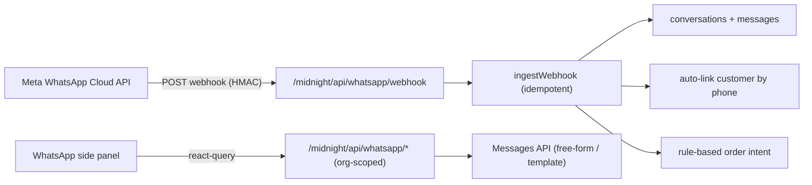

# WhatsApp Business Integration

MidnightEPOS integrates the **official WhatsApp Business Platform (Cloud API)** as an
org-scoped communication channel: receive customer messages, reply, link contacts to
customers, turn messages into draft orders, and send approved templates.

> The integration is **disabled by default** (`WHATSAPP_ENABLED=false`). Outbound sends
> and webhook processing are no-ops until it is enabled and configured. It does **not**
> use WhatsApp Web scraping or "linked device" tricks — only the official Cloud API.

---

## Architecture



- **Schema** (`shared/schema.ts`): `whatsapp_accounts`, `whatsapp_conversations`,
  `whatsapp_messages`, `whatsapp_customer_links`, `whatsapp_order_intents`,
  `whatsapp_templates`. Migrations `033`–`035`.
- **Service** (`server/whatsapp/*`): `config`, `verify` (challenge + HMAC),
  `parse`, `client` (Messages/Templates), `store` (org-scoped DAL), `intent`
  (rule-based parser), `service` (ingestion), `templates` (seeds).
- **Routes** (`server/routes/whatsapp.ts`): public webhook + org-scoped endpoints.
- **UI**: persistent panel (`client/src/components/whatsapp/WhatsAppPanel.tsx`) and
  Settings → Integrations (`client/src/components/settings/WhatsAppSettings.tsx`).

---

## Environment variables

```env
WHATSAPP_ENABLED=false
WHATSAPP_VERIFY_TOKEN=              # token you invent; also entered in Meta webhook config
WHATSAPP_ACCESS_TOKEN=             # permanent system-user token (server-only secret)
WHATSAPP_PHONE_NUMBER_ID=          # from WhatsApp > API Setup (not the phone number)
WHATSAPP_BUSINESS_ACCOUNT_ID=      # WABA id, used for template sync
WHATSAPP_APP_SECRET=               # Meta app secret, used to verify webhook HMAC
WHATSAPP_DEFAULT_COUNTRY_CODE=44   # default dialing code for normalising local numbers
# Optional:
# WHATSAPP_GRAPH_API_VERSION=v21.0
```

Secrets are read server-side only and are **never** sent to the browser. The Settings
screen shows presence (Set/Missing), never the values.

---

## Webhook URL

```
https://<your-host>/midnight/api/whatsapp/webhook
```

- `GET` handles Meta's verification challenge (validates `hub.verify_token` against
  `WHATSAPP_VERIFY_TOKEN`).
- `POST` receives inbound messages and status updates. The request body HMAC
  (`X-Hub-Signature-256`) is verified against `WHATSAPP_APP_SECRET`. The endpoint
  acknowledges immediately (200) and processes asynchronously.

Copy the exact URL from **Settings → Integrations → WhatsApp Business**.

---

## Meta app setup

1. Create / configure a Meta developer app and add the **WhatsApp** product.
2. Create or connect a **WhatsApp Business Account (WABA)**.
3. Add and **register** the business phone number; note its **phone number ID**.
4. In **WhatsApp → Configuration → Webhook**, set the **Callback URL** (above) and the
   **Verify token** (`WHATSAPP_VERIFY_TOKEN`).
5. Add the `WHATSAPP_*` secrets to the server environment and set `WHATSAPP_ENABLED=true`.
6. Subscribe to the **`messages`** webhook field.
7. Insert a `whatsapp_accounts` row for the org with the `phone_number_id` so inbound
   webhooks route to the correct tenant.
8. Send a test message to the number, then reply from the panel.
9. **Sync templates** (Settings → Integrations) and submit them for Meta approval.

---

## Phone number migration warning — `07805597760`

Before moving `07805597760` onto the Cloud API, confirm **all** of the following.
Do **not** attempt irreversible migration steps from code:

- Whether the number is currently used in the **WhatsApp** app or **WhatsApp Business** app.
- Whether existing chats need **exporting / backing up** (they are not migrated to the API).
- Whether the number can be onboarded with **Embedded Signup**, migrated, or whether the
  existing WhatsApp account must be **deleted / offboarded** first.
- Whether **downtime** is acceptable during registration.
- **Who owns / administers** the Meta Business account and the WABA.

A number can only be active in one place at a time (consumer/business app *or* Cloud API).
Plan the cutover and back up chat history first.

---

## Messaging rules (service window)

- **Inside** the 24h customer service window (24h since the customer's last inbound
  message): free-form text replies are allowed.
- **Outside** the window: free-form replies are blocked with
  *"This conversation is outside WhatsApp's customer service window. Use an approved
  template."* Only **approved templates** may be sent.

Templates are seeded locally (status `LOCAL`) and must be **submitted to Meta** and
become `APPROVED` before they are valid outside the window. Seed templates include
`order_confirmation`, `order_ready`, `stock_update`, `payment_reminder`,
`delivery_update`, `thanks_follow_up`, `opening_hours`.

---

## Customer linking & order intent

- Inbound numbers are normalised and matched against existing customers by phone; an
  exact match auto-links the conversation. Otherwise the conversation is **Unlinked**
  with **Create customer** / **Link existing** actions in the panel.
- New customers created from a conversation are saved with `source = "whatsapp"` and a
  note, and previous messages are preserved.
- A lightweight **rule-based** parser scans inbound text for order intent (quantities,
  `x3`/number words, product name/alias/SKU matches) and stores a
  `whatsapp_order_intents` **suggestion**. The panel shows it as *Suggested order*.
- **Create draft order** accepts the suggestion and pre-fills the POS cart (matched by
  SKU) with the linked customer. **No final order is created without explicit checkout**
  (the order still flows through the normal `engine.placeOrder` path).
- Add product **aliases** (Products → edit) so shorthand names match, e.g.
  `coke, large coke`.

---

## Permissions

| Action | Roles |
|--------|-------|
| Read conversations / messages | any authenticated org member |
| Reply (free-form) / send template / create draft order | SUPER_ADMIN, ADMIN, MANAGER, CASHIER |
| Link / create customer, attach order, sync templates | SUPER_ADMIN, ADMIN, MANAGER |

All endpoints are org-scoped; the only cross-tenant read is the webhook routing lookup
by globally-unique `phone_number_id`. Write actions are recorded in `admin_audit_logs`.

---

## Roll-out checklist

- [ ] Secrets set; `WHATSAPP_ENABLED=true` on the target environment.
- [ ] `whatsapp_accounts` row created for the org with the correct `phone_number_id`.
- [ ] Webhook verified (GET challenge returns 200) and `messages` field subscribed.
- [ ] Inbound test message appears in the panel; reply delivered.
- [ ] Templates synced and submitted to Meta for approval.
- [ ] Product aliases added for common shorthand.

---

## Troubleshooting

| Symptom | Likely cause |
|---------|--------------|
| GET webhook returns 403 | `WHATSAPP_VERIFY_TOKEN` mismatch / unset. |
| POST webhook returns 401 | Bad `X-Hub-Signature-256` — wrong `WHATSAPP_APP_SECRET`. |
| Inbound messages not stored | No `whatsapp_accounts` row for the `phone_number_id`, or `WHATSAPP_ENABLED=false`. |
| Reply fails with 409 | Not enabled or missing access token / phone number ID. |
| Reply blocked with 422 | Outside the 24h service window — use an approved template. |
| Template send fails | Template not approved by Meta, or wrong language/variables. |

---

## Notes / deferred work

- **Outbox events / dedicated worker** are intentionally **not** registered in
  `REQUIRED_WORKERS` yet, per Architectural Principle 11 (in-progress features stay out
  of the worker registry until promoted). Ingestion is lightweight and the webhook acks
  immediately; promote to the outbox/worker pipeline when the feature graduates.
- **Media**: inbound media metadata (id, mime type, caption) is stored; a secure
  server-side media download proxy is a follow-up. Media URLs are never exposed to the
  client.
